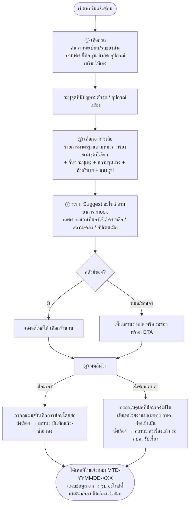

# 🔁 Flow ฟอร์มแจ้งซ่อม + Mock Data

> Flow ยืนยันกับเจ้าของงานแล้ว 17 ก.ค. 2569: **เลือกอาการเสียก่อน → เห็นอะไหล่ → ค่อยตัดสินใจ ซ่อมเอง/ส่ง กบค.**

## Flow ละเอียด

**กติกาใน mock:**

- อะไหล่แนะนำแสดง **ทันทีที่เลือกอาการ** (ขั้น ③ อัปเดตตามอาการที่ติ๊ก) — แสดงคู่กับสต็อกจอเดียวกัน (มติ BL01: ไม่แยกขั้น)
- จองได้เฉพาะรายการที่คงเหลือ > 0 · จำนวนจองเริ่มต้น = จำนวนที่ต้องใช้ แต่ไม่เกินคงเหลือ
- เปลี่ยนอาการ → รายการอะไหล่อัปเดต และการจองของอาการที่เอาออกถูกยกเลิก (แจ้งผู้ใช้)
- สถานะคลัง: `พร้อมเบิก` (>3) · `ใกล้หมด` (1–3) · `หมด` (0) · `หมด-รอของ` (0 + มี ETA) — เกณฑ์ "ใกล้หมด" เป็นค่าสมมุติ รอคำตอบคำถามเปิด #3
- ใบแจ้งซ่อมเก็บ snapshot รายการอะไหล่ที่ระบบแนะนำไว้กับเรื่องเสมอ (AC ของ US-06/US-08)

## Mock Data

### รถ (4 คัน)

| ทะเบียน | ยี่ห้อ/รุ่น | สังกัด | อุปกรณ์เสริม |
|---|---|---|---|
| 81-2345 นครราชสีมา | Hino FM8J 6 ล้อ | กฟภ. เขต ฉ.3 นครราชสีมา | เครน Tadano TM-ZE304 |
| 82-6789 ขอนแก่น | Isuzu FTR | กฟภ. เขต ฉ.1 ขอนแก่น | กระเช้า Aichi SK17A |
| 83-1122 กรุงเทพมหานคร | Mitsubishi Fuso FI | สำนักงานใหญ่ (กบค.) | เครน Unic URV554 |
| 80-5566 เชียงใหม่ | Hino XZU กระบะยกสูง | กฟภ. เขต น.1 เชียงใหม่ | — |

### อาการเสียมาตรฐาน (ตามหมวด)

| รหัส | หมวด | อาการ | ใช้กับ |
|---|---|---|---|
| HYD-01 | ระบบไฮดรอลิก | กระบอกไฮดรอลิกรั่ว/ซึม | อุปกรณ์เสริม |
| HYD-02 | ระบบไฮดรอลิก | ปั๊มไฮดรอลิกเสียงดัง/แรงดันตก | อุปกรณ์เสริม |
| HYD-03 | ระบบไฮดรอลิก | สายไฮดรอลิกแตก/รั่ว | อุปกรณ์เสริม |
| BOOM-01 | บูม/กระเช้า | บูมยืด-หดสะดุด | อุปกรณ์เสริม |
| BOOM-02 | บูม/กระเช้า | ลวดสลิงหย่อน/เส้นใยขาด | อุปกรณ์เสริม |
| BOOM-03 | บูม/กระเช้า | กระเช้าเอียง/ล็อกไม่อยู่ | อุปกรณ์เสริม |
| ELEC-01 | ระบบไฟฟ้า | รีโมทคอนโทรลไม่ทำงาน | อุปกรณ์เสริม |
| ELEC-02 | ระบบไฟฟ้า | ไฟเตือน load sensor ขึ้น | อุปกรณ์เสริม |
| ENG-01 | เครื่องยนต์ | สตาร์ทไม่ติด | ตัวรถ |
| ENG-02 | เครื่องยนต์ | ควันดำ/กำลังตก | ตัวรถ |
| OTH | อื่นๆ | ระบุเอง (มีเสมอ — AC ของ US-03) | ทั้งคู่ |

### อะไหล่ + สต็อก (mapping อาการ → อะไหล่)

| อาการ | อะไหล่ (รหัส) | ต้องใช้/ครั้ง | คงเหลือ | สถานะ | คลัง |
|---|---|---|---|---|---|
| HYD-01 | ชุดซีลกระบอกไฮดรอลิก (SL-4402) | 1 ชุด | 6 | 🟢 พร้อมเบิก | กบค. สนญ. |
| HYD-01 | น้ำมันไฮดรอลิก ISO VG46 18L (OL-0046) | 1 ถัง | 2 | 🟡 ใกล้หมด | กบค. สนญ. |
| HYD-02 | ปั๊มไฮดรอลิกเกียร์ (PM-2210) | 1 ตัว | 0 | 🔴 หมด-รอของ (ETA 24 ก.ค.) | กบค. สนญ. |
| HYD-02 | ไส้กรองไฮดรอลิก (FT-1108) | 2 ชิ้น | 12 | 🟢 พร้อมเบิก | กบค. สนญ. |
| HYD-03 | สายไฮดรอลิกแรงดันสูง 3/8" (HS-3808) | 2 เส้น | 4 | 🟢 พร้อมเบิก | คลังเขต |
| HYD-03 | ข้อต่อไฮดรอลิก (FT-2205) | 4 ตัว | 3 | 🟡 ใกล้หมด | คลังเขต |
| BOOM-01 | แผ่นสไลด์บูม wear pad (WP-1030) | 4 แผ่น | 8 | 🟢 พร้อมเบิก | กบค. สนญ. |
| BOOM-01 | จาระบี EP2 (GR-0002) | 1 หลอด | 20 | 🟢 พร้อมเบิก | คลังเขต |
| BOOM-02 | ลวดสลิง 10 มม. (WR-1000) | 25 เมตร | 0 | 🔴 หมด | กบค. สนญ. |
| BOOM-03 | ชุดล็อกกระเช้า (LK-0770) | 1 ชุด | 5 | 🟢 พร้อมเบิก | กบค. สนญ. |
| ELEC-01 | แบตเตอรี่รีโมท (BT-0912) | 2 ก้อน | 15 | 🟢 พร้อมเบิก | คลังเขต |
| ELEC-01 | ชุดรับสัญญาณรีโมท (RC-5521) | 1 ชุด | 1 | 🟡 ใกล้หมด | กบค. สนญ. |
| ELEC-02 | เซ็นเซอร์ load cell (SN-3310) | 1 ตัว | 0 | 🔴 หมด-รอของ (ETA 31 ก.ค.) | กบค. สนญ. |
| ENG-01 | แบตเตอรี่รถ 12V 120Ah (BT-1212) | 2 ลูก | 5 | 🟢 พร้อมเบิก | คลังเขต |
| ENG-02 | ไส้กรองอากาศ (FT-0330) | 1 ชิ้น | 9 | 🟢 พร้อมเบิก | คลังเขต |

*ทุกรายการ mock ให้ "อัปเดตล่าสุด 17 ก.ค. 2569 09:30" — ของจริงต้องแสดงเวลาอัปเดตจริง + เตือนเมื่อข้อมูลเก่า (AC ของ US-07)*
