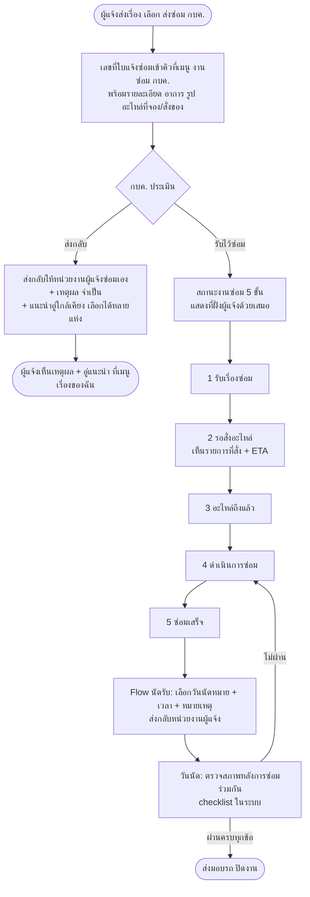

# 🔧 Flow ฝั่ง กบค. — รับงาน · สถานะซ่อม · นัดรับ · ตรวจสภาพหลังซ่อม

> เพิ่มตามความต้องการเจ้าของงาน 17 ก.ค. 2569 (mock v0.3) — ต่อจาก [02-Flow-and-Mock-Data.md](02-Flow-and-Mock-Data.md)
> ครอบคลุมช่วงหลังผู้แจ้งกด "ส่งซ่อม กบค." จนถึงส่งมอบรถคืน

## Flow รวม

## กติกา (ตามที่ตกลง + ที่ mock ตีความ)

| เรื่อง | กติกา | หมายเหตุ |
|---|---|---|
| คิวงาน กบค. | เรื่องที่เลือก "ส่งซ่อม กบค." เท่านั้นที่เข้าคิว (ซ่อมเองไม่เข้า) · badge ตัวเลขบนเมนู = จำนวนเรื่องรอรับ | |
| การประเมิน | 2 ทาง: **รับไว้ซ่อม** / **ส่งกลับให้ซ่อมเอง** · ส่งกลับต้องระบุเหตุผล (บังคับ) และแนะนำอู่ใกล้เคียงได้หลายแห่ง | รายชื่ออู่เป็น mock — ของจริงควรดึงตามพื้นที่หน่วยงานผู้แจ้ง |
| สถานะงานซ่อม | 5 ขั้นตามลำดับ: **รับเรื่องซ่อม → รอสั่งอะไหล่ → อะไหล่ถึงแล้ว → ดำเนินการซ่อม → ซ่อมเสร็จ** | ทุกครั้งที่เปลี่ยน บันทึกลงประวัติสถานะ (timeline) และ**ผู้แจ้งเห็นเหมือนกันทันที** |
| นัดรับ | หลังซ่อมเสร็จ: เลือกวันนัดหมาย + เวลา + หมายเหตุ (จุดรับรถ) → ผู้แจ้งเห็นวันนัด | |
| ตรวจสภาพหลังซ่อม | ทำร่วมกันวันนัด — checklist ในระบบ 4 ข้อ (mock): ทดสอบตามอาการที่แจ้ง / ไม่มีรอยรั่ว-เสียงผิดปกติ / อุปกรณ์ความปลอดภัยครบ / เอกสาร-รายการอะไหล่ครบ | **ผ่านครบทุกข้อจึงปิดงานได้** · ไม่ผ่าน → กลับสถานะ "ดำเนินการซ่อม" พร้อมบันทึกเหตุผล |
| ปิดงาน | สถานะ "ปิดงาน — ตรวจสภาพผ่าน ส่งมอบแล้ว" + ผลตรวจติดเรื่องถาวร | |

## ส่วนที่แก้ใน flow เดิม (ฝั่งผู้แจ้ง)

- **สั่งของได้เมื่ออะไหล่หมด:** ขั้น "อะไหล่ที่แนะนำ" — รายการที่ **หมด/หมด-รอของ** มีปุ่ม **"สั่งของ"** เพื่อรวมเป็นรายการที่ต้องใช้ (แยกจาก "จอง" ที่ใช้กับของที่มีในคลัง) ปรับจำนวนได้ ยกเลิกได้ และแสดงในสรุป + ติดไปกับเรื่องที่ส่งถึง กบค. (โยงกับสถานะ "รอสั่งอะไหล่" ของ กบค.)
- หน้า success เพิ่มปุ่ม "ดูสถานะเรื่องของฉัน" — เข้าเมนูติดตามสถานะได้ทันที

## เมนูใหม่ใน mock (สลับจาก sidebar)

| เมนู | บทบาท | มีอะไร |
|---|---|---|
| 🔧 แจ้งซ่อม | ผู้แจ้ง | ฟอร์ม 4 ขั้นเดิม + สั่งของได้ |
| 📋 เรื่องแจ้งซ่อมของฉัน | ผู้แจ้ง | รายการเรื่อง + สถานะ, รายละเอียด, timeline, วันนัด, เหตุผล/อู่แนะนำกรณีส่งกลับ, ผลตรวจสภาพ |
| 👷 งานซ่อม กบค. (badge จำนวนรอรับ) | กบค. | คิวงาน → ประเมิน → เดินสถานะ → นัดรับ → ตรวจสภาพ → ปิดงาน |

## หมายเหตุขอบเขต

- การติดตามสถานะฝั่งผู้แจ้ง = ขอบเขตของ [US-09](../backlog/BL01-แจ้งซ่อม-Suggest-อะไหล่/US-09-ติดตามสถานะเรื่องของตัวเอง.md) ซึ่ง **BL01 เดิมตัดออก** — เจ้าของงานสั่งเพิ่มใน prototype 17 ก.ค. 2569 → ตอนแตกการ์ดจริงควรทบทวนขอบเขต BL01/BL02 กับทีม
- Flow ฝั่ง กบค. (ประเมิน/ซ่อม/ปิดงาน) เดิมอยู่ในแผน flow-กบค F2–F7 — mock นี้เป็นเวอร์ชันย่อไว้คุยกับลูกค้า
- ข้อมูลทั้งหมด in-memory: รีเฟรชหน้าแล้วเรื่องที่สร้างใหม่หาย (เหลือ seed 2 เรื่อง) — ตั้งใจให้เดโมง่าย
