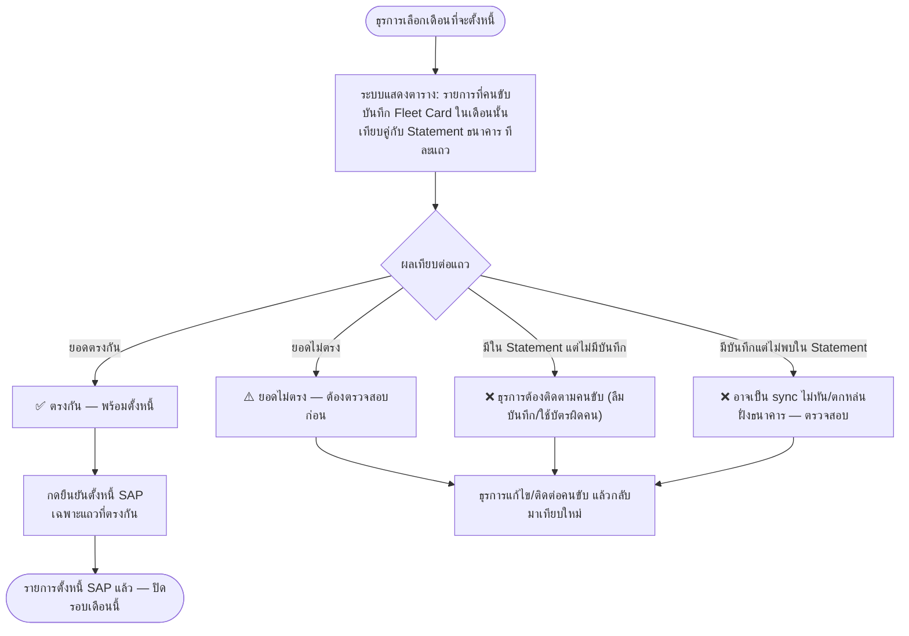

# ⛽ Flow เติมน้ำมัน (อ่านสลิป) + บันทึกชั่วโมงทำงาน/เครน-กระเช้า

> เพิ่มตามที่คุยกัน 21 ก.ค. 2569 (mock v0.1) — ต่อจาก [03-Flow-KBK-Pickup-Inspection.md](03-Flow-KBK-Pickup-Inspection.md)
> ครอบคลุมงานคนละ scope กับ "แจ้งซ่อม": นี่คือบันทึกประจำวันของคนขับ/ผู้ควบคุมยานพาหนะ ไม่ใช่เรื่องซ่อม
> อ้างอิง TOR: ข้อ 2 (T6 ชั่วโมงทำงาน, T8 ค่าน้ำมัน) และข้อ 5 (T11-T13 Fleet Card) ใน [CLAUDE.md](../CLAUDE.md)

> ⚠️ **แก้ไข 21 ก.ค. 2569 (บ่าย):** ตอนเริ่มเขียนเอกสารนี้ยังไม่รู้ว่า **มีแอปจริงสำหรับงานนี้อยู่แล้ว** คือ [`/daily-record/`](../daily-record/) (PWA ติดตั้งได้จริง มี service worker + OCR module ของตัวเอง + ตั้งค่าผ่าน `admin-config.html` ส่วน "บันทึกการใช้งานรถ") ซึ่งสมบูรณ์กว่า mock ที่สร้างไว้ใน `mock/Maintenance-Request-Form.html` (ฟีเจอร์ pf-) มาก
> - **`mock/Maintenance-Request-Form.html`** (ฟีเจอร์ pf- ที่อธิบายในเอกสารนี้ส่วนใหญ่) — เดโม/ต้นแบบคู่ขนานที่สร้างไว้ก่อนเจอแอปจริง **ยังคงเก็บไว้เป็นข้อมูลอ้างอิง/เทียบแนวทาง UI** (ตามที่ตกลง) แต่ **ไม่ใช่ทางที่ควรต่อยอดจริง**
> - **`/daily-record/`** คือแอปจริงที่ควรต่อยอด — ดู `daily-record/app.js`, `ocr.js`, `sw.js` และ `config-daily.js` (`window.MDD`)
> - ฟีเจอร์ **"ตั้งหนี้ + Reconcile Fleet Card"** (ซึ่งยังไม่มีอยู่จริงที่ไหนเลยตอนตรวจสอบ) ถูกย้ายไปสร้างใน **`admin-config.html` ส่วน "บันทึกการใช้งานรถ" การ์ดที่ 4** แทน โดยดึงข้อมูลใบเสร็จจริงจาก `ddb.records` (ผ่าน `MDD`) ไม่ใช่ seed แยกต่างหากอีกต่อไป — รายละเอียดในหัวข้อด้านล่าง

## ทำไมต้องแยกจาก flow แจ้งซ่อม

| ประเด็น | แจ้งซ่อม (01-03) | เติมน้ำมัน + ชั่วโมงทำงาน (ไฟล์นี้) |
|---|---|---|
| ผู้ใช้หลัก | ผู้แจ้ง (เจ้าของรถ/หัวหน้างาน) + กบค. | คนขับ/ผู้ควบคุมยานพาหนะ หน้างานจริง |
| ความถี่ | เกิดเมื่อรถเสีย (ไม่บ่อย) | ทุกวัน/ทุกครั้งที่เติมน้ำมัน (บ่อยมาก) |
| Layout ที่ใช้ | Desktop admin shell (sidebar + fgrid) — เหมาะกับกรอกที่โต๊ะ/สลับบทบาทดูข้อมูล | Mobile app-shell (topbar + bottom-nav + wizard) — เหมาะกับใช้มือเดียวหน้าปั๊ม/ในรถ |
| ปัญหาเน็ต | ไม่ critical เท่า (กรอกตอนกลับถึงที่ทำงานได้) | **Critical** — พื้นที่ปฏิบัติงานเครน/กระเช้าหลายจุดไม่มีสัญญาณ ต้องกรอกได้แม้ไม่มีเน็ต |

**สรุปการตัดสินใจ (21 ก.ค. 2569):** ต่อยอดจากโปรเจกต์ `Maintenance-Request-Form` เดิม ใช้ `design-system/tokens.css` (สี/ฟอนต์) ร่วมกัน แต่หน้าจอของฟีเจอร์นี้ (เมนู "เติมน้ำมัน + ชั่วโมงทำงาน" ในไซด์บาร์) เรนเดอร์เป็น mobile app-shell แยกของตัวเอง ไม่ใช้ `.fgrid`/`.wsteps` แบบฟอร์มแจ้งซ่อม — ยืนยันซ้ำอีกครั้งภายหลังว่าให้คงกรอบมือถือ (bottom-nav/sheet) ไว้ตามเดิม แค่ปรับการ์ด/ปุ่ม/checkbox ให้ใช้ class ที่ใช้ร่วมกับฟอร์มแจ้งซ่อม (`.tile`, `.chk`, `.veh`-proportions) มากขึ้นเพื่อความกลมกลืน

## ภาพรวมวงจรข้อมูล: บันทึกรายวัน → ประมวลผลรายเดือน

ยืนยันกับเจ้าของงานเพิ่ม (21 ก.ค. 2569): งานนี้มี **2 จังหวะเวลาที่ต่างกัน**

1. **รายวัน (คนขับ)** — ทุกวันที่ออกหน้างาน คนขับต้องบันทึกการใช้งานรถ (เลขไมล์ + ชั่วโมงทำงาน) และถ่ายรูปสลิปน้ำมันทุกครั้งที่เติม ผ่านเมนู "เติมน้ำมัน + ชั่วโมงทำงาน" ในไฟล์นี้
2. **รายเดือน (บัญชี/ธุรการ)** — ปลายเดือน ข้อมูลที่คนขับสะสมไว้ทั้งเดือนจะถูก "นำเข้าระบบ" อย่างเป็นทางการ แยกเป็น 2 เส้นทางตามประเภทข้อมูล:
   - **ชั่วโมงทำงาน** → ใช้เป็น input ของรอบบำรุงรักษาตามชั่วโมงใช้งานจริง (T2/T6) — ไม่ต้อง reconcile กับระบบภายนอก
   - **ค่าน้ำมัน** → กลายเป็นรายการ **ตั้งหนี้ (AP)** เข้า SAP (T13) แต่ก่อนตั้งหนี้ต้อง **reconcile กับ Statement ธนาคาร** ของ Fleet Card ก่อนเสมอ (เงินสดสำรองจ่ายไม่ผ่านขั้นนี้ — ไปตามขั้นตอนเบิกคืนเงินสดแยกต่างหาก ยังไม่ออกแบบใน mock นี้)

หน้าจอ "ตั้งหนี้ + Reconcile Fleet Card" (ใน `admin-config.html` ส่วน "บันทึกการใช้งานรถ" — การ์ดที่ 4) คือจุดที่ครอบคลุมจังหวะที่ 2 ของฝั่งน้ำมัน — ดูรายละเอียดด้านล่าง

## Flow เติมน้ำมัน (ถ่ายสลิป → OCR เลขที่ → กรอกรายละเอียด → บันทึก)

```mermaid
flowchart TD
    A([กดปุ่ม "เติมน้ำมัน" จากปุ่มกลาง bottom-nav]) --> B[① ถ่ายรูปสลิป<br/>ทำงานได้แม้ไม่มีเน็ต — OCR รันฝั่ง client ในเครื่อง]
    B --> C{OCR อ่านเลขที่สลิปได้ไหม}
    C -- ได้ --> D[แสดงเลขที่สลิปที่ระบบอ่านได้ + tag "อ่านจากสลิป"<br/>ผู้ใช้ยืนยัน/แก้ไขได้ที่ขั้น ④]
    C -- ไม่ได้ --> D2[แจ้งอ่านไม่เจอ — ให้พิมพ์เลขที่สลิปเองที่ขั้น ④]
    D --> E[ยืนยันภาพสลิปชัดเจน เก็บสลิปตัวจริงไว้ก่อน]
    D2 --> E
    E --> F[② ยืนยันรถ<br/>ค่าเริ่มต้น = รถคันล่าสุดที่ใช้ เปลี่ยนได้จาก bottom sheet]
    F --> G[③ เลือกวิธีชำระเงิน<br/>บัตรเติมน้ำมัน Fleet Card / เงินสดสำรองจ่าย]
    G --> H[④ กรอกรายละเอียด: สถานี ประเภทเชื้อเพลิง เลขไมล์<br/>วันที่ใบเสร็จ เลขที่สลิป ราคา/ลิตร จำนวนลิตร ยอดรวม]
    H --> I[⑤ สรุป + ย้ำเก็บสลิปตัวจริง]
    I --> J[บันทึกลงเครื่องทันที — เข้าคิว sync]
    J --> K{มีสัญญาณเน็ตตอนบันทึกไหม}
    K -- มี --> L([sync ขึ้นระบบกลางทันที])
    K -- ไม่มี --> M([badge "รอ sync" ค้างไว้ที่รายการ — sync อัตโนมัติเมื่อกลับมามีเน็ต])
```

## Flow บันทึกชั่วโมงทำงาน + ชั่วโมงเครน/กระเช้า (T6)

```mermaid
flowchart TD
    A([กดปุ่ม "บันทึกชั่วโมงทำงาน" จาก bottom-nav]) --> B[ยืนยันรถ + วันที่ + เลขไมล์เริ่มต้น]
    B --> C[กรอกเวลาเริ่ม-เลิกงาน → ระบบคำนวณชั่วโมงทำงานรวมให้อัตโนมัติ]
    C --> D{รถคันนี้มีเครน/กระเช้าติดตั้งไหม}
    D -- มี --> E[บังคับกรอก ชั่วโมงมิเตอร์เครื่องยนต์เครน/กระเช้า Hour Meter<br/>**แยกจากชั่วโมงทำงานรวมของข้อ C เสมอ**]
    D -- ไม่มี --> F[ข้ามช่องนี้ไป — ไม่บังคับ]
    E --> G[หมายเหตุ ถ้ามี] --> H[บันทึก]
    F --> G
```

## Flow ตั้งหนี้ + Reconcile Fleet Card รายเดือน (บัญชี/ธุรการ) — mock คร่าวๆ



**สถานะ mock ตอนนี้ (`admin-config.html` การ์ดที่ 4 ของส่วน "บันทึกการใช้งานรถ"):** ดึง**ใบเสร็จจริง**จาก `ddb.records[].receipts` (ผ่าน `MDD.load()`) ของเดือนที่เลือก — ไม่ใช่ seed แยกต่างหาก ทุกใบเสร็จในโมเดลข้อมูลปัจจุบันถือเป็น Fleet Card อยู่แล้ว (ยังไม่มีตัวเลือกเงินสดในแอปจริง) แต่เพราะยังไม่มี Statement ธนาคารจริง จึงปรับยอด/เติมแถวสาธิต 3 จุด (ยอดไม่ตรง 1 แถว, หาไม่พบใน Statement 1 แถว, มีใน Statement แต่ไม่มีบันทึก 1 แถว) ให้เห็นครบทุกสถานะเสมอเวลาพรีเซนต์ — ของจริงต้องรอ Statement ที่ import จากธนาคารจริง (ยังไม่ยืนยันรูปแบบ) มาเทียบแทน ปุ่ม "ยืนยันตั้งหนี้ SAP" เป็น mock (แค่ toast + badge เปลี่ยน) ยังไม่เชื่อม SAP จริง

## กติกา (ตามที่ตกลง 21 ก.ค. 2569)

| เรื่อง | กติกา | หมายเหตุ |
|---|---|---|
| OCR เลขที่สลิป | รันด้วย Tesseract.js ฝั่ง client (in-browser WASM) — **ไม่ต้องใช้เน็ต** เพราะทำงานบนเครื่องผู้ใช้ทั้งหมด | เลขที่ที่อ่านได้ยังแก้ไขเองได้เสมอที่ขั้นกรอกฟอร์ม |
| Offline-first | ทุกรายการบันทึกลง local storage/queue ก่อนเสมอ ไม่ต้องรอเน็ตถึงจะกดบันทึกได้ | ต่อยอด mock ด้วย toggle จำลอง "ไม่มีเน็ต" ในตัวฟีเจอร์ เพื่อสาธิตพฤติกรรม queue/sync ให้ กฟภ. ดู — ของจริงคือ IndexedDB + background sync |
| สถานะ sync ต่อรายการ | badge 2 สถานะ: `รอ sync` (คิวอยู่) / `sync แล้ว` — เปลี่ยนอัตโนมัติเมื่อกลับมามีเน็ต | ผู้ใช้เห็นสถานะชัดเจน ไม่ต้องเดาว่าข้อมูลหายหรือยัง |
| ชั่วโมงเครื่องยนต์ vs ชั่วโมงเครน/กระเช้า | **แยกกันเสมอ** ตาม TOR T6 — ชั่วโมงทำงานรวม (เวลาเริ่ม-เลิกงาน) กับชั่วโมงมิเตอร์อุปกรณ์เสริม (hour meter) เป็นคนละค่า | ใช้ `attach` ของรถ (จาก `MDC.data('vehicles')`) เป็นตัวกำหนดว่าต้องบังคับกรอกช่องนี้หรือไม่ |
| วิธีชำระเงินเติมน้ำมัน | 2 ทาง: Fleet Card / เงินสดสำรองจ่าย — mock นี้ยังไม่เชื่อม reconciliation กับธนาคารจริง | รอยืนยันธนาคาร/รูปแบบ Statement ตาม Pre-Discovery Checklist ใน CLAUDE.md ก่อนออกแบบเชื่อมต่อจริง |
| ข้อมูลรถ | ใช้ master data ชุดเดียวกับฟอร์มแจ้งซ่อม (`MDC.data('vehicles')`) ไม่สร้างชุดใหม่ซ้อน | รถคันล่าสุดที่ใช้ถูกจำไว้เป็นค่าเริ่มต้นของครั้งถัดไป |
| ข้อมูลทั้งหมด | in-memory + localStorage แยก key จากข้อมูลแจ้งซ่อม — รีเฟรชหน้าไม่หายเพราะ persist ใน localStorage (ต่างจาก mock แจ้งซ่อมที่ตั้งใจให้ in-memory ล้วน) | เพื่อสาธิต offline queue ให้เห็นผลจริงตอน refresh/reopen |

## เมนูที่เกี่ยวข้อง

| ที่ไหน | บทบาท | มีอะไร |
|---|---|---|
| `mock/Maintenance-Request-Form.html` → เมนู "⛽ เติมน้ำมัน + ชั่วโมงทำงาน" | คนขับ/ผู้ควบคุมยานพาหนะ | **เดโมคู่ขนาน (เก็บไว้อ้างอิงเท่านั้น)** — mobile app-shell ในตัว: ปุ่มลัดเติมน้ำมัน (wizard 5 ขั้น) และบันทึกชั่วโมงทำงาน (ฟอร์มเดียว) + รายการย้อนหลังพร้อม badge sync — **แอปจริงที่ควรใช้คือ `/daily-record/` ด้านล่าง** |
| [`/daily-record/`](../daily-record/) | คนขับ/ผู้ควบคุมยานพาหนะ | **แอปจริง** — PWA ติดตั้งได้ (manifest + service worker) มี tab หน้าหลัก/บันทึก/ประวัติ/สรุปเดือน, Fleet Card ต่อคัน, OCR ใบเสร็จของตัวเอง (`ocr.js`), ฟิลด์กำหนดเองได้ |
| `admin-config.html` → ส่วน "บันทึกการใช้งานรถ" | บัญชี/ธุรการ (ตั้งค่า) | ตั้งค่าฟิลด์ฟอร์ม, Fleet Card ต่อคัน, seed/ล้างข้อมูลบันทึก, **การ์ดที่ 4 "ตั้งหนี้ + Reconcile Fleet Card"** (เพิ่มใหม่ 21 ก.ค. 2569 บ่าย — ดู Flow ด้านล่าง) |

## ประเด็นเปิด / สิ่งที่ต้องยืนยันต่อ

| # | ประเด็น | หมายเหตุ |
|---|---|---|
| 1 | Fleet Card reconciliation กับธนาคาร | มี mock คร่าวๆ แล้วใน `admin-config.html` (การ์ดที่ 4 ของส่วน "บันทึกการใช้งานรถ") ดึงใบเสร็จจริงจาก `ddb.records` แต่ Statement ธนาคารยังเป็นค่าที่ปรับ/เติมเอง — ต้องรอฝ่ายการเงินยืนยันธนาคาร/format Statement ตาม Pre-Discovery Checklist ก่อนออกแบบการเชื่อมต่อจริง |
| 1b | mock คู่ขนานใน `mock/Maintenance-Request-Form.html` (ฟีเจอร์ pf-) | ซ้ำซ้อนกับ `/daily-record/` ที่มีอยู่แล้ว — ตกลงเก็บไว้เป็นข้อมูลอ้างอิงก่อน (21 ก.ค. 2569) ยังไม่ได้ตัดสินใจว่าจะลบ/รวมทีหลังหรือไม่ |
| 2 | เกณฑ์บังคับกรอกชั่วโมงเครน/กระเช้า | mock ใช้ `attach != null` ของรถเป็นตัวบังคับ — ของจริงอาจต้องแยกประเภทอุปกรณ์ละเอียดกว่านี้ (เครน vs กระเช้า มิเตอร์คนละแบบ) |
| 3 | ใบรับรองความปลอดภัยเครน/กระเช้า (T5b) | ยังไม่รวมใน mock นี้ — ตาม Risk Register ใน CLAUDE.md รอยืนยันแยกต่างหาก |
| 4 | Sync จริงเมื่อกลับมามีเน็ต | mock จำลองด้วย toggle + setTimeout — ของจริงต้องออกแบบ background sync/IndexedDB queue ในขั้น Implementation |
