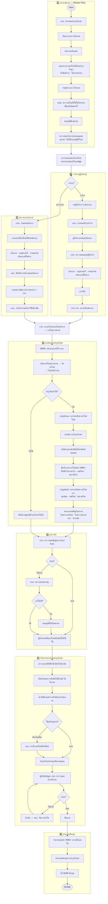

# บำรุงรักษาตามวาระ (To-be) — ภาพรวม 6 ช่วง

> ที่มา: `Maintenance-Request-Form/maintainance-yearly/maintannance-yearly.md` · แยกมาเพื่อดูเป็นภาพง่าย (GitHub render mermaid ให้อัตโนมัติ)

```mermaid
flowchart TB
    Start([Start])

    subgraph S1["1️⃣ ออกเลขงาน — Master Plan"]
        Start --> A[กบก. สร้างแผนบำรุงรักษา]
        A --> B[เลือกเกณฑ์ ทรัค/เนต] --> C[เลือกรถเข้าแผน]
        C --> D[แสดงรายการอะไหล่ที่ต้องบำรุงรักษา<br/>น้ำมันต่างๆ · ไส้กรองต่างๆ]
        D --> E[ระบุช่วงเวลา ไทรมาส]
        E --> F[ผบพ. ตรวจอะไหล่ที่ใช้ในไทรมาส<br/>เพื่อเตรียมของไว้]
        F --> G[ขออนุมัติเลขงาน]
        G --> H[ตรวจสอบจำนวนรถตามแผน<br/>สถานะ: ไม่ใช้/รออนุมัติ/โอน]
    end

    H --> I[ตรวจสอบและเบิกอะไหล่<br/>ผ่านระบบขออะไหล่ App]
    I --> D1{ว่าจ้าง?}

    subgraph S2A["2️⃣ ว่าจ้าง (ผู้รับจ้าง)"]
        D1 -- ว่าจ้าง --> J1[หาผู้รับจ้าง / เสนอราคา]
        J1 --> J2[กบก. กำหนดอัตราค่าจ้าง]
        J2 --> J3[ผู้รับจ้างทำแผนเดินทาง]
        J3 --> J4[กบก. ตรวจสอบแผนผู้รับจ้าง]
        J4 --> J5[เลือกรถ · ระบุสถานที่ · กำหนดวันเดินทางเป็นช่วง]
        J5 --> J6[ทำ PO] --> J7[แจ้ง กรย. ทราบวันเดินทาง]
    end

    subgraph S2B["2️⃣ ตรวจเอง (กบก.)"]
        D1 -- ตรวจเอง --> K1[กบก. ทำแผนเดินทาง]
        K1 --> K2[กรอกค่าเบี้ยเลี้ยง/ที่พัก/เดินทาง]
        K2 --> K3[เลือกรถ · ระบุสถานที่ · กำหนดวันเดินทางเป็นช่วง]
        K3 --> K4[กบก. ยืนยันการสร้างแผนเดินทาง]
        K4 --> K5[ระบบส่ง Noti แจ้งเจ้าของรถ + กรย.]
        K5 --> K6[กบก. ทำใบนำจ่ายด้วย PEA Life]
    end

    J7 --> L[กรย. เอาอะไหล่ก่อนวันเดินทาง<br/>→ วางที่จุดรวมงาน]
    K6 --> L
    L --> M[VMS+ สร้างเอกสารให้ กบก.]

    subgraph S3["3️⃣ ดำเนินการบำรุงรักษา"]
        M --> N[เดินทางไปจุดรวมงาน → รับอะไหล่<br/>→ ไปจุดหน้างาน]
        N --> D2{บำรุงรักษาได้?}
        D2 -- ไม่ได้ --> N0[บันทึกเหตุผลที่บำรุงรักษาไม่ได้]
        D2 -- ได้ --> N1[ถ่ายรูปก่อน: รถ+ทะเบียน+อะไหล่ใหม่]
        N1 --> N2[ดำเนินการบำรุงรักษา]
        N2 --> N3[เก็บตัวอย่างน้ำมันไฮโดรลิคไปทดสอบ]
        N3 --> N4[บันทึกงาน+อะไหล่บน VMS+<br/>ยืนยันจำนวนจริง · เลขไมล์ · ชม.เครื่อง]
        N4 --> N5[ถ่ายรูปหลัง: รถ+ทะเบียน+อะไหล่เก่า<br/>จุดซ่อม · เลขไมล์ · ชม.เครื่อง]
        N5 --> N6[หน่วยงานพัสดุรับทราบ<br/>ใบตรวจอะไหล่ · ใบตรวจสภาพงาน · ประเมิน]
    end

    subgraph S4["4️⃣ ตรวจรับ"]
        N6 --> O[กบก. ตรวจสอบข้อมูลการบำรุงรักษา]
        N0 --> O
        O --> D3{ผ่าน?}
        D3 -- ไม่ผ่าน --> O1[กบก. ตรวจสอบสาเหตุ]
        O1 --> D4{แก้ไขได้?}
        D4 -- ไม่ --> O2[ขออนุมัติปรับลดงาน]
        D3 -- ผ่าน --> O3[ผู้รับจ้างส่งคืนอะไหล่/น้ำมันที่ไม่ได้ใช้]
        O2 --> O3
        D4 -- ได้ --> O3
    end

    subgraph S5["5️⃣ จัดทำรายงานการบำรุงรักษา"]
        O3 --> P[ตรวจสภาพไฟฟ้า/น้ำมัน/ไฮโดรลิค]
        P --> P1[บันทึกผลตรวจน้ำมันไฮโดรลิค ในใบงาน]
        P1 --> P2[ส่ง Noti ผลตรวจน้ำมันแก่เจ้าของรถ]
        P2 --> D5{ใช้อะไหล่ครบ?}
        D5 -- มีอะไหล่คืน --> P3[กบก. ทำเรื่องอะไหล่คืนที่คลัง]
        D5 -- ครบ --> P4[บำรุงรักษาครบทุกคันตามแผน]
        P3 --> P4
        P4 --> P5[ผู้บังคับบัญชา กบก. ตรวจสอบประวัติงาน]
        P5 --> D6{ผ่าน?}
        D6 -- ไม่ผ่าน --> P6[ตีกลับ → กบก. จัดการแก้ไข]
        P6 --> P5
        D6 -- ผ่าน --> P7[ปิดงาน]
    end

    subgraph S6["6️⃣ คำนวณต้นทุน"]
        P7 --> Q[รายงานผลบน VMS+ ดาวน์โหลดได้]
        Q --> Q1[คำนวณต้นทุนการบำรุงรักษา]
        Q1 --> Q2[ได้ SUM ต้นทุน]
        Q2 --> Done([DONE])
    end
```
