# บำรุงรักษาตามวาระ (To-be) — ภาพรวม: ออกเลขงาน + 5 เฟสปฏิบัติการ

> 💡 **ผังนี้ sync กับ prototype ปัจจุบัน** (โครงใหม่ 8 ส.ค. 2569) — ที่มา: `maintainance-yearly/` + `maintainance-yearly/skeleton.html`
>
> **โครงเปลี่ยนจากเดิม "6 ช่วง" เป็น "ออกเลขงาน (แยกหน้า) + 5 เฟส"**
> · **"ออกเลขงาน" แยกออกจาก stepper** เป็นหน้าของตัวเอง (`plan-new.html`) — ไม่นับเป็นเฟส
> · stepper เหลือ **5 เฟสปฏิบัติการ** และเป็น stepper **ของแต่ละแผน** (`plan.phase`) ระบบเก็บได้หลายแผน
> · **เลขงานคือหัวข้อของแผน** — เฟสถัดไปเริ่มด้วยการ **หยิบแผนจากรายการ**
> · **ฝ่ายพัสดุไม่ใช่ผู้อนุมัติ** — กบค. ออกเลขงานเอง แล้วส่งเอกสารแจ้งพัสดุให้ **รับทราบ** (ไม่บล็อกเฟสถัดไป)
> · **ไม่ต้องเลือกไทรมาส** — เป็นแผนประจำปี · ไทรมาสในเลขงานคิดจากวันที่ออกเลข
> · หน่วยงานคือ **กบค.** ("กบก." ที่เคยเขียนคือพิมพ์ผิด)

## สถานะการทำ prototype

| | ส่วน | ไฟล์ผัง | สถานะ |
|---|---|---|---|
| — | ออกเลขงาน (แผนประจำปี) + แจ้งพัสดุ | [01](01-ออกเลขงาน.md) | ✅ ทำแล้ว |
| เฟส 1 | เบิก/จัดหาอะไหล่ + แผนเดินทาง | [02](02-เฟส1-เบิกจัดหา-แผนเดินทาง.md) | ✅ ทำแล้ว (เฉพาะสายตรวจเอง) |
| เฟส 2 | ดำเนินการบำรุงรักษา | [03](03-เฟส2-ดำเนินการบำรุงรักษา.md) | ⬜ ยังเป็นหน้าเปล่า |
| เฟส 3 | ตรวจรับ | [04](04-เฟส3-ตรวจรับ.md) | ⬜ ยังเป็นหน้าเปล่า |
| เฟส 4 | จัดทำรายงาน | [05](05-เฟส4-จัดทำรายงาน.md) | ⬜ ยังเป็นหน้าเปล่า |
| เฟส 5 | คำนวณต้นทุน | [06](06-เฟส5-คำนวณต้นทุน.md) | ⬜ ยังเป็นหน้าเปล่า |

```mermaid
flowchart TB
    Start([Start])

    subgraph P0["📋 ก่อนเข้า stepper — ออกเลขงาน (หน้าแยก) ✅"]
        Start --> A["กบค. สร้างแผนบำรุงรักษาประจำปี<br/>ตั้งชื่อแผน + เลือกรถ (กรย. 12 เขต · ทั้งภาค · ทั้งเขต · ข้ามเขตได้)"]
        A --> C["รายการอะไหล่ที่ต้องบำรุงรักษา — ระบบคำนวณจากรถที่เลือก<br/>น้ำมัน · ไส้กรอง · trigger รอบปี/ชม.เครื่อง/ระยะทาง<br/>จัดกลุ่มดู 4 แบบ · ปรับจำนวน เพิ่ม ตัดออกได้"]
        C --> D[สรุปแผนทั้งปี]
        D --> E["กบค. กดออกเลขงานเอง<br/>MT-ปี-ไทรมาส-NNN (ไทรมาส = ณ วันที่ออกเลข)"]
    end

    subgraph PSD["📦 ฝ่ายพัสดุ — ผู้รับทราบ (ไม่ได้อนุมัติ · ไม่บล็อก)"]
        F[เอกสารแจ้งเตรียม/สั่งอะไหล่]
        G[กดรับทราบ → เตรียม/สั่งอะไหล่]
        F --> G
    end

    E ==>|ส่งเอกสารแจ้งทราบ| F
    E --> LIST[["📑 รายการแผน — เลขงานคือหัวข้อของแผน"]]
    G -. อัปเดตสถานะกลับ .-> LIST
    LIST --> OPEN["เปิดแผน → stepper 5 เฟส ของแผนนั้น"]

    subgraph S1["1️⃣ เฟส 1 — เบิก/จัดหา + แผนเดินทาง ✅"]
        OPEN --> I[ตรวจสอบและเบิกอะไหล่<br/>ผ่านระบบขออะไหล่ App]
        I --> D1{ว่าจ้าง?}
        D1 -->|"ว่าจ้าง ⬜ ยังไม่ทำในต้นแบบ"| J1[หาผู้รับจ้าง / เสนอราคา]
        J1 --> J2[กบค. กำหนดอัตราค่าจ้าง]
        J2 --> J3[ผู้รับจ้างทำแผนเดินทาง]
        J3 --> J4[กบค. ตรวจสอบแผนผู้รับจ้าง]
        J4 --> J5[เลือกรถ · ระบุสถานที่ · กำหนดวันเดินทางเป็นช่วง]
        J5 --> J6[ทำ PO] --> J7[แจ้ง กรย. ทราบวันเดินทาง]

        D1 -->|"ตรวจเอง ✅"| K1[กบค. ทำแผนเดินทาง]
        K1 --> K2[กรอกค่าเบี้ยเลี้ยง/ที่พัก/เดินทาง]
        K2 --> K3[เลือกรถ · ระบุสถานที่ · กำหนดวันเดินทางเป็นช่วง]
        K3 --> K4[กบค. ยืนยันการสร้างแผนเดินทาง]
        K4 --> K5[ระบบส่ง Noti แจ้งเจ้าของรถ + กรย.]
        K5 --> K6[กบค. ทำใบนำจ่ายด้วย PEA Life]
    end

    subgraph S2["2️⃣ เฟส 2 — ดำเนินการบำรุงรักษา ⬜"]
        L[กรย. เอาอะไหล่ก่อนวันเดินทาง<br/>→ วางที่จุดรวมงาน]
        L --> M[VMS+ สร้างเอกสารให้ กบค.]
        M --> N[เดินทางไปจุดรวมงาน → รับอะไหล่<br/>→ ไปจุดหน้างาน]
        N --> D2{บำรุงรักษาได้?}
        D2 -- ไม่ได้ --> N0[บันทึกเหตุผลที่บำรุงรักษาไม่ได้]
        D2 -- ได้ --> N1[ถ่ายรูปก่อน: รถ+ทะเบียน+อะไหล่ใหม่]
        N1 --> N2[ดำเนินการบำรุงรักษา]
        N2 --> N3[เก็บตัวอย่างน้ำมันไฮดรอลิกไปทดสอบ]
        N3 --> N4[บันทึกงาน+อะไหล่บน VMS+<br/>ยืนยันจำนวนจริง · เลขไมล์ · ชม.เครื่อง]
        N4 --> N5[ถ่ายรูปหลัง: รถ+ทะเบียน+อะไหล่เก่า<br/>จุดซ่อม · เลขไมล์ · ชม.เครื่อง]
        N5 --> N6[หน่วยงานพัสดุรับทราบ<br/>ใบตรวจอะไหล่ · ใบตรวจสภาพงาน · ประเมิน]
    end

    J7 --> L
    K6 --> L

    subgraph S3["3️⃣ เฟส 3 — ตรวจรับ ⬜"]
        N6 --> O[กบค. ตรวจสอบข้อมูลการบำรุงรักษา]
        N0 --> O
        O --> D3{ผ่าน?}
        D3 -- ไม่ผ่าน --> O1[กบค. ตรวจสอบสาเหตุ]
        O1 --> D4{แก้ไขได้?}
        D4 -- ไม่ --> O2["ขออนุมัติปรับลดงาน<br/>❓ ใครอนุมัติ — ยังไม่เคาะ"]
        D3 -- ผ่าน --> O3[ผู้รับจ้าง/กบค. คืนอะไหล่-น้ำมันที่ไม่ได้ใช้]
        O2 --> O3
        D4 -- ได้ --> O3
    end

    subgraph S4["4️⃣ เฟส 4 — จัดทำรายงาน ⬜"]
        O3 --> P[ตรวจสภาพไฟฟ้า/น้ำมัน/ไฮดรอลิก]
        P --> P1[บันทึกผลตรวจน้ำมันไฮดรอลิก ในใบงาน]
        P1 --> P2[ส่ง Noti ผลตรวจน้ำมันแก่เจ้าของรถ]
        P2 --> D5{ใช้อะไหล่ครบ?}
        D5 -- มีอะไหล่คืน --> P3[กบค. ทำเรื่องอะไหล่คืนที่คลัง]
        D5 -- ครบ --> P4[บำรุงรักษาครบทุกคันตามแผน]
        P3 --> P4
        P4 --> P5[ผู้บังคับบัญชา กบค. ตรวจสอบประวัติงาน]
        P5 --> D6{ผ่าน?}
        D6 -- ไม่ผ่าน --> P6[ตีกลับ → กบค. จัดการแก้ไข]
        P6 --> P5
        D6 -- ผ่าน --> P7[ปิดงาน]
    end

    subgraph S5["5️⃣ เฟส 5 — คำนวณต้นทุน ⬜"]
        P7 --> Q[รายงานผลบน VMS+ ดาวน์โหลดได้]
        Q --> Q1[คำนวณต้นทุนการบำรุงรักษา]
        Q1 --> Q2[ได้ SUM ต้นทุน + Export Excel]
        Q2 --> Done([DONE])
    end
```

## เงื่อนไขที่ยังไม่เคาะ

รวบรวมไว้ที่ [`maintainance-yearly/skeleton.html`](../../maintainance-yearly/skeleton.html) — **17 ข้อ** กระจายตามเฟส · ดูสรุปต่อเฟสได้ในไฟล์ผังของเฟสนั้น
