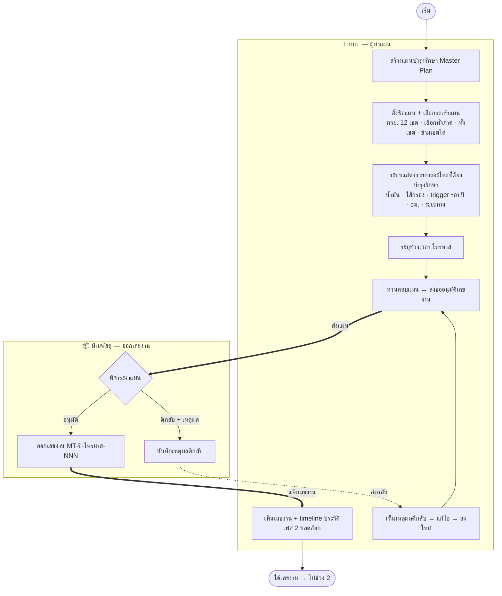

# ช่วงที่ 1 — ออกเลขงาน (Master Plan) + ขออนุมัติข้ามหน่วยงาน

> ที่มา: prototype จริง `maintainance-yearly/` (ช่วงที่ 1) · flow: บำรุงรักษาตามวาระ (To-be)
> 💡 ผังนี้ **sync กับ prototype ปัจจุบัน** — รวม "ชื่อแผน + เลือกรถ (เขต)" เป็นขั้นเดียว, ตัด "เกณฑ์ ทรัค/เนต" ออก, และขออนุมัติเลขงานส่งไป **ฝ่ายพัสดุ** (อนุมัติ/ตีกลับ)

