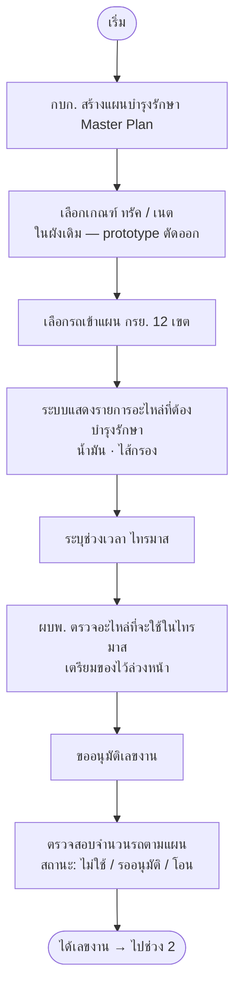

# ช่วงที่ 1 — ออกเลขงาน (Master Plan)

> ที่มา: `maintainance-yearly/maintannance-yearly.md` (ช่วงที่ 1) · flow: บำรุงรักษาตามวาระ (To-be)
> 💡 prototype จริง **รวม "ชื่อแผน + เลือกรถ (เขต)" เป็นขั้นเดียว และตัด "เกณฑ์ ทรัค/เนต" ออก**

