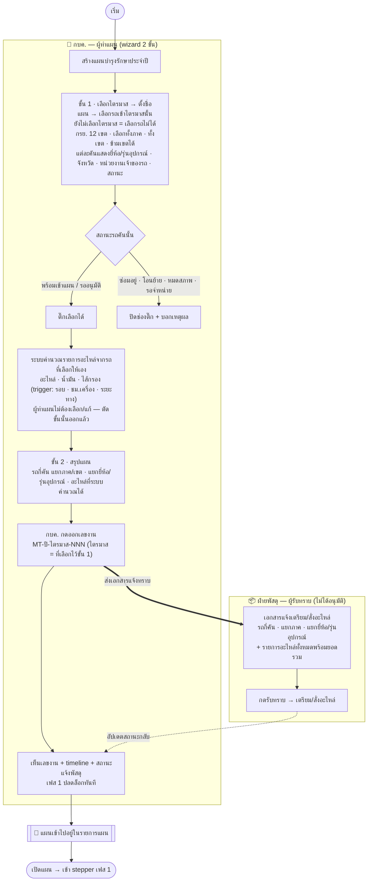

# ก่อนเข้า stepper — ออกเลขงาน (แผนประจำปี) + แจ้งฝ่ายพัสดุ

> **สถานะ prototype: ✅ ทำแล้ว** — หน้าแยก `maintainance-yearly/plan-new.html` (wizard 2 ขั้น) + `supplies.html` (ฝั่งพัสดุ)
> ที่มา: prototype จริง `maintainance-yearly/` · flow: บำรุงรักษาตามวาระ (To-be)
> 💡 ผังนี้ **sync กับ prototype ปัจจุบัน** (แก้ 8 ส.ค. 2569)
> - ⚠️ **ไม่ใช่เฟสใน stepper** — "ออกเลขงาน" แยกออกมาเป็นหน้าของตัวเอง · stepper 5 เฟสเริ่มหลังจากนี้ ([ภาพรวม](00-ภาพรวม.md))
> - **เลขงานคือหัวข้อของแผน** — พอออกเลขแล้ว แผนไปโผล่ใน **รายการแผน** และเฟสถัดไปเริ่มด้วยการ **หยิบแผนจากรายการ**
> - **1 แผน = 1 ไตรมาส** — ผู้ทำแผน**เลือกไตรมาสก่อน แล้วจึงเลือกรถเข้าไตรมาสนั้น** (แก้ 17 ส.ค. 2569 ตามที่เจ้าของงานสั่ง — เดิมไม่ให้เลือก) · ทำแผนครบปี = มี 4 แผน 4 เลขงาน
> - **ตัดขั้น "ผบพ. เตรียมอะไหล่" ออก** — ช่วงทำแผนยังไม่มีการเตรียมอะไหล่
> - ⚠️ **ฝ่ายพัสดุไม่ใช่ผู้อนุมัติ** — **กบค. กดออกเลขงานเอง**ที่หน้าสรุป แล้วระบบส่งเอกสารไปแจ้งพัสดุให้ทราบว่าต้องเตรียม/สั่งอะไหล่อะไรบ้าง (พัสดุกด "รับทราบ" ไม่บล็อกเฟสถัดไป)
> - 🆕 **ตัดขั้น "เลือก/แก้รายการอะไหล่" ออก** (17 ส.ค. 2569 ตามคำสั่งเจ้าของงาน) — ผู้ทำแผนไม่ต้องมาปรับจำนวนอะไหล่ตอนทำแผน · **ระบบยังคำนวณรายการอะไหล่จากรถที่เลือกให้เอง** แล้วส่งเข้าเอกสารพัสดุ/ขั้นเบิกอะไหล่เหมือนเดิม ⇒ wizard เหลือ 2 ขั้น
> - 🆕 **รถที่สถานะไม่พร้อมเลือกเข้าแผนไม่ได้** — ซ่อมอยู่ · โอนย้ายหน่วยงาน · หมดสภาพการใช้งาน · รอจำหน่าย ⇒ ปิดช่องติ๊ก + บอกเหตุผลใต้ป้ายสถานะ · "เลือกทั้งเขต/ภาค/ทั้งหมด" ข้ามรถเหล่านี้ให้ · ตารางรถแสดง **จังหวัด + หน่วยงานเจ้าของรถ** เพิ่มจากเดิม
> - เลขงาน `MT-ปี-ไตรมาส-NNN` — **ไตรมาสมาจากที่ผู้ทำแผนเลือกไว้ในขั้น 1** ไม่ใช่วันที่กดออกเลข (ปีงบประมาณ ต.ค.–ก.ย.)
> - ⚠️ **ระบบแนะนำไม่ได้ว่ารถคันไหนควรอยู่ไตรมาสไหน** — ข้อมูลรถมีแค่เลขไมล์/ชม.เครื่องสะสม ไม่มีวันซ่อมล่าสุดหรือรอบครบกำหนด ⇒ คนกำหนดเอง

```mermaid
flowchart TB
    S([เริ่ม])

    subgraph KBK["🏢 กบค. — ผู้ทำแผน (wizard 2 ขั้น)"]
        A[สร้างแผนบำรุงรักษาประจำปี]
        A --> B["ขั้น 1 · เลือกไตรมาส → ตั้งชื่อแผน → เลือกรถเข้าไตรมาสนั้น<br/>ยังไม่เลือกไตรมาส = เลือกรถไม่ได้<br/>กรย. 12 เขต · เลือกทั้งภาค · ทั้งเขต · ข้ามเขตได้<br/>แต่ละคันแสดงยี่ห้อ/รุ่นอุปกรณ์ · จังหวัด · หน่วยงานเจ้าของรถ · สถานะ"]
        B --> B2{"สถานะรถคันนั้น"}
        B2 -->|พร้อมเข้าแผน / รออนุมัติ| B3["ติ๊กเลือกได้"]
        B2 -->|ซ่อมอยู่ · โอนย้าย · หมดสภาพ · รอจำหน่าย| B4["ปิดช่องติ๊ก + บอกเหตุผล"]
        B3 --> C["ระบบคำนวณรายการอะไหล่จากรถที่เลือกให้เอง<br/>อะไหล่ · น้ำมัน · ไส้กรอง (trigger: รอบ · ชม.เครื่อง · ระยะทาง)<br/>ผู้ทำแผนไม่ต้องเลือก/แก้ — ตัดขั้นนั้นออกแล้ว"]
        C --> D["ขั้น 2 · สรุปแผน<br/>รถกี่คัน แยกภาค/เขต · แยกยี่ห้อ/รุ่นอุปกรณ์ · อะไหล่ที่ระบบคำนวณได้"]
        D --> E["กบค. กดออกเลขงาน<br/>MT-ปี-ไตรมาส-NNN (ไตรมาส = ที่เลือกไว้ขั้น 1)"]
        E --> J[เห็นเลขงาน + timeline + สถานะแจ้งพัสดุ<br/>เฟส 1 ปลดล็อกทันที]
    end

    subgraph PSD["📦 ฝ่ายพัสดุ — ผู้รับทราบ (ไม่ได้อนุมัติ)"]
        F["เอกสารแจ้งเตรียม/สั่งอะไหล่<br/>รถกี่คัน · แยกภาค · แยกยี่ห้อ/รุ่นอุปกรณ์<br/>+ รายการอะไหล่ทั้งหมดพร้อมยอดรวม"]
        G[กดรับทราบ → เตรียม/สั่งอะไหล่]
        F --> G
    end

    S --> A
    E ==>|ส่งเอกสารแจ้งทราบ| F
    G -. อัปเดตสถานะกลับ .-> J
    J --> L[["📑 แผนเข้าไปอยู่ในรายการแผน"]]
    L --> Z(["เปิดแผน → เข้า stepper เฟส 1"])
```

## ยังค้าง

- ยี่ห้อ/รุ่นอุปกรณ์ในข้อมูลจำลองมี 5 ตัว (`TADANO TM-ZE304` · `TADANO TM-ZE504` · `UNIC URV554` · `AICHI SK17A` · `KOMATSU PC130-8`) — ยกมาจาก `config.js` และ `repair-history.html` ที่มีอยู่แล้ว **ยังไม่ใช่ทะเบียนจริง**
- อะไหล่ยังผูกกับ **ชนิดรถ** (`appliesToTypes`) ไม่ได้ผูกกับ **ยี่ห้อ** — รายการอะไหล่ของแต่ละยี่ห้อยังเหมือนกันถ้าชนิดรถเดียวกัน
- สถานะรถทั้ง 6 แบบยังเป็น**ข้อมูลจำลอง** วนตามสูตร ไม่ได้ต่อกับระบบที่รู้ว่ารถคันไหนกำลังซ่อม/หมดสภาพจริง
