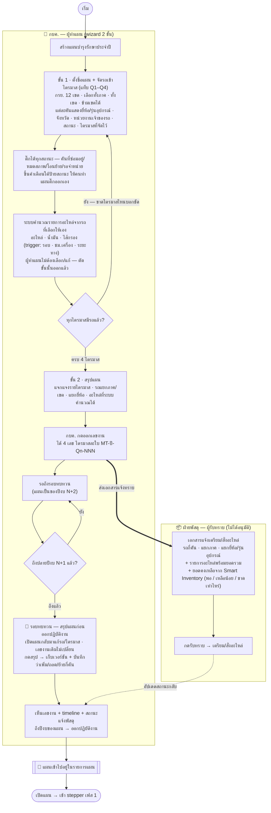

# ก่อนเข้า stepper — ออกเลขงาน (แผนประจำปี) + แจ้งฝ่ายพัสดุ

> **สถานะ prototype: ✅ ทำแล้ว** — หน้าแยก `maintainance-yearly/plan-new.html` (wizard 2 ขั้น) + `supplies.html` (ฝั่งพัสดุ)
> ที่มา: prototype จริง `maintainance-yearly/` · flow: บำรุงรักษาตามวาระ (To-be)
> 💡 ผังนี้ **sync กับ prototype ปัจจุบัน** (แก้ 8 ส.ค. 2569)
> - ⚠️ **ไม่ใช่เฟสใน stepper** — "ออกเลขงาน" แยกออกมาเป็นหน้าของตัวเอง · stepper 5 เฟสเริ่มหลังจากนี้ ([ภาพรวม](00-ภาพรวม.md))
> - **เลขงานคือหัวข้อของแผน** — พอออกเลขแล้ว แผนไปโผล่ใน **รายการแผน** และเฟสถัดไปเริ่มด้วยการ **หยิบแผนจากรายการ**
> - **1 แผน = ทั้งปีงบ · รถแยกรายไตรมาส** — ผู้ทำแผน**ต้องจัดรถให้ครบทุกไตรมาส (ไตรมาสละ ≥1 คัน) จึงจะไปขั้นสรุปได้** · กดออกเลขงานครั้งเดียวได้ **4 เลข ไตรมาสละใบ** (`MT-2569-Q1-001` … `Q4-001`)
>   - แก้ 17 ส.ค. 2569 · เคยลองเป็น "1 แผน = 1 ไตรมาส (4 แผน)" ช่วงเช้าวันเดียวกัน แต่เจ้าของงานดูหน้าจริงแล้วสั่งให้เป็นแผนใบเดียวครอบทั้งปี
>   - **รถคันหนึ่งอยู่ได้ไตรมาสเดียว** — ติ๊กในไตรมาสใหม่ = ย้ายออกจากไตรมาสเดิมให้เอง (ไม่งั้นยอดอะไหล่นับซ้ำ)
>   - มีถัง **"ยังไม่ระบุไตรมาส"** สำหรับรถที่อยู่ในแผนแต่ถูกพักไว้ตอนแก้แผนเดินทาง
> - **ตัดขั้น "ผบพ. เตรียมอะไหล่" ออก** — ช่วงทำแผนยังไม่มีการเตรียมอะไหล่
> - ⚠️ **ฝ่ายพัสดุไม่ใช่ผู้อนุมัติ** — **กบค. กดออกเลขงานเอง**ที่หน้าสรุป แล้วระบบส่งเอกสารไปแจ้งพัสดุให้ทราบว่าต้องเตรียม/สั่งอะไหล่อะไรบ้าง (พัสดุกด "รับทราบ" ไม่บล็อกเฟสถัดไป)
> - 🆕 **ตัดขั้น "เลือก/แก้รายการอะไหล่" ออก** (17 ส.ค. 2569 ตามคำสั่งเจ้าของงาน) — ผู้ทำแผนไม่ต้องมาปรับจำนวนอะไหล่ตอนทำแผน · **ระบบยังคำนวณรายการอะไหล่จากรถที่เลือกให้เอง** แล้วส่งเข้าเอกสารพัสดุ/ขั้นเบิกอะไหล่เหมือนเดิม ⇒ wizard เหลือ 2 ขั้น
> - 🆕 **เลือกได้ทุกสถานะ** — เจ้าของงานสั่ง 17 ส.ค. 2569 (แก้จากตอนเช้าที่ให้ปิดช่องติ๊ก): *"ตอนเลือก ทุกสถานะสามารถเลือกได้ แล้วคนสร้างแผนค่อยมาเลือกออก"* ⇒ สถานะเป็น**ข้อมูลประกอบการตัดสินใจ** (ป้าย + คำเตือนใต้ป้าย เช่น "อยู่ระหว่างซ่อม — ตรวจสอบก่อนว่าจะซ่อมเสร็จทันรอบไหม") ไม่ใช่ตัวกั้น · ตารางรถแสดง **จังหวัด + หน่วยงานเจ้าของรถ + ไตรมาสที่จัดไว้** เพิ่มจากเดิม
> - เลขงาน `MT-ปี-ไตรมาส-NNN` — **ออกครบ 4 ใบพร้อมกัน** ไตรมาสละใบ ตามรถที่จัดไว้ในไตรมาสนั้น (ปีงบประมาณ ต.ค.–ก.ย.)
> - 🆕 **แผนทำล่วงหน้า 2 ปี + รอบทบทวน** (17 ส.ค. 2569) — ทำแผนในปีงบ N ได้แผนของ **ปีงบ N+2** · ระหว่างรอมี **รอบทบทวน = "สรุปแผนก่อนออกปฏิบัติงาน"** ทุกปลายปีงบ (ก.ค.–ก.ย.) ตั้งแต่ปี N+1 ถึงปีก่อนแผนมีผล
>   - แผนทำปีงบ 2569 → ใช้ปีงบ 2571 → ทบทวน **1 รอบ ปลายปีงบ 2570**
>   - รอบทบทวน = เปิดแผนกลับมาแก้รถ/ไตรมาสได้ แล้วกดสรุป · **เลขงานเดิมไม่เปลี่ยน** · เก็บเป็นเวอร์ชันพร้อมบันทึกว่าเพิ่ม/ถอด/ย้ายไตรมาสกี่คัน
>   - ไม่นับปลายปีที่ทำแผนเอง (ทำแผนช่วง ก.ค.–ก.ย. จะเด้งเข้ารอบทบทวนของตัวเองทันที ซึ่งไม่มีอะไรให้ทบทวน)
>   - ต้นแบบมี **ตัวจำลองวันที่บนแถบบน** — ไม่งั้นเดโมรอบทบทวนไม่ได้เพราะรอบอยู่ในอนาคต
> - ⚠️ **ระบบแนะนำไม่ได้ว่ารถคันไหนควรอยู่ไตรมาสไหน** — ข้อมูลรถมีแค่เลขไมล์/ชม.เครื่องสะสม ไม่มีวันซ่อมล่าสุดหรือรอบครบกำหนด ⇒ คนกำหนดเอง

```mermaid
flowchart TB
    S([เริ่ม])

    subgraph KBK["🏢 กบค. — ผู้ทำแผน (wizard 2 ขั้น)"]
        A[สร้างแผนบำรุงรักษาประจำปี]
        A --> B["ขั้น 1 · ตั้งชื่อแผน + จัดรถเข้าไตรมาส (แท็บ Q1–Q4)<br/>กรย. 12 เขต · เลือกทั้งภาค · ทั้งเขต · ข้ามเขตได้<br/>แต่ละคันแสดงยี่ห้อ/รุ่นอุปกรณ์ · จังหวัด · หน่วยงานเจ้าของรถ · สถานะ · ไตรมาสที่จัดไว้"]
        B --> B2["ติ๊กได้ทุกสถานะ — คันที่ซ่อมอยู่/หมดสภาพ/โอนย้าย/รอจำหน่าย<br/>ขึ้นคำเตือนใต้ป้ายสถานะ ให้คนทำแผนติ๊กออกเอง"]
        B2 --> C["ระบบคำนวณรายการอะไหล่จากรถที่เลือกให้เอง<br/>อะไหล่ · น้ำมัน · ไส้กรอง (trigger: รอบ · ชม.เครื่อง · ระยะทาง)<br/>ผู้ทำแผนไม่ต้องเลือก/แก้ — ตัดขั้นนั้นออกแล้ว"]
        C --> CQ{"ทุกไตรมาสมีรถแล้ว?"}
        CQ -->|"ยัง — ขาดไตรมาสไหนบอกชัด"| B
        CQ -->|ครบ 4 ไตรมาส| D["ขั้น 2 · สรุปแผน<br/>แจกแจงรายไตรมาส · รถแยกภาค/เขต · แยกยี่ห้อ · อะไหล่ที่ระบบคำนวณได้"]
        D --> E["กบค. กดออกเลขงาน<br/>ได้ 4 เลข ไตรมาสละใบ MT-ปี-Qn-NNN"]
        E --> W["รอถึงรอบทบทวน<br/>(แผนเป็นของปีงบ N+2)"]
        W --> RV{"ถึงปลายปีงบ N+1 แล้ว?"}
        RV -->|ยัง| W
        RV -->|ถึงแล้ว| R1["🔁 รอบทบทวน — สรุปแผนก่อนออกปฏิบัติงาน<br/>เปิดแผนกลับมาแก้รถ/ไตรมาส · เลขงานเดิมไม่เปลี่ยน<br/>กดสรุป → เก็บเวอร์ชัน + บันทึกว่าเพิ่ม/ถอด/ย้ายกี่คัน"]
        R1 --> J[เห็นเลขงาน + timeline + สถานะแจ้งพัสดุ<br/>ถึงปีงบของแผน → ออกปฏิบัติงาน]
    end

    subgraph PSD["📦 ฝ่ายพัสดุ — ผู้รับทราบ (ไม่ได้อนุมัติ)"]
        F["เอกสารแจ้งเตรียม/สั่งอะไหล่<br/>รถกี่คัน · แยกภาค · แยกยี่ห้อ/รุ่นอุปกรณ์<br/>+ รายการอะไหล่พร้อมยอดรวม<br/>+ ยอดคงเหลือจาก Smart Inventory (พอ / เหลือน้อย / ขาดเท่าไหร่)"]
        G[กดรับทราบ → เตรียม/สั่งอะไหล่]
        F --> G
    end

    S --> A
    E ==>|ส่งเอกสารแจ้งทราบ| F
    G -. อัปเดตสถานะกลับ .-> J
    J --> L[["📑 แผนเข้าไปอยู่ในรายการแผน"]]
    L --> Z(["เปิดแผน → เข้า stepper เฟส 1"])
```

## ยังค้าง

- **ข้อมูลระบุตัวรถแยกฟิลด์ตามแบบฟอร์มจริงแล้ว** (17 ส.ค. 2569 — เจ้าของงานส่ง "แบบฟอร์มตรวจสภาพบำรุงรักษารถกระเช้า" มา): ยี่ห้อรถยนต์ · รุ่นรถยนต์ · รหัส · ทะเบียน (มีตัวย่อจังหวัด) · ยี่ห้ออุปกรณ์ยก · รุ่นอุปกรณ์ยก · หมายเลข S/N · ชั่วโมงการทำงาน · หมายเลข HC · ใช้งานประจำที่ — เปิดดูได้จากปุ่มทะเบียนในตารางเลือกรถ
  - ของเดิมยุบเป็นสตริงเดียว (`AICHI SK17A` / `ISUZU FTR`) แยกไม่ออกว่าท่อนไหนยี่ห้อ ท่อนไหนรุ่น · ตอนนี้ `brand`/`chassis` กลายเป็นค่าที่**ประกอบขึ้นจากฟิลด์แยก** เพื่อให้หน้าที่จัดกลุ่มตามยี่ห้อ (พัสดุ · สรุปแผน) ใช้ต่อได้โดยไม่ต้องแก้
  - ป้ายชื่ออุปกรณ์เปลี่ยนตามชนิดรถ (กระเช้า/เครน/ชุดขุด) เพราะฟอร์มจริงของรถกระเช้าเขียนว่า "ยี่ห้อกระเช้า"
- ยี่ห้อ/รุ่นในข้อมูลจำลองมี 6 คู่ (เพิ่ม `VERSALIFT SST37EIH` บน `ISUZU FTR` ที่ยกจากฟอร์มจริง) — ที่เหลือมาจาก `config.js` และ `repair-history.html` **ยังไม่ใช่ทะเบียนจริง**
- ⚠️ **รหัสครุภัณฑ์ · S/N · หมายเลข HC · ตัวย่อจังหวัดบนทะเบียน เป็นค่าจำลอง** — รูปแบบยกจากฟอร์มจริง (`น.2-09-0504` · `HC-1507` · `80-5738 นน.`) แต่ค่าที่เห็นสร้างจากสูตร ไม่ใช่ทะเบียนของจริง
- ⚠️ **ยังอ่านไฟล์ฟอร์มตัวเต็มไม่ได้** — ลิงก์ที่ให้มาเป็น OneDrive ส่วนตัว (401) จึงได้แค่หัวฟอร์มที่เจ้าของงานวางมา · **ตัวรายการตรวจสภาพ (เนื้อฟอร์ม) ยังไม่มี** ซึ่งเป็นของที่เฟส 2/3 ต้องใช้
- อะไหล่ยังผูกกับ **ชนิดรถ** (`appliesToTypes`) ไม่ได้ผูกกับ **ยี่ห้อ** — รายการอะไหล่ของแต่ละยี่ห้อยังเหมือนกันถ้าชนิดรถเดียวกัน
- สถานะรถทั้ง 6 แบบยังเป็น**ข้อมูลจำลอง** วนตามสูตร ไม่ได้ต่อกับระบบที่รู้ว่ารถคันไหนกำลังซ่อม/หมดสภาพจริง
