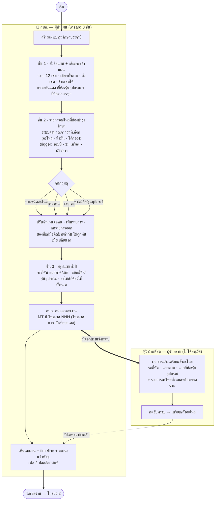

# ช่วงที่ 1 — ออกเลขงาน (แผนประจำปี) + แจ้งฝ่ายพัสดุ

> ที่มา: prototype จริง `maintainance-yearly/` (ช่วงที่ 1) · flow: บำรุงรักษาตามวาระ (To-be)
> 💡 ผังนี้ **sync กับ prototype ปัจจุบัน** (แก้ 8 ส.ค. 2569)
> - เป็น **แผนประจำปี** — **ไม่ต้องเลือกไทรมาส** แล้ว (ตัดขั้นนั้นออก)
> - **ตัดขั้น "ผบพ. เตรียมอะไหล่" ออก** — ช่วงทำแผนยังไม่มีการเตรียมอะไหล่
> - ⚠️ **ฝ่ายพัสดุไม่ใช่ผู้อนุมัติ** — **กบก. กดออกเลขงานเอง**ที่หน้าสรุป แล้วระบบส่งเอกสารไปแจ้งพัสดุให้ทราบว่าต้องเตรียม/สั่งอะไหล่อะไรบ้าง (พัสดุกด "รับทราบ" ไม่บล็อกเฟสถัดไป)
> - ขั้นอะไหล่ **จัดกลุ่มดูได้ 4 แบบ** — ชนิดอะไหล่ / ภาค / เขต / **ยี่ห้อ-รุ่นอุปกรณ์** และ **ปรับจำนวน · เพิ่ม · ตัดออกได้**
> - เลขงาน `MT-ปี-ไทรมาส-NNN` — **ไทรมาสคิดจากวันที่ออกเลขงาน** (ปีงบประมาณ ต.ค.–ก.ย.) ไม่ใช่ผู้ทำแผนเลือก

```mermaid
flowchart TB
    S([เริ่ม])

    subgraph KBK["🏢 กบก. — ผู้ทำแผน (wizard 3 ขั้น)"]
        A[สร้างแผนบำรุงรักษาประจำปี]
        A --> B["ขั้น 1 · ตั้งชื่อแผน + เลือกรถเข้าแผน<br/>กรย. 12 เขต · เลือกทั้งภาค · ทั้งเขต · ข้ามเขตได้<br/>แต่ละคันแสดงยี่ห้อ/รุ่นอุปกรณ์ + ยี่ห้อรถบรรทุก"]
        B --> C["ขั้น 2 · รายการอะไหล่ที่ต้องบำรุงรักษา<br/>ระบบคำนวณจากรถที่เลือก (อะไหล่ · น้ำมัน · ไส้กรอง)<br/>trigger: รอบปี · ชม.เครื่อง · ระยะทาง"]
        C --> C2{"จัดกลุ่มดู"}
        C2 -->|ตามชนิดอะไหล่| C3
        C2 -->|ตามภาค| C3
        C2 -->|ตามเขต| C3
        C2 -->|ตามยี่ห้อ/รุ่นอุปกรณ์| C3
        C3["ปรับจำนวนต่อคัน · เพิ่มรายการ · ตัดรายการออก<br/>ของที่แก้มือติดป้ายกำกับ ไม่ถูกทับเมื่อเปลี่ยนรถ"]
        C3 --> D["ขั้น 3 · สรุปแผนทั้งปี<br/>รถกี่คัน แยกภาค/เขต · แยกยี่ห้อ/รุ่นอุปกรณ์ · อะไหล่ที่ต้องใช้ทั้งหมด"]
        D --> E["กบก. กดออกเลขงาน<br/>MT-ปี-ไทรมาส-NNN (ไทรมาส = ณ วันที่ออกเลข)"]
        E --> J[เห็นเลขงาน + timeline + สถานะแจ้งพัสดุ<br/>เฟส 2 ปลดล็อกทันที]
    end

    subgraph PSD["📦 ฝ่ายพัสดุ — ผู้รับทราบ (ไม่ได้อนุมัติ)"]
        F["เอกสารแจ้งเตรียม/สั่งอะไหล่<br/>รถกี่คัน · แยกภาค · แยกยี่ห้อ/รุ่นอุปกรณ์<br/>+ รายการอะไหล่ทั้งหมดพร้อมยอดรวม"]
        G[กดรับทราบ → เตรียม/สั่งอะไหล่]
        F --> G
    end

    S --> A
    E ==>|ส่งเอกสารแจ้งทราบ| F
    G -. อัปเดตสถานะกลับ .-> J
    J --> Z([ได้เลขงาน → ไปช่วง 2])
```

## ยังค้าง

- **กบก. คือหน่วยงานอะไร** — ใช่ตัวเดียวกับ กบค. ไหม (ยังไม่เคาะ)
- ยี่ห้อ/รุ่นอุปกรณ์ในข้อมูลจำลองมี 5 ตัว (`TADANO TM-ZE304` · `TADANO TM-ZE504` · `UNIC URV554` · `AICHI SK17A` · `KOMATSU PC130-8`) — ยกมาจาก `config.js` และ `repair-history.html` ที่มีอยู่แล้ว **ยังไม่ใช่ทะเบียนจริง**
- อะไหล่ยังผูกกับ **ชนิดรถ** (`appliesToTypes`) ไม่ได้ผูกกับ **ยี่ห้อ** — จัดกลุ่มตามยี่ห้อได้แล้ว แต่รายการอะไหล่ของแต่ละยี่ห้อยังเหมือนกันถ้าชนิดรถเดียวกัน
