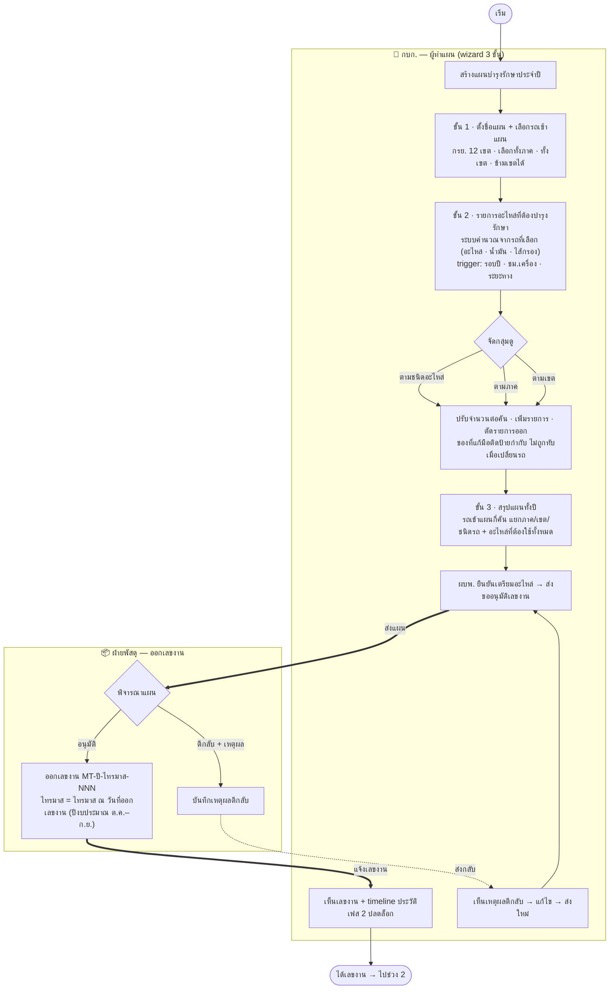

# ช่วงที่ 1 — ออกเลขงาน (แผนประจำปี) + ขออนุมัติข้ามหน่วยงาน

> ที่มา: prototype จริง `maintainance-yearly/` (ช่วงที่ 1) · flow: บำรุงรักษาตามวาระ (To-be)
> 💡 ผังนี้ **sync กับ prototype ปัจจุบัน** (แก้ 8 ส.ค. 2569 — wizard เหลือ 3 ขั้น)
> - เป็น **แผนประจำปี** — **ผู้ทำแผนไม่ต้องเลือกไทรมาส** แล้ว (ตัดขั้นนั้นออก)
> - ขั้นอะไหล่ **จัดกลุ่มดูได้ 3 แบบ** (ชนิดอะไหล่ / ภาค / เขต) และ **ปรับจำนวน · เพิ่ม · ตัดออกได้**
> - ขั้นสุดท้ายเป็น **หน้าสรุปทั้งปี** — รถกี่คัน แยกภาค/เขต + อะไหล่ที่ต้องใช้ทั้งหมด
> - เลขงานยังเป็น `MT-ปี-ไทรมาส-NNN` แต่ **ไทรมาสมาจากตอนฝ่ายพัสดุออกเลขงาน** (ปีงบประมาณ ต.ค.–ก.ย.) ไม่ใช่ผู้ทำแผนเลือก

```mermaid
flowchart TB
    S([เริ่ม])

    subgraph KBK["🏢 กบก. — ผู้ทำแผน (wizard 3 ขั้น)"]
        A[สร้างแผนบำรุงรักษาประจำปี]
        A --> B["ขั้น 1 · ตั้งชื่อแผน + เลือกรถเข้าแผน<br/>กรย. 12 เขต · เลือกทั้งภาค · ทั้งเขต · ข้ามเขตได้"]
        B --> C["ขั้น 2 · รายการอะไหล่ที่ต้องบำรุงรักษา<br/>ระบบคำนวณจากรถที่เลือก (อะไหล่ · น้ำมัน · ไส้กรอง)<br/>trigger: รอบปี · ชม.เครื่อง · ระยะทาง"]
        C --> C2{"จัดกลุ่มดู"}
        C2 -->|ตามชนิดอะไหล่| C3
        C2 -->|ตามภาค| C3
        C2 -->|ตามเขต| C3
        C3["ปรับจำนวนต่อคัน · เพิ่มรายการ · ตัดรายการออก<br/>ของที่แก้มือติดป้ายกำกับ ไม่ถูกทับเมื่อเปลี่ยนรถ"]
        C3 --> D["ขั้น 3 · สรุปแผนทั้งปี<br/>รถเข้าแผนกี่คัน แยกภาค/เขต/ชนิดรถ + อะไหล่ที่ต้องใช้ทั้งหมด"]
        D --> E[ผบพ. ยืนยันเตรียมอะไหล่ → ส่งขออนุมัติเลขงาน]
        H[เห็นเหตุผลตีกลับ → แก้ไข → ส่งใหม่]
        H --> E
        J[เห็นเลขงาน + timeline ประวัติ<br/>เฟส 2 ปลดล็อก]
    end

    subgraph PSD["📦 ฝ่ายพัสดุ — ออกเลขงาน"]
        F{พิจารณาแผน}
        I["ออกเลขงาน MT-ปี-ไทรมาส-NNN<br/>ไทรมาส = ไทรมาส ณ วันที่ออกเลขงาน (ปีงบประมาณ ต.ค.–ก.ย.)"]
        R[บันทึกเหตุผลตีกลับ]
        F -->|อนุมัติ| I
        F -->|ตีกลับ + เหตุผล| R
    end

    S --> A
    E ==>|ส่งแผน| F
    R -. ส่งกลับ .-> H
    I ==>|แจ้งเลขงาน| J
    J --> Z([ได้เลขงาน → ไปช่วง 2])
```

## ยังค้าง

- **จัดกลุ่ม "ตามยี่ห้อ" ยังทำไม่ได้** — ข้อมูลรถมีแค่ `ทะเบียน · ชนิดรถ · เขต · เลขไมล์ · ชม.เครื่อง` **ไม่มีฟิลด์ยี่ห้อ** และอะไหล่ผูกกับ*ชนิดรถ* (`appliesToTypes`) ไม่ใช่*ยี่ห้อ* → ต้องเพิ่มข้อมูลก่อน
- **กบก. คือหน่วยงานอะไร** — ใช่ตัวเดียวกับ กบค. ไหม (ยังไม่เคาะ)
- ฝ่ายพัสดุอนุมัติ **ทั้งแผนทีเดียว** หรืออนุมัติ **รายเขต** ได้
