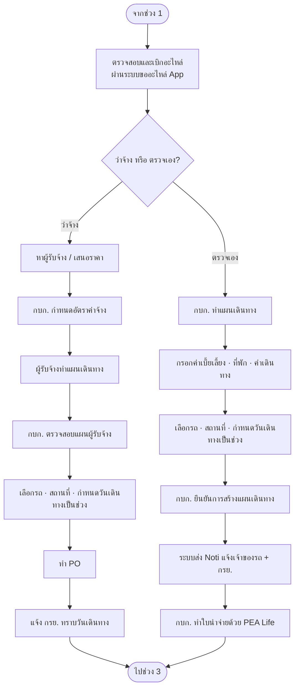

# ช่วงที่ 2 — เบิก/จัดหาอะไหล่ + แผนเดินทาง

> ที่มา: `maintainance-yearly/maintannance-yearly.md` (ช่วงที่ 2) · flow: บำรุงรักษาตามวาระ (To-be)
> 💡 prototype โฟกัสสาย **ตรวจเอง (กบก.)**

```mermaid
flowchart TB
    S([จากช่วง 1]) --> I[ตรวจสอบและเบิกอะไหล่<br/>ผ่านระบบขออะไหล่ App]
    I --> D{ว่าจ้าง หรือ ตรวจเอง?}

    D -->|ว่าจ้าง| A1[หาผู้รับจ้าง / เสนอราคา]
    A1 --> A2[กบก. กำหนดอัตราค่าจ้าง]
    A2 --> A3[ผู้รับจ้างทำแผนเดินทาง]
    A3 --> A4[กบก. ตรวจสอบแผนผู้รับจ้าง]
    A4 --> A5[เลือกรถ · สถานที่ · กำหนดวันเดินทางเป็นช่วง]
    A5 --> A6[ทำ PO]
    A6 --> A7[แจ้ง กรย. ทราบวันเดินทาง]

    D -->|ตรวจเอง| B1[กบก. ทำแผนเดินทาง]
    B1 --> B2[กรอกค่าเบี้ยเลี้ยง · ที่พัก · ค่าเดินทาง]
    B2 --> B3[เลือกรถ · สถานที่ · กำหนดวันเดินทางเป็นช่วง]
    B3 --> B4[กบก. ยืนยันการสร้างแผนเดินทาง]
    B4 --> B5[ระบบส่ง Noti แจ้งเจ้าของรถ + กรย.]
    B5 --> B6[กบก. ทำใบนำจ่ายด้วย PEA Life]

    A7 --> E([ไปช่วง 3])
    B6 --> E
```
