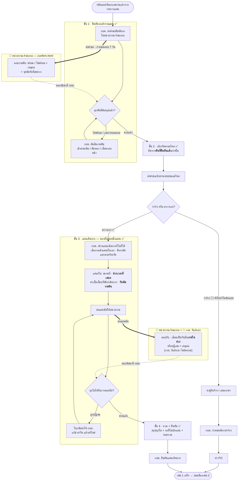

# เฟส 1 — ยืนยันรถ + เบิก/จัดหาอะไหล่ + แผนเดินทาง

> **สถานะ prototype: ✅ ทำครบทั้งเฟส** (สายตรวจเอง) — `maintainance-yearly/app.js` + `confirm.html`
> ที่มา: `maintainance-yearly/maintannance-yearly.md` + `plan-skeleton.html` · flow: บำรุงรักษาตามวาระ (To-be)
> 💡 ผังนี้ sync กับโค้ดรอบ **11 ส.ค. 2569**
> - **เฟสแรกของ stepper** — เข้ามาด้วยการ**หยิบแผนที่ออกเลขงานแล้วจากรายการแผน** ([ภาพรวม](00-ภาพรวม.md))
> - **ฝ่ายพัสดุไม่บล็อก** — พัสดุแค่รับทราบเอกสารจากตอนออกเลขงาน เฟสนี้เดินต่อได้เลย
> - เฟสนี้จบเมื่อ **ยืนยันแผนเดินทาง** (`plan.travelConfirmed === true`) แล้วเฟส 2 ปลดล็อก

## ลำดับ 4 ขั้นใน wizard ย่อย

```
1 ยืนยันรถเข้าร่วมแผน → 2 เบิก/จัดหาอะไหล่ → 3 แผนเดินทาง → 4 ทวน + ยืนยัน
```

🔒 **สลับลำดับ 10 ส.ค. 2569 ตามที่เจ้าของงานสั่ง** — เดิมเบิกอะไหล่มาก่อน
*"เฟสทบทวนและยืนยันต้องเกิดก่อนที่จะเบิกอะไหล่ หลังจากยืนยันครบแล้วถึงจะเริ่มทำเรื่องจัดหาอะไหล่ และถึงไปเริ่มทำแผนการเดินทาง"*
เหตุผล: ตารางอะไหล่คำนวณจากจำนวนรถ ถ้าเบิกก่อนยืนยันจะสั่งของเกินให้คันที่ถูกตัด/เลื่อน

**กดข้ามขั้นไม่ได้** — คลิกหัวข้อบน stepper เพื่อเดินหน้าจะถูกกันไว้จนกว่าทุกขั้นก่อนหน้าจะผ่าน (ถอยกลับไปดูขั้นเก่าได้เสมอ)



## กติกาที่เคาะแล้ว

**ขั้น 1 · ยืนยันรถ** (เคาะ 10 ส.ค. 2569)

| เรื่อง | กติกา |
|---|---|
| ผู้ตอบ | **หน่วยงานเจ้าของรถ** — ไม่แยกเป็นเจ้าของรถ/กรย. อีกแล้ว |
| กำหนดตอบ | **7 วัน** (ตั้งค่าได้ที่ Admin ไม่ hardcode) |
| ไม่ตอบตามกำหนด | **ระบบไม่ตัดรถเอง** — ขึ้นป้าย "เลยกำหนด" ให้ กบค. กดตัดสิน เหมือนคันที่ตอบว่าไม่พร้อม |
| แก้คำตอบ | ได้จนกว่า กบค. จะยืนยันแผนเดินทาง แล้วล็อก · เก็บประวัติการแก้ทุกครั้ง |
| คำตัดสิน กบค. | **ชนะคำตอบของหน่วยงานเสมอ** — สั่ง "เข้าตามเดิม" ได้แม้หน่วยงานตอบว่าไม่พร้อม |

**ขั้น 3 · แผนเดินทาง** (เคาะ 10 ส.ค. 2569)

| เรื่อง | กติกา |
|---|---|
| จำนวนใบ | **อิสระ** — จังหวัดละใบ หรือจังหวัดละหลายใบก็ได้ · *"เลือกรถได้ เลือกแผน"* |
| ระดับใบ | สถานที่ · ช่วงเวลาที่เสนอ · ค่าใช้จ่าย |
| ระดับคัน | **วันนัดรายคัน** ต้องอยู่ในช่วงของใบนั้น |
| ผู้ตอบ | หน่วยงานเจ้าของรถ **ต่อใบ** (ใบหนึ่งอาจมีหลายหน่วยงาน ต่างคนต่างตอบเฉพาะรถของตัวเอง) |
| เอกสาร | ส่งถึงเจ้าของรถ **และ กรย.** — กรย. รับสำเนา ไม่ต้องกดตอบ |
| จบขั้น | **จัดรถเข้าใบครบทุกคัน** + **ทุกใบได้รับการตอบรับ** |

## เงื่อนไขที่ยังไม่เคาะ

**ยืนยันรถ**
- **ใครในหน่วยงาน**เป็นผู้มีสิทธิ์กดตอบ (ตอนนี้พิมพ์ชื่อผู้ตอบเอง ยังไม่ผูก role)
- **จำนวนวันจริง** ที่ให้ตอบ (ตั้ง 7 วันไว้ก่อน)
- **"หน่วยงานเจ้าของรถ" ของจริงดึงจากไหน** — ตอนนี้ยกจาก `hierarchy-data.json` ของจริงต้อง join กับ `mas_department`

**แผนเดินทาง**
- คันที่ถูก **"เลื่อนรอบหน้า"** ต้องไปโผล่ในแผนปีถัดไปอัตโนมัติไหม
- **เอกสารพัสดุออกตอนออกเลขงาน ซึ่งเกิดก่อนยืนยันรถ** ⇒ ยอดในเอกสารเป็นของแผนเต็ม แต่ที่เบิกจริงน้อยกว่า — จะให้เป็นประมาณการ หรือมีใบปรับยอดตามทีหลัง
- ต้นแบบทำ **เฉพาะสายตรวจเอง** — ทำสายว่าจ้างด้วยไหม · เลือก "ว่าจ้าง/ตรวจเอง" ตรงไหน

> ตอบได้ที่ [`maintainance-yearly/plan-skeleton.html`](../../maintainance-yearly/plan-skeleton.html) — พิมพ์คำตอบ ติ๊กเคาะแล้ว แล้ว export เป็น Markdown

## 🆕 ฟอร์มแผนเดินทาง (17 ส.ค. 2569)

เจ้าของงานระบุสิ่งที่ กบค. ต้องกรอกตอนสร้างแผนเดินทาง — **หยิบแผนของแต่ละไตรมาสออกมากำหนดช่วงการเดินทาง**

| ระดับ | ข้อมูล |
|---|---|
| ระดับใบ | ชื่อแผน · ช่วงที่เสนอ (จาก–ถึง) · **พนักงาน กบค. ที่ออกไปซ่อม (ปกติ 2-3 คน)** · ค่าเบี้ยเลี้ยง · ค่าที่พัก · ค่าเดินทาง |
| ระดับรายคัน | **งานที่จะทำ — เปลี่ยนถ่ายน้ำมันไฮดรอลิก / ตรวจน้ำมันไฮดรอลิก** (เลือกอย่างเดียวหรือทั้งสองก็ได้ · ตั้งต้นติ๊กทั้งคู่) · **สถานที่บำรุงรักษา** · วันนัด · ไตรมาส (ย้าย/พักได้) |

**ค่าตั้งต้นของสถานที่บำรุงรักษา** — รถของหน่วยงานระดับจังหวัด/สาขา → **จังหวัดที่สังกัด** · รถของเขต (`ownerLevel='region'`) → **กรย. เขต N** · แก้รายคันได้ ลบข้อความทิ้งแล้วกลับไปใช้ค่าตั้งต้น

**ส่งใบไม่ได้จนกว่า** จะมีพนักงานอย่างน้อย 1 คน · ทุกคันเลือกงานอย่างน้อย 1 อย่าง · วันนัดครบและอยู่ในช่วงที่เสนอ

⚠️ **ข้อจำกัดที่ต้องรู้**
- `ownerLevel` (รถเขต/รถจังหวัด) เป็น**ข้อมูลจำลอง** — วนให้ทุก 6 คันเป็นรถเขต 1 คัน · ของจริงต้องดูจาก `mas_department` ว่าหน่วยเจ้าของอยู่ระดับไหน
- **สถานที่ยังเป็นข้อความอิสระ ไม่มีพิกัด/แผนที่** และไม่มีทะเบียนสถานที่ให้เลือก — ถ้าจะรองรับ location จริง ต้องรู้ก่อนว่า VMS Plus มี master สถานที่ให้ดึงหรือไม่ (ยังไม่เคยเห็น API นั้น)

