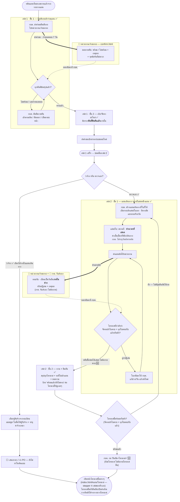

# เฟส 1 เบิก/จัดหา + เฟส 2 แผนเดินทาง

> **สถานะ prototype: ✅ ทำครบทั้งสองเฟส** (สายตรวจเอง) — `maintainance-yearly/app.js` + `confirm.html`
> ที่มา: `maintainance-yearly/maintannance-yearly.md` + `plan-skeleton.html` · flow: บำรุงรักษาตามวาระ (To-be)
> 💡 ผังนี้ sync กับโค้ดรอบ **28 ส.ค. 2569**
>
> 🆕 **ยืนยันแผนเดินทางทีละไตรมาส + พาเข้าหน้าไตรมาสตรงๆ (28 ส.ค. 2569 เจ้าของงานสั่ง)** — เดิมขั้น "ทวน +
> ยืนยัน" มีปุ่มเดียวกดยืนยันทั้งแผน ต้องรอครบทั้ง 4 ไตรมาสก่อน ตอนนี้**ยืนยันได้ทีละไตรมาสตามที่พร้อม**
> (ปุ่ม "ยืนยัน&lt;ไตรมาส&gt;" ต่อไตรมาส ไม่มีเกณฑ์บล็อกแล้ว) กดแล้วพาเข้า**หน้าไตรมาสนั้นตรงๆ**
> (`index.html#<planId>/<Q1-4>`) ซึ่งมี stepper 4 เฟสของตัวเอง — **4 เฟสท้ายของ stepper เดิม (ตรวจสภาพก่อนซ่อม/
> ดำเนินการบำรุงรักษา/จัดทำรายงาน/คำนวณต้นทุน) จึงย้ายออกจาก stepper ของแผนไปเป็นหน้าแยกนี้** (ดู
> [00-ภาพรวม.md](00-ภาพรวม.md)) · ไตรมาสที่ยืนยันแล้วเปิดดำเนินการซ้ำได้จาก "รายการไตรมาส" ท้ายเฟสนี้
> · shell ของเฟส "แผนเดินทาง" ไม่มีปุ่ม "ย้อนกลับ"/"ถัดไป" อีกแล้วด้วย — สลับขั้นย่อยด้วยการกดหัวข้อ sub-stepper
> ได้เลย ไม่ต้องผ่านเกณฑ์อะไรก่อน (ตัดเกณฑ์ "ต้องพร้อมครบทั้ง 4 ไตรมาสก่อนไปขั้นทวน+ยืนยัน" ออกพร้อมกัน)
> · ขั้น "ทำแผนเดินทาง" ก็เปลี่ยนจากแท็บสลับทีละไตรมาสเป็น**รายการพับ/กางทั้ง 4 ไตรมาสพร้อมกัน**เช่นกัน
>
> 🧩 **แผนเดินทางแยกเป็นโมดูล + หน้าเดี่ยว 25 ส.ค. 2569 ตามที่เจ้าของงานสั่ง** —
> *"อยากให้แยก prototype ออกมา ตรงจังหวะการสร้างแผนการเดินทาง ของบำรุงรักษา"*
> โค้ดขั้นแผนเดินทาง (558 บรรทัด) ย้ายจาก `app.js` ไป **`maintainance-yearly/trip-plan.js`** (`window.TRIP`)
> ซึ่ง**ไม่รู้จัก stepper/เฟส/routing เลย** — host คุยกับโมดูลผ่าน callback `onChange` / `onValidity` / `onConfirm`
> ⇒ ตอนนี้มี **2 ทางเข้าที่ใช้โมดูลเดียวกัน แต่หน้าตา/เกณฑ์ต่างกันแล้ว** (28 ส.ค. 2569):
> · `index.html` — เฟส 2 ของ stepper ของแผน — ยืนยันทีละไตรมาส (ไม่มีเกณฑ์ครบ 4 ไตรมาส) + ไม่มีปุ่ม
>   ย้อนกลับ/ถัดไปของ shell แล้ว (`opts.showConfirm:true` บอกโมดูลให้วาดปุ่มยืนยันในเนื้อขั้นเอง)
> · **`trip-plan.html`** — หน้าเดี่ยว เลือกแผน → เลือกไตรมาส → ทำแผนเดินทาง → ทวน + ยืนยัน — **ยังคงปุ่ม
>   เดียวยืนยันทั้งแผน + เกณฑ์ครบ 4 ไตรมาสของเดิมไว้** (ยังไม่ได้ปรับตามการเปลี่ยนแปลง 28 ส.ค. 2569 — นอกขอบเขต
>   รอบนั้น) ไม่มีปุ่ม "ไปเฟสถัดไป" เพราะไม่ส่ง `onNextPhase` · ข้อมูลชุดเดียวกับหน้ารายการแผน สลับไปมาได้
> *(ชื่อไฟล์ยังเป็น `02-เฟส1-...` เพื่อไม่ให้ลิงก์ในไฟล์อื่นพัง — เนื้อในครอบทั้งเฟส 1 และเฟส 2)*
> - **สองเฟสแรกของ stepper** — เข้ามาด้วยการ**หยิบแผนที่ออกเลขงานแล้วจากรายการแผน** ([ภาพรวม](00-ภาพรวม.md))
> - **ฝ่ายพัสดุไม่บล็อก** — พัสดุแค่รับทราบเอกสารจากตอนออกเลขงาน เฟสนี้เดินต่อได้เลย
> - เฟส 1 จบเมื่อ **ยืนยันรถครบทุกคัน + ส่งคำขอเบิกอะไหล่แล้ว** (`plan.partsRequisitioned === true`) แล้วเฟส 2 ปลดล็อก
> - เฟส 2 จบเมื่อ **ทุกไตรมาสที่มีรถยืนยันแผนเดินทางครบแล้ว** (`plan.travelConfirmed === true` — ตอนนี้ตั้งอัตโนมัติ
>   เมื่อไตรมาสสุดท้ายที่มีรถถูกยืนยัน) — ปลดล็อกอะไร: ไม่มี "เฟส 3" ของแผนให้ปลดอีกต่อไป แต่ละไตรมาสที่ยืนยันแล้ว
>   เปิดหน้าไตรมาสของตัวเองได้ทันทีโดยไม่ต้องรอไตรมาสอื่น (ดูย่อหน้า 🆕 ด้านบน)

## ลำดับขั้น — 2 เฟส เฟสละ 2 ขั้น

```
เฟส 1 · เบิก/จัดหา   :  1 ยืนยันรถเข้าร่วมแผน → 2 เบิก/จัดหาอะไหล่
เฟส 2 · แผนเดินทาง   :  1 ทำแผนเดินทาง (หลายใบ) → 2 ทวน + ยืนยัน
```

🔒 **แยก "เบิก/จัดหา" กับ "แผนเดินทาง" ออกจากกัน 21 ส.ค. 2569 ตามที่เจ้าของงานสั่ง** —
*"แยกขั้นตอนของ เบิก/จัดหา+แผนเดินทาง โดยแยกแผนเดินทางออกมาเป็นขั้นตอนที่ 2 แล้ว เบิก/จัดหา เป็นขั้นตอนที่ 1
และเลื่อนสถานะที่ไม่ได้ปรับออกเป็น 3,4,5,6 ตามเดิม"*
เดิมทั้งสองอย่างอยู่ในเฟสเดียวกัน (ป้ายเฟสเขียนติดกันว่า "เบิก/จัดหา + แผนเดินทาง") ตอนนี้เป็นคนละเฟสบน stepper
⇒ stepper ของแผนกลายเป็น **2 เฟส**: 1 เบิก/จัดหา · 2 แผนเดินทาง (4 เฟสท้าย — ตรวจสภาพก่อนซ่อม/ดำเนินการ
บำรุงรักษา/จัดทำรายงาน/คำนวณต้นทุน — แยกเป็น stepper ของหน้าไตรมาสแล้วตั้งแต่ 28 ส.ค. 2569 ดู [00-ภาพรวม.md](00-ภาพรวม.md))
**ลำดับการทำงานไม่เปลี่ยน** — ยืนยันรถ → เบิกอะไหล่ → แผนเดินทาง → ทวน+ยืนยัน เหมือนเดิมทุกประการ

🔒 **สลับลำดับ 10 ส.ค. 2569 ตามที่เจ้าของงานสั่ง** — เดิมเบิกอะไหล่มาก่อน
*"เฟสทบทวนและยืนยันต้องเกิดก่อนที่จะเบิกอะไหล่ หลังจากยืนยันครบแล้วถึงจะเริ่มทำเรื่องจัดหาอะไหล่ และถึงไปเริ่มทำแผนการเดินทาง"*
เหตุผล: ตารางอะไหล่คำนวณจากจำนวนรถ ถ้าเบิกก่อนยืนยันจะสั่งของเกินให้คันที่ถูกตัด/เลื่อน

**กดข้ามไม่ได้ทั้งสองระดับ** — ข้ามขั้นใน wizard ไม่ได้ และคลิกเฟส 2 บน stepper หลักไม่ได้จนกว่าเฟส 1 จะจบ
(ถอยกลับไปดูขั้น/เฟสเก่าได้เสมอ)



## กติกาที่เคาะแล้ว

**เฟส 1 · ขั้น 1 · ยืนยันรถ** (เคาะ 10 ส.ค. 2569)

| เรื่อง | กติกา |
|---|---|
| ผู้ตอบ | **หน่วยงานเจ้าของรถ** — ไม่แยกเป็นเจ้าของรถ/กรย. อีกแล้ว |
| กำหนดตอบ | **7 วัน** (ตั้งค่าได้ที่ Admin ไม่ hardcode) |
| ไม่ตอบตามกำหนด | **ระบบไม่ตัดรถเอง** — ขึ้นป้าย "เลยกำหนด" ให้ กบค. กดตัดสิน เหมือนคันที่ตอบว่าไม่พร้อม |
| แก้คำตอบ | ได้จนกว่า กบค. จะยืนยันแผนเดินทาง แล้วล็อก · เก็บประวัติการแก้ทุกครั้ง |
| คำตัดสิน กบค. | **ชนะคำตอบของหน่วยงานเสมอ** — สั่ง "เข้าตามเดิม" ได้แม้หน่วยงานตอบว่าไม่พร้อม |

**เฟส 2 · ขั้น 1 · แผนเดินทาง** (เคาะ 10 ส.ค. 2569)

| เรื่อง | กติกา |
|---|---|
| จำนวนใบ | **อิสระ** — จังหวัดละใบ หรือจังหวัดละหลายใบก็ได้ · *"เลือกรถได้ เลือกแผน"* |
| ระดับใบ | สถานที่ · ช่วงเวลาที่เสนอ · ค่าใช้จ่าย |
| ระดับคัน | **วันนัดรายคัน** — **หน่วยงานเจ้าของรถเป็นคนเลือกเอง** ตอนตอบรับ (ไม่ใช่ กบค.) ต้องอยู่ในช่วงของใบนั้น |
| ผู้ตอบ | หน่วยงานเจ้าของรถ **ต่อใบ** (ใบหนึ่งอาจมีหลายหน่วยงาน ต่างคนต่างตอบเฉพาะรถของตัวเอง) |
| เอกสาร | ส่งถึงเจ้าของรถ **และ กรย.** — กรย. รับสำเนา ไม่ต้องกดตอบ |
| ไปขั้น 2 (ทวน + ยืนยัน) | **ไม่มีเกณฑ์แล้ว** (เคาะ 28 ส.ค. 2569 — เดิมต้องพร้อมอย่างน้อย 1 ไตรมาสก่อน, ก่อนหน้านั้นอีกต้องครบทั้ง 4 ไตรมาส) สลับขั้นย่อยด้วยการกดหัวข้อ sub-stepper ได้เสมอ ไม่มีปุ่ม "ถัดไป" ของ shell ให้กดแล้ว — ⚠️ **รถที่พักไว้แบบ "ยังไม่ระบุไตรมาส" ไม่นับเข้าเกณฑ์ความพร้อมของไตรมาสไหนเลย** (เจ้าของงานเคาะ 20 ส.ค. 2569) |
| กด "ยืนยัน&lt;ไตรมาส&gt;" (ขั้น 2) | **ยืนยันได้ทีละไตรมาสตามที่พร้อม** (เคาะ 28 ส.ค. 2569 — เดิมต้องครบทั้ง 4 ไตรมาสก่อนถึงจะกดปุ่มเดียวยืนยันทั้งแผนได้) ไตรมาสไหนพร้อม (`MYD.quarterTravelReady`) มีปุ่มให้กด กดแล้วบันทึก `plan.travelConfirmedByQuarter[q]` + **เปิดหน้าไตรมาสนั้นตรงๆ** · ยืนยันครบทุกไตรมาสที่มีรถแล้ว `plan.travelConfirmed` ตั้งเป็น `true` ให้อัตโนมัติ (เพื่อความเข้ากันได้กับส่วนอื่นที่ยังอ่านธงนี้ เช่น `confirm.js`) |

## เงื่อนไขที่ยังไม่เคาะ

**ยืนยันรถ**
- **ใครในหน่วยงาน**เป็นผู้มีสิทธิ์กดตอบ (ตอนนี้พิมพ์ชื่อผู้ตอบเอง ยังไม่ผูก role)
- **จำนวนวันจริง** ที่ให้ตอบ (ตั้ง 7 วันไว้ก่อน)
- **"หน่วยงานเจ้าของรถ" ของจริงดึงจากไหน** — ตอนนี้ยกจาก `hierarchy-data.json` ของจริงต้อง join กับ `mas_department`

**แผนเดินทาง**
- คันที่ถูก **"เลื่อนรอบหน้า"** ต้องไปโผล่ในแผนปีถัดไปอัตโนมัติไหม
- **เอกสารพัสดุออกตอนออกเลขงาน ซึ่งเกิดก่อนยืนยันรถ** ⇒ ยอดในเอกสารเป็นของแผนเต็ม แต่ที่เบิกจริงน้อยกว่า — จะให้เป็นประมาณการ หรือมีใบปรับยอดตามทีหลัง
- ~~ต้นแบบทำเฉพาะสายตรวจเอง — ทำสายว่าจ้างด้วยไหม · เลือก "ว่าจ้าง/ตรวจเอง" ตรงไหน~~ ✅ **เคาะแล้ว 17 ส.ค. 2569:** ทำสายว่าจ้างด้วย และ**เลือกรายใบแผนเดินทาง** (ใบหนึ่งจ้าง อีกใบตรวจเองได้ในแผนเดียวกัน) — เลือกผู้รับจ้างจากทะเบียน แล้ว assign ใบนั้นให้เลย · โหมดจ้างคิดค่าใช้จ่ายเป็น **ค่าจ้างเหมา** แทนเบี้ยเลี้ยง/ที่พัก/เดินทาง · ⚠️ ทะเบียนผู้รับจ้างเป็น**ข้อมูลจำลอง** ยังไม่มีของจริงจาก VMS Plus · ขั้นเสนอราคา/ทำ PO ยังไม่ทำ

> ตอบได้ที่ [`maintainance-yearly/plan-skeleton.html`](../../maintainance-yearly/plan-skeleton.html) — พิมพ์คำตอบ ติ๊กเคาะแล้ว แล้ว export เป็น Markdown

## 🆕 ฟอร์มแผนเดินทาง (17 ส.ค. 2569)

เจ้าของงานระบุสิ่งที่ กบค. ต้องกรอกตอนสร้างแผนเดินทาง — **หยิบแผนของแต่ละไตรมาสออกมากำหนดช่วงการเดินทาง**

| ระดับ | ข้อมูล |
|---|---|
| ระดับใบ | ชื่อแผน · ช่วงที่เสนอ (จาก–ถึง) · **ผู้ดำเนินการ: กบค. ตรวจเอง / จ้างผู้รับจ้าง** · ถ้าตรวจเอง → **พนักงาน กบค. (ปกติ 2-3 คน)** + ค่าเบี้ยเลี้ยง/ที่พัก/เดินทาง · ถ้าจ้าง → **ผู้รับจ้าง + ค่าจ้างเหมา** |
| ระดับรายคัน | **งานที่จะทำ — เปลี่ยนถ่ายน้ำมันไฮดรอลิก / ตรวจน้ำมันไฮดรอลิก / เปลี่ยนตัวกรอง** (ติ๊กกี่อย่างก็ได้ แต่ต้องอย่างน้อย 1 · ตั้งต้นติ๊ก 2 งานน้ำมัน ส่วน *เปลี่ยนตัวกรอง* (เพิ่ม 21 ส.ค. 2569) ตั้งต้นไม่ติ๊ก — เลือกเพิ่มรายคัน) · **สถานที่บำรุงรักษา** — *วันนัดไม่อยู่ที่นี่ (หน่วยงานเจ้าของรถเลือกเองตอนตอบรับ) · ไตรมาสก็ย้ายที่นี่ไม่ได้ กำหนดตั้งแต่ตอนสร้างแผน* |

**ค่าตั้งต้นของสถานที่บำรุงรักษา** — รถของหน่วยงานระดับจังหวัด/สาขา → **จังหวัดที่สังกัด** · รถของเขต (`ownerLevel='region'`) → **กรย. เขต N** · แก้รายคันได้ ลบข้อความทิ้งแล้วกลับไปใช้ค่าตั้งต้น

**ส่งใบไม่ได้จนกว่า** จะมีพนักงานอย่างน้อย 1 คน · ทุกคันเลือกงานอย่างน้อย 1 อย่าง · มีสถานที่และช่วงเวลาที่เสนอครบ
*(ไม่บังคับวันนัดรายคันอีกต่อไป — เป็นหน้าที่ของหน่วยงานเจ้าของรถตอนตอบรับ)*

⚠️ **ข้อจำกัดที่ต้องรู้**
- `ownerLevel` (รถเขต/รถจังหวัด) เป็น**ข้อมูลจำลอง** — วนให้ทุก 6 คันเป็นรถเขต 1 คัน · ของจริงต้องดูจาก `mas_department` ว่าหน่วยเจ้าของอยู่ระดับไหน
- **สถานที่ยังเป็นข้อความอิสระ ไม่มีพิกัด/แผนที่** และไม่มีทะเบียนสถานที่ให้เลือก — ถ้าจะรองรับ location จริง ต้องรู้ก่อนว่า VMS Plus มี master สถานที่ให้ดึงหรือไม่ (ยังไม่เคยเห็น API นั้น)

