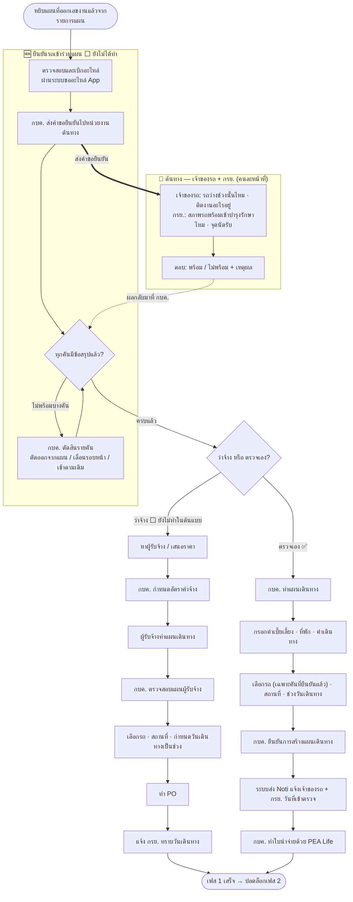

# เฟส 1 — เบิก/จัดหาอะไหล่ + ยืนยันรถ + แผนเดินทาง

> **สถานะ prototype: ◐ ทำบางส่วน** — เบิกอะไหล่ + แผนเดินทาง (สายตรวจเอง) ✅ `maintainance-yearly/app.js` · **ยืนยันรถ ⬜ ยังไม่ได้ทำ**
> ที่มา: `maintainance-yearly/maintannance-yearly.md` + `plan-skeleton.html` (เฟส 1) · flow: บำรุงรักษาตามวาระ (To-be)
> 💡 ผังนี้ **sync กับ prototype ปัจจุบัน** (โครงใหม่ 8 ส.ค. · เพิ่มขั้นยืนยันรถ 9 ส.ค. 2569)
> - **เฟสแรกของ stepper** — เข้ามาที่นี่ด้วยการ **หยิบแผนที่ออกเลขงานแล้วจากรายการแผน** ไม่ใช่ไหลต่อมาจากหน้าออกเลขงาน ([ภาพรวม](00-ภาพรวม.md))
> - **ฝ่ายพัสดุไม่บล็อก** — พัสดุแค่รับทราบเอกสารจากตอนออกเลขงาน เฟสนี้เดินต่อได้เลย
> - 🆕 **ยืนยันรถต้องมาก่อนแผนเดินทาง** — ต้องรู้ก่อนว่ารถคันไหนเข้าได้จริง ถึงจะวางวัน · จุดนัด · คำนวณเบี้ยเลี้ยงได้ถูก
> - เฟสนี้ถือว่า **จบเมื่อยืนยันแผนเดินทาง** (`plan.travelConfirmed === true`) แล้วเฟส 2 ถึงปลดล็อก

## เงื่อนไขที่ยังไม่เคาะ

**ยืนยันรถ (ใหม่ 9 ส.ค.)**
- เจ้าของรถกับ กรย. **ต้องตอบทั้งคู่ไหม** หรือคนใดคนหนึ่งพอ
- **กำหนดตอบภายในกี่วัน** · ถ้าไม่ตอบถือว่าพร้อมหรือไม่พร้อม
- ตอบไปแล้ว **แก้คำตอบได้ไหม** ถึงเมื่อไหร่
- **"หน่วยงานเจ้าของรถ" ดึงจากไหน** — ยังไม่มีในข้อมูลจำลอง

**เบิก/จัดหา + แผนเดินทาง**
- ต้นแบบทำ **เฉพาะสายตรวจเอง** — ทำสายว่าจ้างด้วยไหม
- เลือก "ว่าจ้าง / ตรวจเอง" **ตรงไหน** — ที่เฟสนี้ หรือย้ายไปเลือกตอนออกเลขงาน
- แผนเดินทาง **1 แผน = 1 ทริป** หรือหลายทริปในแผนเดียว

> ตอบได้ที่ [`maintainance-yearly/plan-skeleton.html`](../../maintainance-yearly/plan-skeleton.html) — พิมพ์คำตอบ ติ๊กเคาะแล้ว แล้ว export เป็น Markdown ได้เลย
