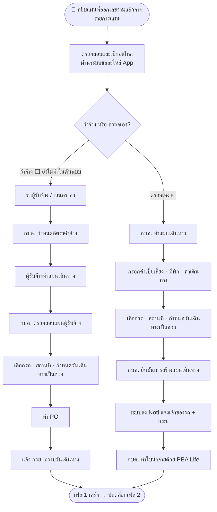

# เฟส 1 — เบิก/จัดหาอะไหล่ + แผนเดินทาง

> **สถานะ prototype: ✅ ทำแล้ว** (เฉพาะ **สายตรวจเอง**) — `maintainance-yearly/app.js` · procurement wizard 3 ขั้น
> ที่มา: `maintainance-yearly/maintannance-yearly.md` + `skeleton.html` (เฟส 1) · flow: บำรุงรักษาตามวาระ (To-be)
> 💡 ผังนี้ **sync กับ prototype ปัจจุบัน** (โครงใหม่ 8 ส.ค. 2569)
> - **เฟสแรกของ stepper** — เข้ามาที่นี่ด้วยการ **หยิบแผนที่ออกเลขงานแล้วจากรายการแผน** ไม่ใช่ไหลต่อมาจากหน้าออกเลขงาน ([ภาพรวม](00-ภาพรวม.md))
> - **ฝ่ายพัสดุไม่บล็อก** — พัสดุแค่รับทราบเอกสารจากตอนออกเลขงาน เฟสนี้เดินต่อได้เลย
> - เฟสนี้ถือว่า **จบเมื่อยืนยันแผนเดินทาง** (`plan.travelConfirmed === true`) แล้วเฟส 2 ถึงปลดล็อก

## เงื่อนไขที่ยังไม่เคาะ

- ต้นแบบทำ **เฉพาะสายตรวจเอง** — ทำสายว่าจ้างด้วยไหม
- เลือก "ว่าจ้าง / ตรวจเอง" **ตรงไหน** — ที่เฟสนี้ หรือย้ายไปเลือกตอนออกเลขงาน
- แผนเดินทาง **1 แผน = 1 ทริป** หรือหลายทริปในแผนเดียว

> เก็บรวมไว้ที่ [`maintainance-yearly/skeleton.html`](../../maintainance-yearly/skeleton.html)
