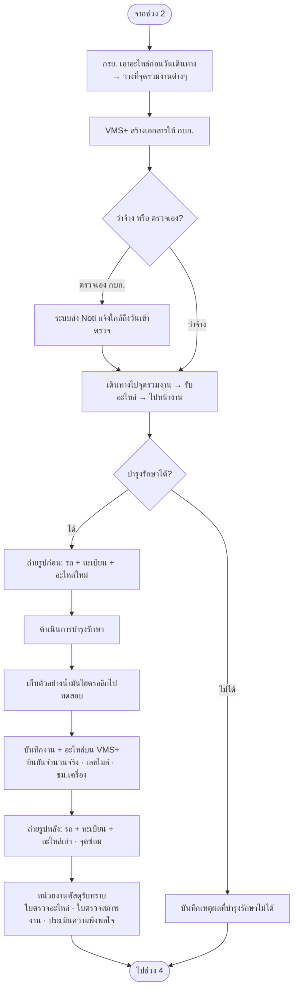

# ช่วงที่ 3 — ดำเนินการบำรุงรักษา

> ที่มา: `maintainance-yearly/maintannance-yearly.md` (ช่วงที่ 3) · flow: บำรุงรักษาตามวาระ (To-be)

```mermaid
flowchart TB
    S([จากช่วง 2]) --> P[กรย. เอาอะไหล่ก่อนวันเดินทาง<br/>→ วางที่จุดรวมงานต่างๆ]
    P --> Q[VMS+ สร้างเอกสารให้ กบก.]
    Q --> D{ว่าจ้าง หรือ ตรวจเอง?}
    D -->|ตรวจเอง กบก.| N0[ระบบส่ง Noti แจ้งใกล้ถึงวันเข้าตรวจ]
    N0 --> R[เดินทางไปจุดรวมงาน → รับอะไหล่ → ไปหน้างาน]
    D -->|ว่าจ้าง| R
    R --> DEC{บำรุงรักษาได้?}
    DEC -->|ไม่ได้| X[บันทึกเหตุผลที่บำรุงรักษาไม่ได้]
    DEC -->|ได้| C1[ถ่ายรูปก่อน: รถ + ทะเบียน + อะไหล่ใหม่]
    C1 --> C2[ดำเนินการบำรุงรักษา]
    C2 --> C3[เก็บตัวอย่างน้ำมันไฮดรอลิกไปทดสอบ]
    C3 --> C4[บันทึกงาน + อะไหล่บน VMS+<br/>ยืนยันจำนวนจริง · เลขไมล์ · ชม.เครื่อง]
    C4 --> C5[ถ่ายรูปหลัง: รถ + ทะเบียน + อะไหล่เก่า · จุดซ่อม]
    C5 --> C6[หน่วยงานพัสดุรับทราบ<br/>ใบตรวจอะไหล่ · ใบตรวจสภาพงาน · ประเมินความพึงพอใจ]
    C6 --> E([ไปช่วง 4])
    X --> E
```
