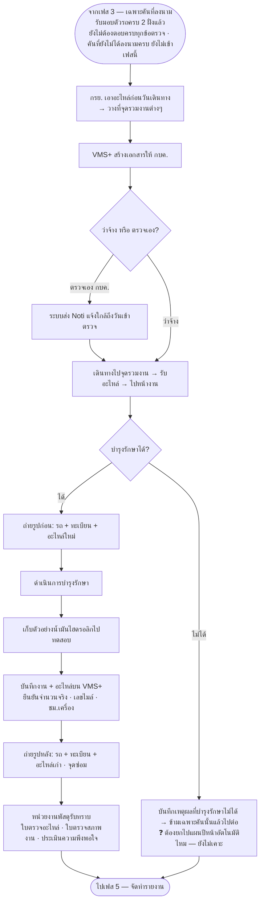

# เฟส 4 — ดำเนินการบำรุงรักษา

> 🔁 **สลับมาเป็นเฟส 3 (20 ส.ค. 2569)** — เดิมเป็นเฟส 2 · "ตรวจสภาพก่อนซ่อม" ขึ้นมาเป็นเฟส 2 แทน
> *(ชื่อไฟล์ยังเป็น `03-เฟส2-...` เพื่อไม่ให้ลิงก์ในไฟล์อื่นพัง)*
> 🔁 **เลื่อนอีกครั้งเป็นเฟส 4 (21 ส.ค. 2569)** — เฟส "เบิก/จัดหา + แผนเดินทาง" แยกเป็น 2 เฟส
> ทำให้เฟสถัดจากนี้ทั้งหมดเลื่อนขึ้นอีก 1 (เฟส 3 เดิม → เฟส 4)

> **สถานะ prototype: 🟡 ทำบางส่วน** — `maintainance-yearly/app.js` (`renderMaintenance`)
> แสดง **รายการรถ + "รายละเอียดงาน" รายคัน** (ติ๊กได้ทีละงาน) ที่ยกมาจากที่เลือกไว้ตอนทำแผนเดินทาง (เฟส 2 · ขั้น 1)
> · 🔓 **เห็นเฉพาะคันที่ลงนามรับมอบตัวรถครบ 2 ฝั่งแล้ว** (`MYD.inspectionReceived`) — ไม่ต้องรอตอบครบทุก
>   รายการตรวจ เพราะลงมือบำรุงรักษาได้ทันทีที่รับมอบตัวรถ · คันที่ยังไม่ได้ลงนามครบไม่ขึ้นที่นี่ และหน้าจอบอกว่า
>   เหลืออีกกี่คัน (เจ้าของงานสั่ง 20 ส.ค. 2569 · ผ่อนเงื่อนไข 25 ส.ค. 2569 เหลือแค่ลงนาม 2 ฝั่ง · เข้มขึ้นอีกครั้ง
>   26 ส.ค. 2569 ให้ต้องตรวจครบทุกข้อด้วย · **ผ่อนกลับเหลือแค่ลงนามอีกครั้ง 27 ส.ค. 2569**)
>   ⚠️ **เฟส 5 จัดทำรายงานยังใช้เกณฑ์เข้มเดิม** (`MYD.inspectionDone` — ต้องตอบครบทุกข้อตรวจด้วย) — สองเฟสนี้
>   ใช้เกณฑ์คนละตัวกันตั้งแต่ 27 ส.ค. 2569 เป็นต้นมา
> · 🎯 **โฟกัสคันเดียวถ้ามาจากตรวจสภาพ** (26 ส.ค. 2569) — กด "เสร็จสิ้น" ที่ใบตรวจสภาพของคันไหน แล้วเฟสถัดไป
>   คือเฟสนี้พอดี จะเห็น**เฉพาะคันนั้น**คันเดียว (ไม่ใช่รถทุกคันที่ตรวจครบแล้วปนกัน) มีปุ่ม "ดูรถทั้งหมด" กลับไปเห็นทุกคัน
>   เข้าเฟสนี้ทางอื่น (คลิก stepper ตรงๆ) ยังเห็นรถทุกคันเหมือนเดิม
> พร้อมสถานที่บำรุงรักษาและชื่อใบเดินทาง · **ยังไม่มีการบันทึกผลงานหน้างาน** (รูปก่อน/หลัง · อะไหล่ที่ใช้จริง · เลขไมล์/ชม.เครื่อง)
> · เพิ่มช่องติ๊ก **"เก็บตัวอย่างน้ำมัน"** ให้รถ**ทุกคัน**ในตารางเสมอ (25 ส.ค. 2569) — ไม่ต้องเลือกตอนทำแผนเดินทางเหมือนงานอื่น
>   ตอบข้อค้างที่ 4 ท้ายไฟล์นี้บางส่วนแล้ว (เคาะเป็น "ทุกคัน")
> · เพิ่มไอคอนถังขยะต่อแถว — กด แล้วบังคับกรอกเหตุผลใน modal ก่อนตัดคันนั้นออกจากตาราง (25 ส.ค. 2569)
>   รถยังอยู่ในแผนเหมือนเดิม (`plan.maintExcluded[vehicleId]={reason,at}` ไม่แตะ `selectedVehicleIds`) แค่ไม่ขึ้นให้ทำงานที่นี่อีก
>   เหตุผลที่ตัดไปแล้วโชว์เป็นรายการไว้ในหน้าเดิม — ตอบข้อค้างที่ 2 ท้ายไฟล์นี้บางส่วนแล้ว ("ข้ามเฉพาะคันนั้น" — ส่วนยกไปปีหน้าอัตโนมัติไหมยังไม่เคาะ)
>
> **สถานะเดิม: ⬜ ยังเป็นหน้าเปล่า** — **คิวถัดไปที่จะทำ** · ต้องเคาะเงื่อนไข 5 ข้อท้ายไฟล์นี้ก่อน
> ที่มา: `maintainance-yearly/maintannance-yearly.md` + `plan-skeleton.html` (จอเฟส 4) · flow: บำรุงรักษาตามวาระ (To-be)
> 💡 ผังนี้ **sync กับโครงใหม่ 8 ส.ค. 2569** (เดิมคือ "ช่วงที่ 3")
> - เข้าเฟสนี้ได้เมื่อ **เฟส 3 ตรวจสภาพก่อนซ่อมเสร็จแล้ว** (รายคัน)
> - ตัวตั้งต้นสำหรับทำเฟสนี้มีแล้ว — แผนตัวอย่าง `MT-2569-Q1-001` (12 คัน · พัสดุรับทราบ · แผนเดินทาง 4–8 พ.ย. 2568) **เฟส 1-2 ปลดล็อกแล้ว**

## เงื่อนไขที่ยังไม่เคาะ (5 ข้อ — ต้องได้คำตอบก่อนลงมือ)

1. **บันทึกรายคัน หรือรายแผน** — แผนหนึ่งมีหลายคันหลายเขต เฟสจบเมื่อครบทุกคันใช่ไหม
2. ~~"บำรุงรักษาไม่ได้" — ข้ามเฉพาะคันนั้นแล้วไปต่อ หรือค้างทั้งแผน~~ ✅ **เคาะแล้ว 25 ส.ค. 2569: ข้ามเฉพาะคันนั้น** —
   ไอคอนถังขยะ + modal บันทึกเหตุผลที่ตารางเฟสนี้ · ❓ **ยังไม่เคาะ**: ต้องยกไปแผนปีหน้าอัตโนมัติไหม (ตอนนี้แค่บันทึกเหตุผลไว้ ไม่ยกอัตโนมัติ)
3. **รูปถ่ายก่อน/หลัง** — บังคับกี่รูป ข้ามได้ไหม ถ้าข้ามต้องให้เหตุผลไหม
4. ~~เก็บตัวอย่างน้ำมันไฮดรอลิก — ทุกคัน หรือเฉพาะบางประเภทรถ~~ ✅ **เคาะแล้ว 25 ส.ค. 2569: ทุกคัน** — ขึ้นเป็นช่องติ๊กในตารางเฟสนี้ให้ทุกคันเสมอ ไม่ผูกกับประเภทรถ
5. **ใบ 3 ใบที่พัสดุรับทราบ** — ออกจากระบบเอง หรืออัปโหลดไฟล์

> เก็บรวมไว้ที่ [`maintainance-yearly/plan-skeleton.html`](../../maintainance-yearly/plan-skeleton.html)
