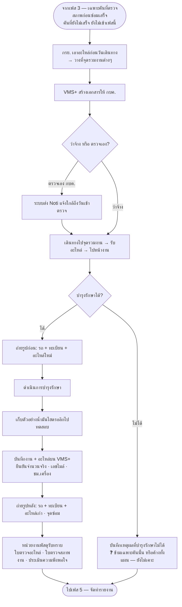

# เฟส 4 — ดำเนินการบำรุงรักษา

> 🔁 **สลับมาเป็นเฟส 3 (20 ส.ค. 2569)** — เดิมเป็นเฟส 2 · "ตรวจสภาพก่อนซ่อม" ขึ้นมาเป็นเฟส 2 แทน
> *(ชื่อไฟล์ยังเป็น `03-เฟส2-...` เพื่อไม่ให้ลิงก์ในไฟล์อื่นพัง)*
> 🔁 **เลื่อนอีกครั้งเป็นเฟส 4 (21 ส.ค. 2569)** — เฟส "เบิก/จัดหา + แผนเดินทาง" แยกเป็น 2 เฟส
> ทำให้เฟสถัดจากนี้ทั้งหมดเลื่อนขึ้นอีก 1 (เฟส 3 เดิม → เฟส 4)

> **สถานะ prototype: 🟡 ทำบางส่วน** — `maintainance-yearly/app.js` (`renderMaintenance`)
> แสดง **รายการรถ + งานที่จะทำรายคัน** ที่ยกมาจากที่เลือกไว้ตอนทำแผนเดินทาง (เฟส 2 · ขั้น 1)
> · 🔒 **เห็นเฉพาะคันที่ตรวจสภาพก่อนซ่อมเสร็จแล้ว** (ลงนามรับมอบครบ + ตรวจครบทุกรายการ) — คันที่ยังไม่เสร็จ
>   ไม่ขึ้นที่นี่ และหน้าจอบอกว่าเหลืออีกกี่คัน (เจ้าของงานสั่ง 20 ส.ค. 2569)
> พร้อมสถานที่บำรุงรักษาและชื่อใบเดินทาง · **ยังไม่มีการบันทึกผลงานหน้างาน** (รูปก่อน/หลัง · อะไหล่ที่ใช้จริง · เลขไมล์/ชม.เครื่อง)
>
> **สถานะเดิม: ⬜ ยังเป็นหน้าเปล่า** — **คิวถัดไปที่จะทำ** · ต้องเคาะเงื่อนไข 5 ข้อท้ายไฟล์นี้ก่อน
> ที่มา: `maintainance-yearly/maintannance-yearly.md` + `plan-skeleton.html` (จอเฟส 4) · flow: บำรุงรักษาตามวาระ (To-be)
> 💡 ผังนี้ **sync กับโครงใหม่ 8 ส.ค. 2569** (เดิมคือ "ช่วงที่ 3")
> - เข้าเฟสนี้ได้เมื่อ **เฟส 3 ตรวจสภาพก่อนซ่อมเสร็จแล้ว** (รายคัน)
> - ตัวตั้งต้นสำหรับทำเฟสนี้มีแล้ว — แผนตัวอย่าง `MT-2569-Q1-001` (12 คัน · พัสดุรับทราบ · แผนเดินทาง 4–8 พ.ย. 2568) **เฟส 1-2 ปลดล็อกแล้ว**

## เงื่อนไขที่ยังไม่เคาะ (5 ข้อ — ต้องได้คำตอบก่อนลงมือ)

1. **บันทึกรายคัน หรือรายแผน** — แผนหนึ่งมีหลายคันหลายเขต เฟสจบเมื่อครบทุกคันใช่ไหม
2. **"บำรุงรักษาไม่ได้"** — ข้ามเฉพาะคันนั้นแล้วไปต่อ หรือค้างทั้งแผน · ต้องยกไปแผนปีหน้าอัตโนมัติไหม
3. **รูปถ่ายก่อน/หลัง** — บังคับกี่รูป ข้ามได้ไหม ถ้าข้ามต้องให้เหตุผลไหม
4. **เก็บตัวอย่างน้ำมันไฮดรอลิก** — ทุกคัน หรือเฉพาะบางประเภทรถ
5. **ใบ 3 ใบที่พัสดุรับทราบ** — ออกจากระบบเอง หรืออัปโหลดไฟล์

> เก็บรวมไว้ที่ [`maintainance-yearly/plan-skeleton.html`](../../maintainance-yearly/plan-skeleton.html)
