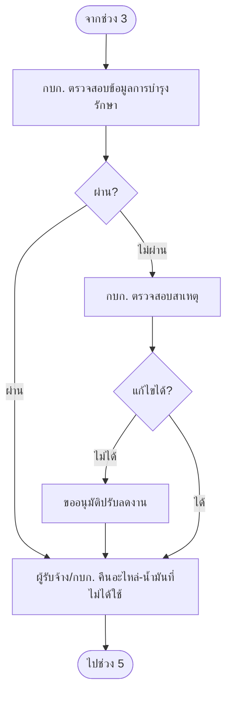

# ช่วงที่ 4 — ตรวจรับ

> ที่มา: `maintainance-yearly/maintannance-yearly.md` (ช่วงที่ 4) · flow: บำรุงรักษาตามวาระ (To-be)

```mermaid
flowchart TB
    S([จากช่วง 3]) --> A[กบก. ตรวจสอบข้อมูลการบำรุงรักษา]
    A --> D{ผ่าน?}
    D -->|ไม่ผ่าน| E[กบก. ตรวจสอบสาเหตุ]
    E --> F{แก้ไขได้?}
    F -->|ไม่ได้| G[ขออนุมัติปรับลดงาน]
    D -->|ผ่าน| H[ผู้รับจ้าง/กบก. คืนอะไหล่-น้ำมันที่ไม่ได้ใช้]
    G --> H
    F -->|ได้| H
    H --> Z([ไปช่วง 5])
```
