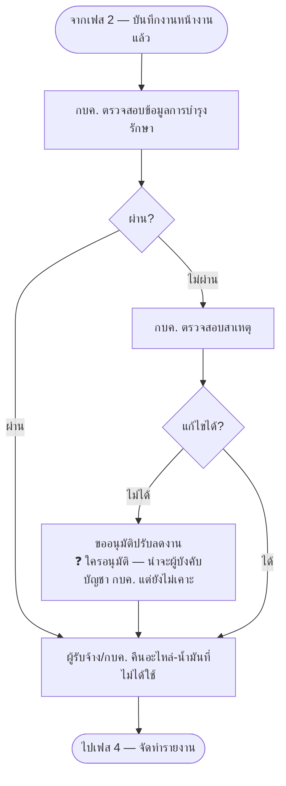

# เฟส 3 — ตรวจรับ

> **สถานะ prototype: ⬜ ยังเป็นหน้าเปล่า**
> ที่มา: `maintainance-yearly/maintannance-yearly.md` + `skeleton.html` (เฟส 3) · flow: บำรุงรักษาตามวาระ (To-be)
> 💡 ผังนี้ **sync กับโครงใหม่ 8 ส.ค. 2569** (เดิมคือ "ช่วงที่ 4")
> - ⚠️ **"ขออนุมัติปรับลดงาน" ยังไม่รู้ว่าใครอนุมัติ** — ฝ่ายพัสดุเป็นแค่ **ผู้รับทราบ** แล้ว จึงไม่ใช่ผู้อนุมัติในจุดนี้

## เงื่อนไขที่ยังไม่เคาะ

- **"ขออนุมัติปรับลดงาน" ใครอนุมัติ** — ฝ่ายพัสดุเป็นแค่ผู้รับทราบแล้ว ⇒ น่าจะเป็นผู้บังคับบัญชา กบค. ใช่ไหม
- ตรวจรับ **รายคัน** หรือ **ทั้งแผนรวดเดียว**
- คืนอะไหล่ — **ตัดยอดคลังกลับอัตโนมัติไหม** (ต้นแบบแจ้งซ่อมยังไม่ตัดสต็อกจริง — จุดนี้เหมือนกันไหม)

> เก็บรวมไว้ที่ [`maintainance-yearly/skeleton.html`](../../maintainance-yearly/skeleton.html)
