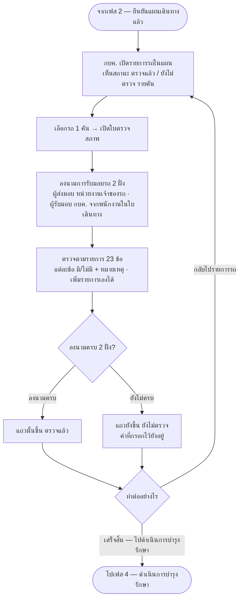
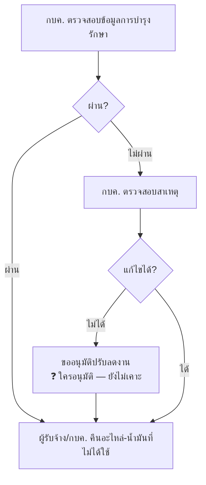

# เฟส 3 — ตรวจสภาพก่อนซ่อม

> 🔁 **เลื่อนเป็นเฟส 3 (21 ส.ค. 2569)** — เฟส "เบิก/จัดหา + แผนเดินทาง" แยกเป็น 2 เฟส เฟสถัดจากนั้นจึงเลื่อนขึ้น 1
> *(ชื่อไฟล์ยังเป็น `04-เฟส3-ตรวจรับ.md` เพื่อไม่ให้ลิงก์ในไฟล์อื่นพัง — เลขในชื่อไฟล์บังเอิญตรงกับของจริงพอดี)*
>
> 🔤 **เปลี่ยนชื่อจาก "ตรวจรับ" → "ตรวจสภาพก่อนซ่อม"** และ 🔁 **สลับจากเฟส 3 ขึ้นมาเป็นเฟส 2 (20 ส.ค. 2569)**
> ตามที่เจ้าของงานสั่ง — ต้องตรวจสภาพ**ก่อน**ลงมือซ่อม ลำดับเดิมกลับหัวกลับหาง
> *(ชื่อไฟล์ยังเป็น `04-เฟส3-ตรวจรับ.md` เพื่อไม่ให้ลิงก์ในไฟล์อื่นพัง)*

> **สถานะ prototype: ✅ ทำแล้ว** — `maintainance-yearly/app.js` (`renderInspection`)
> รายการรถในแผน → ปุ่ม **"ตรวจสภาพก่อนบำรุงรักษา"** ท้ายแถว → ใบตรวจรายคัน
> (ลงนามรับมอบ 2 ฝั่ง + รายการตรวจ 23 ข้อตามแบบฟอร์มกระดาษ · เพิ่มรายการเองได้)
> ที่มา: `maintainance-yearly/maintannance-yearly.md` + `plan-skeleton.html` (จอเฟส 3) · flow: บำรุงรักษาตามวาระ (To-be)
> 💡 ผังนี้ **sync กับโครงใหม่ 8 ส.ค. 2569** (เดิมคือ "ช่วงที่ 4")
> - ⚠️ **"ขออนุมัติปรับลดงาน" ยังไม่รู้ว่าใครอนุมัติ** — ฝ่ายพัสดุเป็นแค่ **ผู้รับทราบ** แล้ว จึงไม่ใช่ผู้อนุมัติในจุดนี้

## หน้าจอที่ทำแล้ว

| ส่วน | รายละเอียด |
|---|---|
| รายการรถ | ทะเบียน · หน่วยงานเจ้าของรถ + ไตรมาส · สถานะตรวจ · ปุ่ม **"ตรวจสภาพก่อนบำรุงรักษา"** ท้ายแถว · ตัวนับ "ตรวจแล้ว N จาก M คัน" |
| ใบตรวจรายคัน | หัวใบ (ทะเบียน · อุปกรณ์ยก · หน่วยงาน · เลขครุภัณฑ์ · Serial · HC No.) → ลงนามรับมอบ → รายการตรวจ 23 ข้อ |
| ทางออกจากใบตรวจ | **← กลับไปรายการรถ** (ด้านบน) — ไปตรวจคันอื่นต่อ · **เสร็จสิ้น — ไปดำเนินการบำรุงรักษา** (ปุ่มล่างขวา) — ปิดเฟสตรวจสภาพแล้วข้ามไปเฟส 4 เลย |
| ⚠️ ไม่บล็อก | กด "เสร็จสิ้น" ตอนยังตรวจไม่ครบทุกคันก็ข้ามเฟสได้ — ระบบแค่บอกว่าเหลือกี่คัน · กลับมาแก้ทีหลังได้จาก stepper |
| ถือว่าตรวจครบเมื่อ | ลงนามครบทั้งสองฝั่ง — ไม่บังคับตอบครบทุกรายการตรวจ (`MYD.inspectionDone`) |
| ผลต่อเฟสถัดไป | **เฟส 4/5/6 (ดำเนินการบำรุงรักษา/จัดทำรายงาน/คำนวณต้นทุน):** 🔓 ทุกเฟสใช้เกณฑ์เดียวกัน — แค่
  **ลงนามรับมอบตัวรถครบ 2 ฝั่ง**ก็ถือว่าตรวจสภาพก่อนซ่อมแล้ว ไม่ต้องรอตอบครบทุกข้อตรวจก่อน (`MYD.inspectionDone`)
  *(ประวัติเกณฑ์: ผ่อนเหลือลงนาม 2 ฝั่ง 25 ส.ค. 2569 → เข้มสุดต้องครบทั้งสองอย่าง 26 ส.ค. 2569 → ผ่อนกลับเหลือ
  แค่ลงนามให้เฟส 4 ก่อน 27 ส.ค. 2569 (ตอนนั้นเฟส 5/6 ยังเข้มอยู่ ใช้ฟังก์ชันแยกกันคนละตัว) →
  **ผ่อนเกณฑ์เดียวกันให้เฟส 5/6 ด้วย 27 ส.ค. 2569 — รวมเหลือฟังก์ชันเดียว `MYD.inspectionDone` ใช้ทุกเฟส**)* |

## เงื่อนไขที่ยังไม่เคาะ

- **"ขออนุมัติปรับลดงาน" ใครอนุมัติ** — ฝ่ายพัสดุเป็นแค่ผู้รับทราบแล้ว ⇒ น่าจะเป็นผู้บังคับบัญชา กบค. ใช่ไหม
- ~~ตรวจรับ **รายคัน** หรือ **ทั้งแผนรวดเดียว**~~ ✅ **เคาะแล้ว 20 ส.ค. 2569: รายคัน** — หน้าจอเป็นรายการรถในแผน แล้วเปิดใบตรวจทีละคัน
- คืนอะไหล่ — **ตัดยอดคลังกลับอัตโนมัติไหม** (ต้นแบบแจ้งซ่อมยังไม่ตัดสต็อกจริง — จุดนี้เหมือนกันไหม)

> เก็บรวมไว้ที่ [`maintainance-yearly/plan-skeleton.html`](../../maintainance-yearly/plan-skeleton.html)

## แบบฟอร์มใบตรวจรายคัน (20 ส.ค. 2569)

ที่มา: ภาพแบบฟอร์มกระดาษที่เจ้าของงานส่งมา

| ส่วน | เนื้อหา |
|---|---|
| หัวใบ | ทะเบียน · อุปกรณ์ยก · หน่วยงานเจ้าของรถ · เลขครุภัณฑ์ · Serial No. · HC No. |
| **ลงนามการรับมอบรถ** | **ผู้ส่งมอบรถ** (ฝั่งหน่วยงานเจ้าของรถ) · **ผู้รับมอบ (กบค.)** — ดึงรายชื่อจาก**พนักงาน กบค. ที่ระบุไว้ในใบเดินทาง**ของรถคันนั้น · ปุ่ม "เซ็นลงนาม" แยกสองฝั่ง กดได้เมื่อเลือกชื่อแล้ว |
| **รายละเอียดการตรวจสภาพก่อนซ่อม** | **23 รายการ** ตามแบบฟอร์ม · แต่ละข้อเลือก **มี / ไม่มี** + หมายเหตุ · ปุ่ม **"เพิ่มรายการ"** ต่อท้ายได้ |

**ถือว่าตรวจครบเมื่อ** ลงนามครบทั้งสองฝั่ง (ไม่บังคับตอบครบทุกรายการตรวจ)

⚠️ **ข้อควรรู้**
- หัวคอลัมน์ในแบบฟอร์มต้นฉบับเขียนว่า *"การทดสอบหลังซ่อม"* ซึ่งขัดกับชื่อหัวข้อ *"ตรวจสภาพก่อนซ่อม"* — ต้นแบบใช้คำว่า **"ผลการตรวจ"** ไปก่อน รอเจ้าของงานยืนยันว่าจะใช้คำไหน
- รายชื่อ **ผู้ส่งมอบรถ** เป็น**ข้อมูลจำลอง** — ของจริงต้อง join กับทะเบียนพนักงานของหน่วยงานเจ้าของรถ
- ยังไม่มีการแนบรูป/ลายเซ็นจริง — ปุ่ม "เซ็นลงนาม" แค่ประทับเวลา

---

## ⚠️ ของเดิมที่ยังไม่มีที่อยู่ — "ตรวจรับ (หลังซ่อม)"

ก่อน 20 ส.ค. 2569 เฟสนี้ชื่อ **"ตรวจรับ"** และหมายถึงการ**ตรวจรับงานหลังซ่อมเสร็จ** ซึ่งเป็นคนละเรื่องกับ
"ตรวจสภาพก่อนซ่อม" ที่มาแทนที่ พอสลับลำดับแล้ว **ขั้นตอนชุดนี้ยังไม่ถูกวางไว้ที่เฟสไหนเลย**

ผังเดิมของมันคือ:

**ต้องเคาะ:** ขั้นตอนนี้ไปอยู่ที่ไหน — รวมเข้า **เฟส 4 ดำเนินการบำรุงรักษา** · รวมเข้า **เฟส 5 จัดทำรายงาน** ·
หรือ **เพิ่มเป็นเฟสที่ 6** · (คำถาม "ขออนุมัติปรับลดงาน ใครอนุมัติ" กับ "คืนอะไหล่ตัดยอดคลังกลับอัตโนมัติไหม" ยังค้างอยู่ทั้งคู่)
