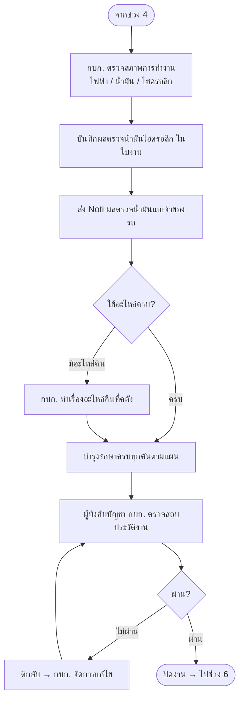

# ช่วงที่ 5 — จัดทำรายงานการบำรุงรักษา

> ที่มา: `maintainance-yearly/maintannance-yearly.md` (ช่วงที่ 5) · flow: บำรุงรักษาตามวาระ (To-be)

```mermaid
flowchart TB
    S([จากช่วง 4]) --> A[กบก. ตรวจสภาพการทำงาน<br/>ไฟฟ้า / น้ำมัน / ไฮดรอลิก]
    A --> B[บันทึกผลตรวจน้ำมันไฮดรอลิก ในใบงาน]
    B --> C[ส่ง Noti ผลตรวจน้ำมันแก่เจ้าของรถ]
    C --> D{ใช้อะไหล่ครบ?}
    D -->|มีอะไหล่คืน| E[กบก. ทำเรื่องอะไหล่คืนที่คลัง]
    D -->|ครบ| F[บำรุงรักษาครบทุกคันตามแผน]
    E --> F
    F --> G[ผู้บังคับบัญชา กบก. ตรวจสอบประวัติงาน]
    G --> H{ผ่าน?}
    H -->|ไม่ผ่าน| I[ตีกลับ → กบก. จัดการแก้ไข]
    I --> G
    H -->|ผ่าน| J([ปิดงาน → ไปช่วง 6])
```
