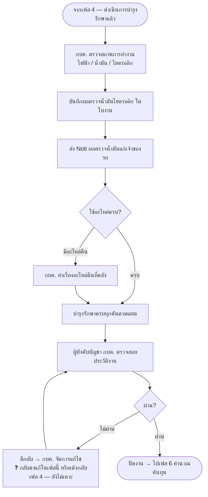

# เฟส 5 — จัดทำรายงานการบำรุงรักษา

> 🔁 **เลื่อนเป็นเฟส 5 (21 ส.ค. 2569)** — เฟส "เบิก/จัดหา + แผนเดินทาง" แยกเป็น 2 เฟส เฟสถัดจากนั้นจึงเลื่อนขึ้น 1
> *(ชื่อไฟล์ยังเป็น `05-เฟส4-...` เพื่อไม่ให้ลิงก์ในไฟล์อื่นพัง)*

> **สถานะ prototype: 🟡 ทำบางส่วน** — `maintainance-yearly/app.js` (`renderReport`, 25 ส.ค. 2569)
> ทำเฉพาะ node `D{ใช้อะไหล่ครบ?}` ในผังด้านล่าง — รายการรถที่ผ่านเฟส 4 มาแล้ว แสดง radio **ครบ/ไม่ครบ** ต่อคัน
> เลือก "ไม่ครบ" ขึ้นรายการอะไหล่ที่เบิกไป (ยกจากลอจิกเดียวกับที่ฝ่ายพัสดุเห็น) พร้อมช่องกรอกจำนวนที่คืนต่อรายการ
> ยังไม่ตัดยอดคลังกลับอัตโนมัติ (ตรงกับข้อค้างเดิมที่ยังไม่เคาะใน `04-เฟส3-ตรวจรับ.md` — "คืนอะไหล่ตัดยอดคลังกลับอัตโนมัติไหม")
> ส่วนที่เหลือของเฟสนี้ (node A/B/C · G/H/I/J — ตรวจสภาพการทำงาน/ผลตรวจน้ำมัน/อนุมัติปิดงาน) **ยังเป็นหน้าเปล่า**
> ⚠️ **node G/H/J (อนุมัติปิดงานของผู้บังคับบัญชา กบค.) ถูกทำในต้นแบบแล้ว แต่ไปอยู่ท้ายเฟส 6 คำนวณต้นทุนแทน**
>   (ปุ่ม "ส่งอนุมัติปิดแผน" + เมนู "อนุมัติปิดแผน" — ดู `06-เฟส5-คำนวณต้นทุน.md`) เพราะ stepper ของแอปจริงจบที่เฟส 6
>   ไม่ใช่เฟส 5 ตามผังนี้ — ควรเคาะให้ตรงกันว่าขั้นอนุมัตินี้ควรอยู่ก่อนหรือหลังคำนวณต้นทุน (25 ส.ค. 2569)
> ที่มา: `maintainance-yearly/maintannance-yearly.md` + `plan-skeleton.html` (จอเฟส 5) · flow: บำรุงรักษาตามวาระ (To-be)
> 💡 ผังนี้ **sync กับโครงใหม่ 8 ส.ค. 2569** (เดิมคือ "ช่วงที่ 5")
> - เฟสนี้จบที่ **ผู้บังคับบัญชา กบค. อนุมัติปิดงาน**

## เงื่อนไขที่ยังไม่เคาะ

- **ผู้บังคับบัญชา กบค. คือระดับไหน** — ผอ.กอง / ผช.ผอ. / อื่น
- ผลตรวจน้ำมันไฮดรอลิก — **รอผลแล็บกี่วัน** เฟสค้างรอผลไหม หรือปิดไปก่อนแล้วเติมทีหลัง
- ตีกลับจากเฟสนี้ → **กลับไปเฟสไหน** (แก้ในเฟสนี้เอง หรือเด้งกลับเฟส 4 ดำเนินการบำรุงรักษา)

> เก็บรวมไว้ที่ [`maintainance-yearly/plan-skeleton.html`](../../maintainance-yearly/plan-skeleton.html)
