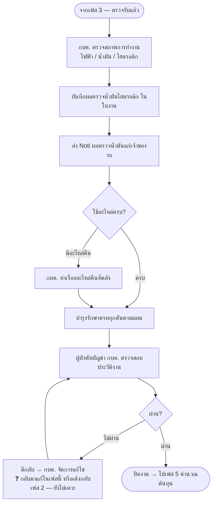

# เฟส 4 — จัดทำรายงานการบำรุงรักษา

> **สถานะ prototype: ⬜ ยังเป็นหน้าเปล่า**
> ที่มา: `maintainance-yearly/maintannance-yearly.md` + `plan-skeleton.html` (เฟส 4) · flow: บำรุงรักษาตามวาระ (To-be)
> 💡 ผังนี้ **sync กับโครงใหม่ 8 ส.ค. 2569** (เดิมคือ "ช่วงที่ 5")
> - เฟสนี้จบที่ **ผู้บังคับบัญชา กบค. อนุมัติปิดงาน**

## เงื่อนไขที่ยังไม่เคาะ

- **ผู้บังคับบัญชา กบค. คือระดับไหน** — ผอ.กอง / ผช.ผอ. / อื่น
- ผลตรวจน้ำมันไฮดรอลิก — **รอผลแล็บกี่วัน** เฟสค้างรอผลไหม หรือปิดไปก่อนแล้วเติมทีหลัง
- ตีกลับจากเฟสนี้ → **กลับไปเฟสไหน** (แก้ในเฟสนี้เอง หรือเด้งกลับเฟส 2)

> เก็บรวมไว้ที่ [`maintainance-yearly/plan-skeleton.html`](../../maintainance-yearly/plan-skeleton.html)
