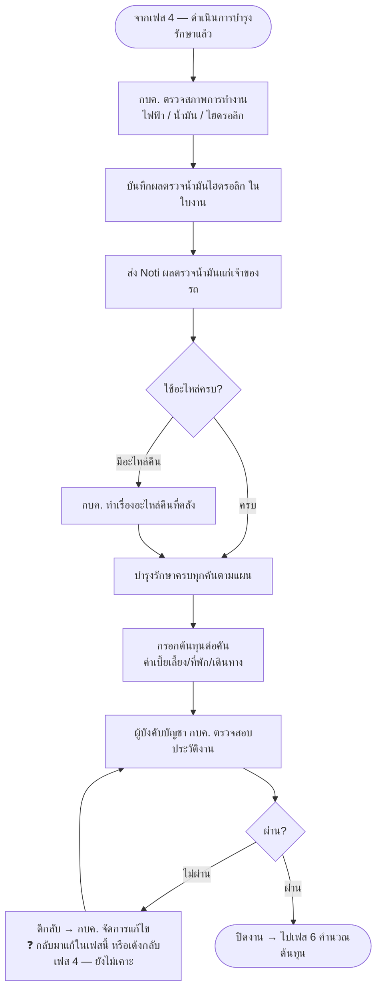

# เฟส 5 — จัดทำรายงานการบำรุงรักษา

> 🔁 **เลื่อนเป็นเฟส 5 (21 ส.ค. 2569)** — เฟส "เบิก/จัดหา + แผนเดินทาง" แยกเป็น 2 เฟส เฟสถัดจากนั้นจึงเลื่อนขึ้น 1
> *(ชื่อไฟล์ยังเป็น `05-เฟส4-...` เพื่อไม่ให้ลิงก์ในไฟล์อื่นพัง)*
>
> 🔀 **ย้ายช่องกรอกต้นทุนมาที่นี่ (26 ส.ค. 2569)** — เจ้าของงานสั่งให้กรอกค่าเบี้ยเลี้ยง/ที่พัก/เดินทาง
> ต่อคันที่เฟสนี้แทน (คู่กับตารางเช็คอะไหล่) เพราะเป็นข้อมูลปิดงานที่กรอกจังหวะเดียวกัน · เฟส 6
> [`06-เฟส5-คำนวณต้นทุน.md`](06-เฟส5-คำนวณต้นทุน.md) เหลือแค่**แสดงผลรวม อ่านอย่างเดียว** ไม่มีช่องกรอกแล้ว

> **สถานะ prototype: 🟡 ทำบางส่วน** — `maintainance-yearly/app.js` (`renderReport`, 26 ส.ค. 2569)
> · 🔓 **เห็นเฉพาะคันที่ลงนามรับมอบตัวรถครบ 2 ฝั่งแล้ว** (`MYD.inspectionDone` — เกณฑ์เดียวกับเฟส 4 ดำเนินการ
>   บำรุงรักษา ดู [`03-เฟส2-ดำเนินการบำรุงรักษา.md`](03-เฟส2-ดำเนินการบำรุงรักษา.md)) ไม่บังคับตอบครบทุกรายการ
>   ตรวจก่อนแล้ว (เจ้าของงานสั่งผ่อนเกณฑ์นี้ 27 ส.ค. 2569 — เดิมเข้มกว่าเฟส 4 ต้องตอบครบทุกข้อตรวจด้วย) — กรองเอง
>   อีกชั้นในหน้านี้ ไม่ได้พึ่งพาว่าคันนั้น "ผ่านเฟส 4 มาแล้ว" อย่างเดียว เผื่อกรณีตัดคันออกจากเฟส 4 (`maintExcluded`)
> · 🎯 **โฟกัสคันเดียวถ้ามาจากเฟส 4 ดำเนินการบำรุงรักษาที่กำลังโฟกัสคันเดียวอยู่** (28 ส.ค. 2569 — แพตเทิร์นเดียวกับ
>   `MAINT.vehicleId` ดู [`03-เฟส2-ดำเนินการบำรุงรักษา.md`](03-เฟส2-ดำเนินการบำรุงรักษา.md)) กด "ถัดไป — จัดทำรายงาน"
>   ขณะโฟกัสคันไหนอยู่ จะเห็น**เฉพาะคันนั้น**คันเดียวที่นี่ (ไม่ใช่รถทุกคันที่ตรวจครบแล้วปนกัน) ล็อกแท็บไตรมาสไปที่
>   ไตรมาสของคันนั้นให้อัตโนมัติ (ซ่อนตัวเลือกไตรมาส) มีปุ่ม "ดูรถทั้งหมด" กลับไปเห็นรถทุกคันของไตรมาสนั้น ·
>   เข้าเฟสนี้ทางอื่น (คลิก stepper ตรงๆ) ยังเห็นรถทุกคันเหมือนเดิม (`REPORT.vehicleId`)
> ทำ node `D{ใช้อะไหล่ครบ?}` ในผังด้านล่าง — รายการรถที่ผ่านเฟส 4 มาแล้ว แสดง radio **ครบ/ไม่ครบ** ต่อคัน
> เลือก "ไม่ครบ" ขึ้นรายการอะไหล่ที่เบิกไป (ยกจากลอจิกเดียวกับที่ฝ่ายพัสดุเห็น) พร้อมช่องกรอกจำนวนที่คืนต่อรายการ
> ยังไม่ตัดยอดคลังกลับอัตโนมัติ (ตรงกับข้อค้างเดิมที่ยังไม่เคาะใน `04-เฟส3-ตรวจรับ.md` — "คืนอะไหล่ตัดยอดคลังกลับอัตโนมัติไหม")
> · เพิ่มตาราง **กรอกต้นทุนต่อคัน** (ค่าเบี้ยเลี้ยง/ที่พัก/เดินทาง — คนละชุดข้อมูลกับ `trip.perDiem/lodging/travel`
> ที่กรอกครอบทั้งใบเดินทางตอนเฟส 2) ต่อท้ายตารางเช็คอะไหล่ ใต้รถกลุ่มเดียวกัน — มีคอลัมน์ "รวม" อัตโนมัติต่อแถว
> + แถวท้ายตาราง "ต้นทุนทั้งหมด" ตรงกับ node ที่เพิ่มในผังด้านล่าง (เดิมช่องนี้อยู่ที่เฟส 6 มาก่อน)
> ส่วนที่เหลือของเฟสนี้ (node A/B/C · G/H/I/J — ตรวจสภาพการทำงาน/ผลตรวจน้ำมัน/อนุมัติปิดงาน) **ยังเป็นหน้าเปล่า**
> ⚠️ **แนบรูปหลักฐานต่อรายการงานทำที่นี่ก่อนช่วงสั้นๆ 27 ส.ค. 2569 แล้วย้ายไปเฟส 4 ในวันเดียวกัน**
>   (เจ้าของงานสั่งว่ารูปหลักฐานเป็นของ "ตอนลงมือทำงาน" ไม่ใช่ตอนปิดรายงาน) — ดู
>   [`03-เฟส2-ดำเนินการบำรุงรักษา.md`](03-เฟส2-ดำเนินการบำรุงรักษา.md)
> ⚠️ **node G/H/J (อนุมัติปิดงานของผู้บังคับบัญชา กบค.) ถูกทำในต้นแบบแล้ว แต่ไปอยู่ท้ายเฟส 6 คำนวณต้นทุนแทน**
>   (ปุ่ม "ส่งอนุมัติปิดแผน" + เมนู "อนุมัติปิดแผน" — ดู `06-เฟส5-คำนวณต้นทุน.md`) เพราะ stepper ของแอปจริงจบที่เฟส 6
>   ไม่ใช่เฟส 5 ตามผังนี้ — ควรเคาะให้ตรงกันว่าขั้นอนุมัตินี้ควรอยู่ก่อนหรือหลังคำนวณต้นทุน (25 ส.ค. 2569)
> ที่มา: `maintainance-yearly/maintannance-yearly.md` + `plan-skeleton.html` (จอเฟส 5) · flow: บำรุงรักษาตามวาระ (To-be)
> 💡 ผังนี้ **sync กับโครงใหม่ 8 ส.ค. 2569** (เดิมคือ "ช่วงที่ 5")
> - เฟสนี้จบที่ **ผู้บังคับบัญชา กบค. อนุมัติปิดงาน**

## เงื่อนไขที่ยังไม่เคาะ

- **ผู้บังคับบัญชา กบค. คือระดับไหน** — ผอ.กอง / ผช.ผอ. / อื่น
- ผลตรวจน้ำมันไฮดรอลิก — **รอผลแล็บกี่วัน** เฟสค้างรอผลไหม หรือปิดไปก่อนแล้วเติมทีหลัง
- ตีกลับจากเฟสนี้ → **กลับไปเฟสไหน** (แก้ในเฟสนี้เอง หรือเด้งกลับเฟส 4 ดำเนินการบำรุงรักษา)

> เก็บรวมไว้ที่ [`maintainance-yearly/plan-skeleton.html`](../../maintainance-yearly/plan-skeleton.html)
