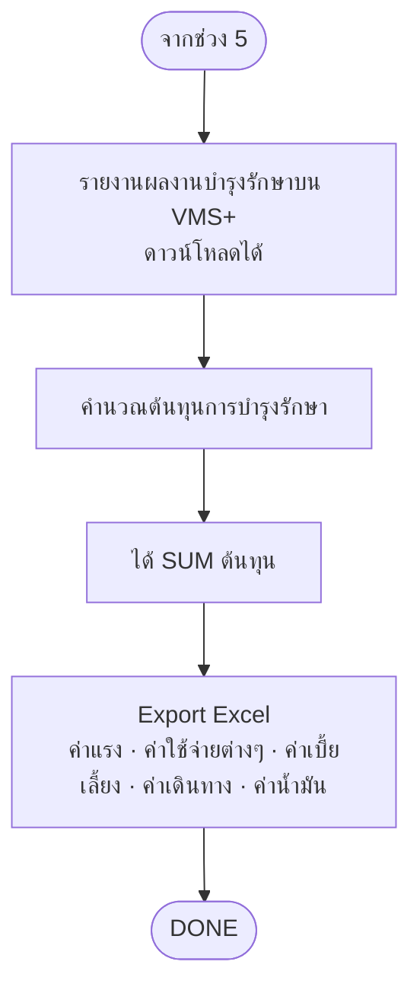

# ช่วงที่ 6 — คำนวณต้นทุน

> ที่มา: `maintainance-yearly/maintannance-yearly.md` (ช่วงที่ 6) · flow: บำรุงรักษาตามวาระ (To-be)

```mermaid
flowchart TB
    S([จากช่วง 5]) --> A[รายงานผลงานบำรุงรักษาบน VMS+<br/>ดาวน์โหลดได้]
    A --> B[คำนวณต้นทุนการบำรุงรักษา]
    B --> C[ได้ SUM ต้นทุน]
    C --> D[Export Excel<br/>ค่าแรง · ค่าใช้จ่ายต่างๆ · ค่าเบี้ยเลี้ยง · ค่าเดินทาง · ค่าน้ำมัน]
    D --> E([DONE])
```
