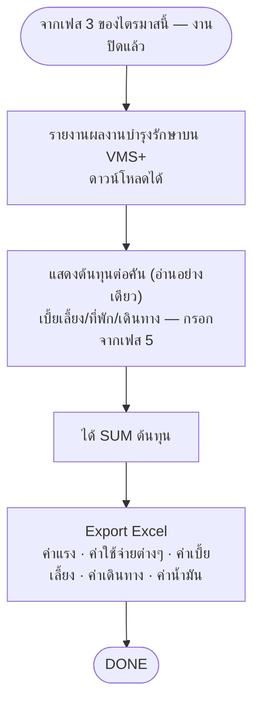

# เฟส 4 (ต่อไตรมาส) — คำนวณต้นทุน

> 🆕 **แยกเป็นเฟสต่อไตรมาสแล้ว (28 ส.ค. 2569)** — ย้ายออกจาก stepper ของแผน ไปเป็น**เฟส 4 (เฟสสุดท้าย) ของ
> stepper 4 เฟส "ต่อไตรมาส"** ที่ `index.html#<planId>/<Q1-4>` — ส่งอนุมัติปิดแผนก็แยกทีละไตรมาสแล้วเช่นกัน
> (`MYD.requestCloseApprovalQuarter`) เนื้อ flow/หน้าจอด้านล่างไม่เปลี่ยน เปลี่ยนแค่ที่อยู่ + ขอบเขตเป็นรายไตรมาส
> *(ชื่อไฟล์ยังเป็น `06-เฟส5-...` ตามเดิม เพื่อไม่ให้ลิงก์ในไฟล์อื่นพัง)*
>
> 🔁 **เลื่อนเป็นเฟส 6 (21 ส.ค. 2569)** — เฟส "เบิก/จัดหา + แผนเดินทาง" แยกเป็น 2 เฟส เฟสถัดจากนั้นจึงเลื่อนขึ้น 1
> *(เลขนี้เป็นเลขเก่าก่อนแยกเฟสต่อไตรมาส 28 ส.ค. 2569 ด้านบน — ตอนนี้คือเฟส 4 ของไตรมาสแล้ว)*
>
> 📖 **เปลี่ยนเป็นอ่านอย่างเดียว (26 ส.ค. 2569)** — เจ้าของงานสั่งย้ายช่องกรอกค่าเบี้ยเลี้ยง/ที่พัก/เดินทาง
> ไปเฟส 5 จัดทำรายงานแทน (ดู [`05-เฟส4-จัดทำรายงาน.md`](05-เฟส4-จัดทำรายงาน.md)) — เฟสนี้เหลือแค่**แสดงผลรวม
> ต้นทุนต่อคัน** ที่กรอกไว้จากเฟสก่อนหน้า ไม่มีช่องกรอกที่หน้านี้แล้ว

> **สถานะ prototype: 🟡 ทำบางส่วน** — `maintainance-yearly/app.js` (`renderCost`, 26 ส.ค. 2569)
> นำรถที่อยู่ในแผนมาขึ้นเป็นตาราง (ทะเบียน · หน่วยงานเจ้าของรถ · ไตรมาส) — ตรงกับ node `A` ("รายงานผลงานบำรุงรักษาบน VMS+")
> · แสดงคอลัมน์ **ค่าเบี้ยเลี้ยง/ที่พัก/เดินทาง แบบอ่านอย่างเดียว** (26 ส.ค. 2569 — ย้ายช่องกรอกไปเฟส 5 แล้ว
>   หน้านี้แค่ดึงค่าจาก `plan.vehicleCost` มาแสดง แก้ตัวเลขต้องกลับไปแก้ที่เฟส 5)
>   แยกจาก `trip.perDiem/lodging/travel` เดิมโดยสิ้นเชิง (คนละชุดข้อมูล คนละจุดประสงค์)
>   แต่ละแถวมีคอลัมน์ **"รวม"** + แถวท้ายตาราง **"ต้นทุนทั้งหมด"** รวมทุกคัน — ตอบข้อค้าง **"สูตร SUM ต้นทุน"** บางส่วน
>   (เคาะแล้ว: **คิดต่อคันแล้วรวมเป็นต้นทุนทั้งแผน** ตรงกับ node `B` ในผังด้านล่าง — ยังไม่รวมค่าจ้างเหมา/อะไหล่/น้ำมัน)
>   ตรงกับ node `D` ("ค่าเบี้ยเลี้ยง · ค่าเดินทาง") บางส่วน ยังไม่มี node `C` (Export Excel) และยังไม่ผูกกับยอดใบเดินทางเดิม
> · ปุ่ม **"ส่งอนุมัติปิดแผน"** ท้ายเฟสนี้ (เปลี่ยนคำจาก "จบแผน" 25 ส.ค. 2569) ไม่ได้ปิดแผนทันที — ตั้ง
>   `plan.closeApproval={status:'pending',requestedAt}` ส่งไปรอที่**เมนูใหม่ "อนุมัติปิดแผน"** (`approve-close.html`)
>   ผู้บังคับบัญชา กบค. เห็นสรุปต้นทุนต่อคันแล้วกด "อนุมัติปิดแผน" ค่อยเปลี่ยนเป็น `status:'approved'` จริง
>   นี่คือจุดที่ทำ **"ผู้บังคับบัญชา กบค. อนุมัติปิดงาน"** ที่ `05-เฟส4-จัดทำรายงาน.md` เขียนไว้ว่าเป็นจุดจบของเฟส — แต่ต้นแบบ
>   วางไว้ท้ายเฟส 6 นี้แทน (เพราะ stepper ของแอปจริงจบที่เฟสนี้ ไม่ใช่เฟส 5) ควรเคาะให้ตรงกับผังจริงว่าเฟสไหนควรมีขั้นอนุมัตินี้
> ที่มา: `maintainance-yearly/maintannance-yearly.md` + `plan-skeleton.html` (จอเฟส 6) · flow: บำรุงรักษาตามวาระ (To-be)
> 💡 ผังนี้ **sync กับโครงใหม่ 8 ส.ค. 2569** (เดิมคือ "ช่วงที่ 6")

## เงื่อนไขที่ยังไม่เคาะ

- ~~**สูตร SUM ต้นทุน** — รวมอะไรบ้าง คิดต่อคันหรือต่อแผน~~ ✅ **เคาะแล้ว 25 ส.ค. 2569 (บางส่วน): คิดต่อคันแล้วรวมทั้งแผน** —
  ใช้กับค่าเบี้ยเลี้ยง/ที่พัก/เดินทาง เท่านั้น (กรอกเองต่อคันที่**เฟส 5 จัดทำรายงาน** 26 ส.ค. 2569 — แยกจากยอดใบเดินทางที่กรอกไว้ตอนเฟส 2)
  ❓ **ยังไม่เคาะ**: ค่าจ้างเหมา (สายว่าจ้าง) + อะไหล่ + น้ำมัน รวมเข้าด้วยยังไง
- **ราคาอะไหล่ใช้ราคาไหน** — ราคาเบิกจากคลัง หรือราคามาตรฐาน
- ต้นทุนนี้ **ต่อยอดไปหน้าประเมินความคุ้มค่า** ของฝั่งแจ้งซ่อมไหม
- **เงื่อนไขการตัดงบประมาณเป็นยังไง เลือกการตัดงบประมาณอะไรได้บ้าง** (25 ส.ค. 2569 · ขึ้นเป็นข้อความนอกตาราง
  ใต้ตารางต้นทุนในต้นแบบแล้ว — แสดงตรงๆ ไม่ใช่ tooltip รอเจ้าของงานตอบ)

> เก็บรวมไว้ที่ [`maintainance-yearly/plan-skeleton.html`](../../maintainance-yearly/plan-skeleton.html)
