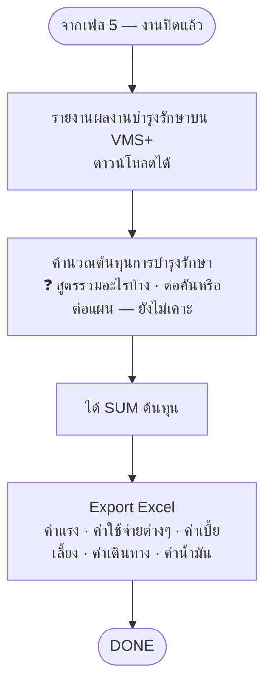

# เฟส 6 — คำนวณต้นทุน

> 🔁 **เลื่อนเป็นเฟส 6 (21 ส.ค. 2569)** — เฟส "เบิก/จัดหา + แผนเดินทาง" แยกเป็น 2 เฟส เฟสถัดจากนั้นจึงเลื่อนขึ้น 1
> *(ชื่อไฟล์ยังเป็น `06-เฟส5-...` เพื่อไม่ให้ลิงก์ในไฟล์อื่นพัง)*

> **สถานะ prototype: 🟡 ทำบางส่วน** — `maintainance-yearly/app.js` (`renderCost`, 25 ส.ค. 2569)
> นำรถที่อยู่ในแผนมาขึ้นเป็นตาราง (ทะเบียน · หน่วยงานเจ้าของรถ · ไตรมาส) — ตรงกับ node `A` ("รายงานผลงานบำรุงรักษาบน VMS+")
> · เพิ่มคอลัมน์ **ค่าเบี้ยเลี้ยง/ที่พัก/เดินทาง กรอกได้ต่อรถแต่ละคัน** (25 ส.ค. 2569 — ยกเลิกแบบเดิมที่คิดระดับใบเดินทางแล้ว
>   เพราะผู้ใช้ต้องการจัดสรรยอดจริงเป็นรายคันตอนปิดงบ ไม่ใช่ยอดใบเดินทางที่กรอกไว้ตอนเฟส 2) — เก็บใน `plan.vehicleCost`
>   แยกจาก `trip.perDiem/lodging/travel` เดิมโดยสิ้นเชิง (คนละชุดข้อมูล คนละจุดประสงค์)
>   แต่ละแถวมีคอลัมน์ **"รวม"** อัตโนมัติ + แถวท้ายตาราง **"ต้นทุนทั้งหมด"** รวมทุกคัน — ตอบข้อค้าง **"สูตร SUM ต้นทุน"** บางส่วน
>   (เคาะแล้ว: **คิดต่อคันแล้วรวมเป็นต้นทุนทั้งแผน** ตรงกับ node `B` ในผังด้านล่าง — ยังไม่รวมค่าจ้างเหมา/อะไหล่/น้ำมัน)
>   ตรงกับ node `D` ("ค่าเบี้ยเลี้ยง · ค่าเดินทาง") บางส่วน ยังไม่มี node `C` (Export Excel) และยังไม่ผูกกับยอดใบเดินทางเดิม
> ที่มา: `maintainance-yearly/maintannance-yearly.md` + `plan-skeleton.html` (จอเฟส 6) · flow: บำรุงรักษาตามวาระ (To-be)
> 💡 ผังนี้ **sync กับโครงใหม่ 8 ส.ค. 2569** (เดิมคือ "ช่วงที่ 6")

## เงื่อนไขที่ยังไม่เคาะ

- ~~**สูตร SUM ต้นทุน** — รวมอะไรบ้าง คิดต่อคันหรือต่อแผน~~ ✅ **เคาะแล้ว 25 ส.ค. 2569 (บางส่วน): คิดต่อคันแล้วรวมทั้งแผน** —
  ใช้กับค่าเบี้ยเลี้ยง/ที่พัก/เดินทาง เท่านั้น (กรอกเองต่อคัน แยกจากยอดใบเดินทางที่กรอกไว้ตอนเฟส 2)
  ❓ **ยังไม่เคาะ**: ค่าจ้างเหมา (สายว่าจ้าง) + อะไหล่ + น้ำมัน รวมเข้าด้วยยังไง
- **ราคาอะไหล่ใช้ราคาไหน** — ราคาเบิกจากคลัง หรือราคามาตรฐาน
- ต้นทุนนี้ **ต่อยอดไปหน้าประเมินความคุ้มค่า** ของฝั่งแจ้งซ่อมไหม
- **เงื่อนไขการตัดงบประมาณเป็นยังไง เลือกการตัดงบประมาณอะไรได้บ้าง** (25 ส.ค. 2569 · ขึ้นเป็นข้อความนอกตาราง
  ใต้ตารางต้นทุนในต้นแบบแล้ว — แสดงตรงๆ ไม่ใช่ tooltip รอเจ้าของงานตอบ)

> เก็บรวมไว้ที่ [`maintainance-yearly/plan-skeleton.html`](../../maintainance-yearly/plan-skeleton.html)
