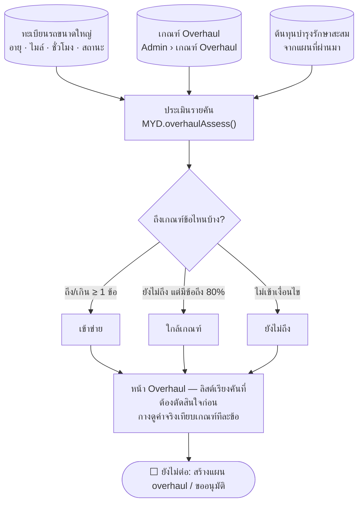

# Overhaul — คัดรถที่เข้าข่ายยกเครื่อง

> 💡 ผังนี้ sync กับโค้ดรอบ **8 ก.ย. 2569**
>
> - **สถานะ prototype: ✅ ทำแล้ว** — หน้าแยก `maintainance-yearly/overhaul.html`
> - ⚠️ **ไม่ใช่เฟสในโฟลว์บำรุงรักษา** — เป็นเมนูของตัวเอง อ่านข้อมูลรถชุดเดียวกับแผนประจำปี
>   แต่ยังไม่ต่อเข้าการสร้างแผน/ขออนุมัติ (จบที่ "รายการรถที่เข้าข่าย + เหตุผล")
> - **ขอบเขต: รถขนาดใหญ่เท่านั้น** (กระเช้า/เครน/รถขุด ที่อยู่ในโฟลว์นี้อยู่แล้ว) ยังไม่รวมรถเล็ก
>   — เจ้าของงานสั่ง 8 ก.ย. 2569
> - 🔴 **เกณฑ์ยังไม่ใช่ของจริง** — เจ้าของงานยกตัวอย่างมาข้อเดียวคือ **"อายุเกิน 15 ปี"**
>   ที่เหลือ (เลขไมล์ · ชั่วโมงเครื่องจักร · ต้นทุนบำรุงรักษาสะสม) เป็นค่าที่เสนอไว้ก่อนจาก
>   ช่วงข้อมูลรถในต้นแบบ · แก้ได้ที่ **Admin › เกณฑ์ Overhaul** โดยไม่ต้องแก้โค้ด

## เกณฑ์และผลประเมิน

| ระดับ | เงื่อนไข |
|---|---|
| **เข้าข่าย** | ถึงหรือเกินเกณฑ์อย่างน้อย 1 ข้อ |
| **ใกล้เกณฑ์** | ยังไม่ถึงสักข้อ แต่มีข้อที่ถึงสัดส่วนที่ตั้งไว้ (ตั้งต้น 80% ของเกณฑ์) |
| **ยังไม่ถึง** | ไม่เข้าเงื่อนไขข้างบน |

เกณฑ์ 4 ข้อ — **อายุใช้งาน** ใช้ค่าเดียวทุกชนิดรถ · **เลขไมล์ / ชั่วโมงเครื่องจักร /
ต้นทุนบำรุงรักษาสะสม** แยกตามชนิดรถเพราะสึกหรอคนละแบบ

หน้าจอบอก**ข้อที่ทำให้เข้าข่ายพร้อมค่าจริงเทียบเกณฑ์**เสมอ ไม่ใช่คะแนนรวมที่อธิบายไม่ได้

## ข้อมูลที่ใช้ และที่ยังขาด

| ใช้อยู่ | มาจาก |
|---|---|
| อายุใช้งาน | `vehicle.firstUseYear` (พ.ศ.) — 🆕 เพิ่ม 8 ก.ย. 2569 · แก้ได้ที่ Admin › ข้อมูลรถ |
| เลขไมล์ · ชั่วโมงเครื่องจักร | ทะเบียนรถเดิม |
| ต้นทุนบำรุงรักษาสะสม | ยอดที่โฟลว์บำรุงรักษาบันทึกไว้ (`MYD.vehicleMaintCostTotal`) |
| ธง "ควรพิจารณาจำหน่าย" | `vehicle.status` = หมดสภาพ / รอจำหน่าย |

⬜ **ยังขาด (ของจริงน่าจะเป็นตัวชี้ขาด)** — ประวัติการซ่อมสะสมรายคัน (ใบแจ้งซ่อมอยู่คนละต้นแบบ
ผูกด้วยเลขทะเบียนไม่ใช่ id รถ) · ค่าซ่อมสะสมเทียบราคารถ · จำนวนครั้งที่เสียซ้ำเรื่องเดิม

