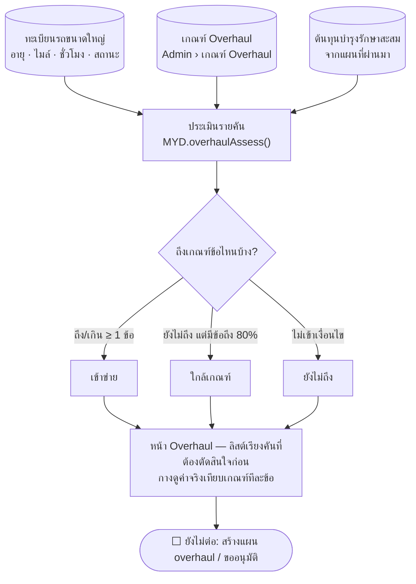
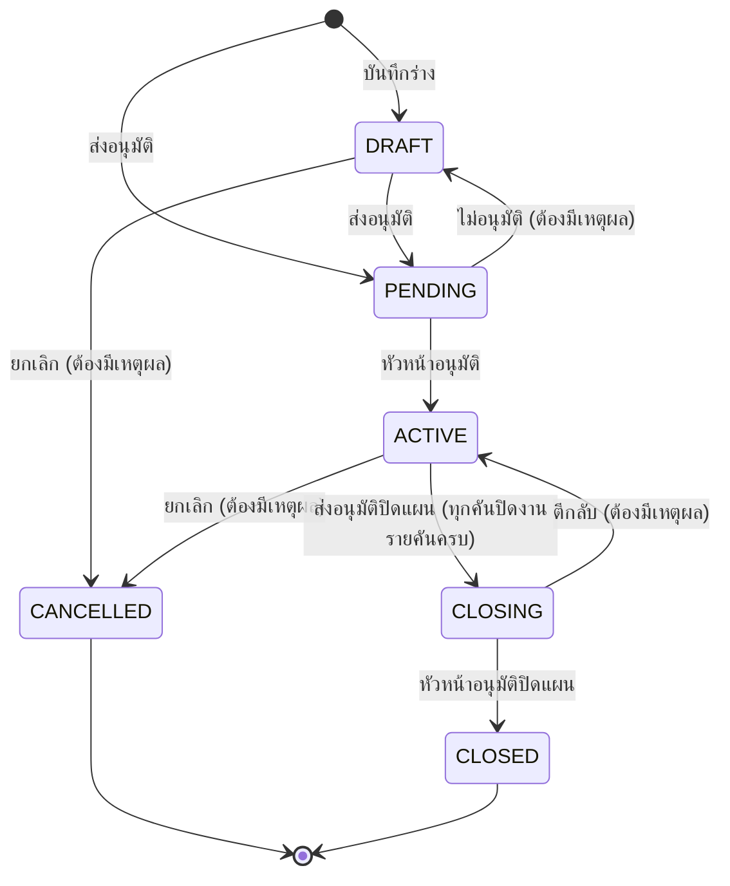

# Overhaul — คัดรถที่เข้าข่ายยกเครื่อง

> 💡 ผังนี้ sync กับโค้ดรอบ **8 ก.ย. 2569** · ส่วนแผน+อนุมัติ (แอป `app/`) sync **29 ก.ย. 2569**
>
> - **สถานะ prototype: ✅ ทำแล้ว** — หน้าแยก `maintainance-yearly/overhaul.html`
> - ⚠️ **ไม่ใช่เฟสในโฟลว์บำรุงรักษา** — เป็นเมนูของตัวเอง อ่านข้อมูลรถชุดเดียวกับแผนประจำปี
>   แต่ยังไม่ต่อเข้าการสร้างแผน/ขออนุมัติ (จบที่ "รายการรถที่เข้าข่าย + เหตุผล")
> - **ขอบเขต: รถขนาดใหญ่เท่านั้น** (กระเช้า/เครน/รถขุด ที่อยู่ในโฟลว์นี้อยู่แล้ว) ยังไม่รวมรถเล็ก
>   — เจ้าของงานสั่ง 8 ก.ย. 2569
> - 🔴 **เกณฑ์ยังไม่ใช่ของจริง** — เจ้าของงานยกตัวอย่างมาข้อเดียวคือ **"อายุเกิน 15 ปี"**
>   ที่เหลือ (เลขไมล์ · ชั่วโมงเครื่องจักร · ต้นทุนบำรุงรักษาสะสม) เป็นค่าที่เสนอไว้ก่อนจาก
>   ช่วงข้อมูลรถในต้นแบบ · แก้ได้ที่ **Admin › เกณฑ์ Overhaul** โดยไม่ต้องแก้โค้ด

## เกณฑ์และผลประเมิน

| ระดับ | เงื่อนไข |
|---|---|
| **เข้าข่าย** | ถึงหรือเกินเกณฑ์อย่างน้อย 1 ข้อ |
| **ใกล้เกณฑ์** | ยังไม่ถึงสักข้อ แต่มีข้อที่ถึงสัดส่วนที่ตั้งไว้ (ตั้งต้น 80% ของเกณฑ์) |
| **ยังไม่ถึง** | ไม่เข้าเงื่อนไขข้างบน |

เกณฑ์ 4 ข้อ — **อายุใช้งาน** ใช้ค่าเดียวทุกชนิดรถ · **เลขไมล์ / ชั่วโมงเครื่องจักร /
ต้นทุนบำรุงรักษาสะสม** แยกตามชนิดรถเพราะสึกหรอคนละแบบ

หน้าจอบอก**ข้อที่ทำให้เข้าข่ายพร้อมค่าจริงเทียบเกณฑ์**เสมอ ไม่ใช่คะแนนรวมที่อธิบายไม่ได้

## ข้อมูลที่ใช้ และที่ยังขาด

| ใช้อยู่ | มาจาก |
|---|---|
| อายุใช้งาน | `vehicle.firstUseYear` (พ.ศ.) — 🆕 เพิ่ม 8 ก.ย. 2569 · แก้ได้ที่ Admin › ข้อมูลรถ |
| เลขไมล์ · ชั่วโมงเครื่องจักร | ทะเบียนรถเดิม |
| ต้นทุนบำรุงรักษาสะสม | ยอดที่โฟลว์บำรุงรักษาบันทึกไว้ (`MYD.vehicleMaintCostTotal`) |
| ธง "ควรพิจารณาจำหน่าย" | `vehicle.status` = หมดสภาพ / รอจำหน่าย |

⬜ **ยังขาด (ของจริงน่าจะเป็นตัวชี้ขาด)** — ประวัติการซ่อมสะสมรายคัน (ใบแจ้งซ่อมอยู่คนละต้นแบบ
ผูกด้วยเลขทะเบียนไม่ใช่ id รถ) · ค่าซ่อมสะสมเทียบราคารถ · จำนวนครั้งที่เสียซ้ำเรื่องเดิม

```mermaid
flowchart TB
    M[("ทะเบียนรถขนาดใหญ่<br/>อายุ · ไมล์ · ชั่วโมง · สถานะ")] --> A
    C[("เกณฑ์ Overhaul<br/>Admin › เกณฑ์ Overhaul")] --> A
    P[("ต้นทุนบำรุงรักษาสะสม<br/>จากแผนที่ผ่านมา")] --> A

    A["ประเมินรายคัน<br/>MYD.overhaulAssess()"] --> L{ถึงเกณฑ์ข้อไหนบ้าง?}
    L -->|"ถึง/เกิน ≥ 1 ข้อ"| D["เข้าข่าย"]
    L -->|"ยังไม่ถึง แต่มีข้อถึง 80%"| N["ใกล้เกณฑ์"]
    L -->|"ไม่เข้าเงื่อนไข"| O["ยังไม่ถึง"]

    D --> V["หน้า Overhaul — ลิสต์เรียงคันที่ต้องตัดสินใจก่อน<br/>กางดูค่าจริงเทียบเกณฑ์ทีละข้อ"]
    N --> V
    O --> V
    V --> X(["⬜ ยังไม่ต่อ: สร้างแผน overhaul / ขออนุมัติ"])
```

## แผน Overhaul + หัวหน้าอนุมัติ (แอป Next.js `app/` · `/overhaul`)

> 🆕 **29 ก.ย. 2569** — เจ้าของงานสั่ง *"สร้างแผนแล้ว ปกติต้องมีหัวหน้าอนุมัติด้วย"*
>
> - สร้าง/แก้แผนร่าง → กด **ส่งอนุมัติ** → **รออนุมัติ** (ล็อกแก้ไขระหว่างรอ)
> - หัวหน้ากดไอคอน `task_alt` ในตารางรายการ (หรือปุ่ม "อนุมัติแผน" หน้ารายละเอียด) → modal อนุมัติ/ไม่อนุมัติ
> - **ไม่อนุมัติต้องใส่เหตุผล** → กลับเป็นร่าง + โชว์เหตุผลให้ผู้วางแผนแก้แล้วส่งใหม่
> - ⚠️ ยังไม่มีการแยกสิทธิ์ — ผู้ login คนเดียวกดได้ทั้งส่งและอนุมัติ · ผู้อนุมัติเป็นชื่อจำลอง `หัวหน้า กบค.`
> - ⚠️ แผนที่อนุมัติแล้ว **แก้ได้โดยไม่ต้องขออนุมัติซ้ำ** (คงพฤติกรรมเดิม) — รอยืนยันกับ กฟภ.
> - 🆕 **1 ต.ค. 2569 — ปิดรายคัน + ปิดแผนตอนครบ** (เจ้าของงานเคาะ): แต่ละคันปิดงานของตัวเองที่ขั้น ⑦ รายงานปิดงาน ·
>   แผนแสดง "ปิดงาน x/n" · หน้ารายละเอียดแผนมีส่วน **ปิดแผน Overhaul** (สรุปค่าอะไหล่/ค่าแรง/รวม/% มูลค่ารถ รายคัน
>   + งบประมาณ · ค่าใช้จ่ายรวมทั้งแผน · คงเหลือ) → ครบทุกคันจึงกด **ส่งอนุมัติปิดแผน** → **รออนุมัติปิดแผน** → หัวหน้า กบค.
>   อนุมัติ = **ปิดแผนแล้ว** (แก้ไขไม่ได้ · ยังเปิดดูงานรายคันได้) / ตีกลับพร้อมเหตุผล = กลับเป็นอนุมัติแล้ว

```mermaid
stateDiagram-v2
    [*] --> DRAFT: บันทึกร่าง
    [*] --> PENDING: ส่งอนุมัติ
    DRAFT --> PENDING: ส่งอนุมัติ
    PENDING --> ACTIVE: หัวหน้าอนุมัติ
    PENDING --> DRAFT: ไม่อนุมัติ (ต้องมีเหตุผล)
    DRAFT --> CANCELLED: ยกเลิก (ต้องมีเหตุผล)
    ACTIVE --> CANCELLED: ยกเลิก (ต้องมีเหตุผล)
    ACTIVE --> CLOSING: ส่งอนุมัติปิดแผน (ทุกคันปิดงานรายคันครบ)
    CLOSING --> CLOSED: หัวหน้าอนุมัติปิดแผน
    CLOSING --> ACTIVE: ตีกลับ (ต้องมีเหตุผล)
    CANCELLED --> [*]
    CLOSED --> [*]
```

## ดำเนินการ Overhaul รายคัน (JO 7.4.2 · แอป `app/` · `/overhaul/[id]/vehicles/[vehicleId]`)

> 🔴 **1 ต.ค. 2569 — เจ้าของงานสั่ง "ไปดูจาก flow/repair แล้วปรับให้คล้ายกัน"** (Overhaul = ซ่อมใหญ่ ยกเครื่อง)
> ⇒ โครงหน้าเดียวกับงานซ่อม**ระบบจริง** (`flow/repair/*.png` = ภาพ UAT `maintain-d/repair` งาน RRZ6900015):
> แท็บ **กระบวนการ Overhaul · ข้อมูล Overhaul · ประวัติการซ่อม · ประวัติการดำเนินการ** + stepper **7 ขั้น** + ป้ายสถานะตามขั้น
>
> - เข้าจากเมนู **จัดการงาน Overhaul** (`/overhaul-jobs`) หรือปุ่ม `build` ในหน้ารายละเอียดแผนที่**อนุมัติแล้ว**
> - ขอบเขตที่เคาะ: **เครื่องมือกลเท่านั้น** (29 ก.ย.) · **กบค. ดำเนินการเอง** (30 ก.ย.) · **ค่าแรงกรอกตอนรายงานปิดงาน** (30 ก.ย.) ·
>   **อะไหล่ประจำรุ่นรู้ล่วงหน้า** → ขั้นเบิกอะไหล่ตั้งรายการให้ (30 ก.ย.)
> - ⚠️ จำลอง: มูลค่าที่ได้มา · อะไหล่ประจำรุ่น · ทดสอบความปลอดภัย · ใบรับรอง/รายงาน · ชื่อผู้ส่งมอบ/รับมอบ/ช่าง · "ต้นทางยืนยัน" / "อนุมัติปิดงาน" กดแทนอีกฝ่าย

| # | ขั้น (ป้ายสถานะ) | จากงานซ่อมระบบจริง | เพิ่มสำหรับ Overhaul (JO 7.4.2) |
|---|---|---|---|
| ① | เบิกอะไหล่ (รอเบิกอะไหล่) | หน้าคลังอะไหล่ 2 คอลัมน์ + modal **สรุปรายการอะไหล่** (`figma/สรุปรายการอะไหล่.svg`) | ตั้งต้นจาก**อะไหล่ประจำรุ่น** (08, 09) |
| ② | นัดหมายวันซ่อม (รอนัดหมาย → รอต้นทางยืนยันนัดหมาย) | รูปแบบการซ่อม + ช่วงเวลา + ช่าง + เบอร์ + สถานที่ → ส่งนัดหมาย → **รอตอบกลับจากหน่วยงาน** (แก้ไขนัดหมาย / ต้นทางยืนยัน) | — |
| ③ | ตรวจสภาพก่อน Overhaul | ข้อมูลยานพาหนะ → **รายการเอกสารรับรถ 13 ข้อ** (มี/ไม่มี/ชำรุด/ผิดรุ่น) → **ลงนามรับมอบรถ** → ตรวจ **24 ข้อ** (ลำดับตามระบบจริง) | ผลวิเคราะห์อาการ + ภาพก่อน (01, 05) |
| ④ | ดำเนินการ Overhaul | **ไม่พบ/พบอาการเพิ่ม** → อาการที่พบ → ไม่เบิก/**เบิกอะไหล่เพิ่ม** (+ modal สรุป) | **รายการงาน + ผู้ดำเนินการ + วันเริ่ม-สิ้นสุด** (02) |
| ⑤ | นัดหมายวันคืนรถ (รอต้นทางยืนยันรับรถ) | ฟอร์มเดียวกับ ② → รอตอบกลับจากหน่วยงาน | — |
| ⑥ | ตรวจสภาพหลัง Overhaul (รอ กบค. ตรวจสภาพหลัง) | ข้อมูลยานพาหนะ + **เลขไมล์/ชม.ปัจจุบัน** → ตรวจ 24 ข้อ → **ลงนามส่งคืนรถ** → **คะแนน 1–5** → **สภาพวัสดุอะไหล่** (ใช้/คืน = เบิก − ใช้) | คอลัมน์ผลก่อน Overhaul · **ทดสอบความปลอดภัย + ใบรับรอง + รับประกัน 180 วัน** + ภาพหลัง (04, 05) |
| ⑦ | รายงานปิดงาน (รอ กบค. ส่งรายงาน → รออนุมัติปิดงาน → ปิดงานแล้ว) | **ข้อมูลเอกสาร** → สภาพวัสดุอะไหล่ + **อะไหล่เก่า** → **ตรวจเอกสารปิดงาน 15 ข้อ + แนบ** → **ส่งอนุมัติ** | **ค่าแรง** + ค่าใช้จ่ายเทียบมูลค่าที่ได้มา (02, 06) · หัวหน้า กบค. อนุมัติ/ตีกลับ |

ไม่ใส่ "บันทึกข้อตกลงลูกค้า" ของรายงานปิดงานงานซ่อม — Overhaul มาจากแผนของ กบค. เอง ไม่มีหน่วยงานมาแจ้งซ่อม
ไม่ใส่ลิงก์ "ปิดงานทันที" ของงานซ่อม — ยังไม่รู้เงื่อนไขของ Overhaul

```mermaid
flowchart LR
    Q["จัดการงาน Overhaul<br/>(แผนอนุมัติแล้ว)"] --> S1["① เบิกอะไหล่<br/>ตั้งต้นจากอะไหล่ประจำรุ่น"]
    S1 -->|"ยืนยันเบิกอะไหล่"| SM{{"สรุปรายการอะไหล่"}}
    SM -->|"ปิด"| S1
    SM -->|"ยืนยัน"| S2["② นัดหมายวันซ่อม"]
    S2 -->|"ส่งนัดหมาย"| W1(["รอตอบกลับจากหน่วยงาน"])
    W1 -->|"แก้ไขนัดหมาย"| S2
    W1 -->|"ต้นทางยืนยัน"| S3["③ ตรวจสภาพก่อน<br/>เอกสารรับรถ · ลงนาม · 24 ข้อ · วิเคราะห์"]
    S3 --> S4{"④ ดำเนินการ<br/>พบอาการเพิ่ม?"}
    S4 -->|"พบ + เบิกอะไหล่เพิ่ม"| SM2{{"สรุปรายการอะไหล่"}}
    SM2 --> S5
    S4 -->|"ไม่พบ / ไม่เบิก"| S5["⑤ นัดหมายวันคืนรถ"]
    S5 -->|"ส่งนัดหมาย"| W2(["รอตอบกลับจากหน่วยงาน"])
    W2 -->|"ต้นทางยืนยัน"| S6["⑥ ตรวจสภาพหลัง<br/>24 ข้อ · ลงนามส่งคืน · คะแนน<br/>ทดสอบความปลอดภัย · ใบรับรอง · รับประกัน 180 วัน"]
    S6 --> S7["⑦ รายงานปิดงาน<br/>อะไหล่เก่า · ค่าแรง · เอกสาร 15 ข้อ"]
    S7 -->|"ส่งอนุมัติ"| A{"หัวหน้า กบค."}
    A -->|"ตีกลับ + เหตุผล"| S7
    A -->|"อนุมัติปิดงาน"| E(["ปิดงานแล้ว → ติดตามหลัง Overhaul (7.4.1-07) ⬜"])
```
