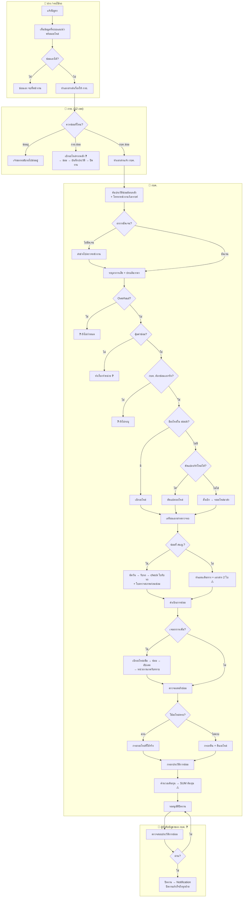

# Flow งานซ่อม กบค. (6 ช่วง)

> ที่มา: `flow-กบค/01-สรุปการทำงาน-Flow-กบค.md` · แยกมาเพื่อดูเป็นภาพง่าย (GitHub render mermaid ให้อัตโนมัติ)

```mermaid
flowchart TB
    subgraph A1["👷 ช่าง / คนใช้รถ"]
        P1[แจ้งปัญหา] --> P2[เห็นข้อมูลที่ระบบแนะนำ<br/>พร้อมอะไหล่]
        P2 --> D1{ซ่อมเองได้?}
        D1 -- ได้ --> P3[ซ่อมเอง จบที่หน้างาน]
        D1 -- ไม่ --> P4[ทำเอกสารส่งเรื่องให้ กรย.]
    end

    subgraph A2["🏢 กรย. (12 เขต)"]
        P4 --> D2{ควรซ่อมที่ไหน?}
        D2 -- ซ่อมอู่ --> P5[เจ้าของรถขับรถไปซ่อมอู่]
        D2 -- กรย.ซ่อม --> P6[เบิกอะไหล่จากคลัง ❓<br/>→ ซ่อม → บันทึกประวัติ → ปิดงาน]
        D2 -- กบค.ซ่อม --> P7[ทำเอกสารแจ้ง กบค.]
    end

    subgraph A3["🔧 กบค."]
        P7 --> P8[ค้นประวัติซ่อมย้อนหลัง<br/>+ โทรหาหน้างานวิเคราะห์]
        P8 --> D3{อาการชัดเจน?}
        D3 -- ไม่ชัดเจน --> P9[ส่งช่างไปตรวจหน้างาน] --> P10
        D3 -- ชัดเจน --> P10[ระบุอาการเสีย + ประเมินราคา]
        P10 --> D4{Overhaul?}
        D4 -- ใช่ --> Q1[❓ ยังไม่กำหนด]
        D4 -- ไม่ --> D5{คุ้มค่าซ่อม?}
        D5 -- ไม่ --> Q2[ทำเรื่องจำหน่าย ❓]
        D5 -- ใช่ --> D6{กบค. ต้องซ่อมเองจริง?}
        D6 -- ไม่ --> Q3[❓ ยังไม่ระบุ]
        D6 -- ใช่ --> D7{มีอะไหล่ใน stock?}
        D7 -- มี --> P11[เบิกอะไหล่]
        D7 -- ไม่มี --> D8{ดัดแปลง/ทำใหม่ได้?}
        D8 -- ได้ --> P12[ดัดแปลงอะไหล่]
        D8 -- ไม่ได้ --> P13[สั่งเบิก → รออะไหล่มาส่ง]
        P11 & P12 & P13 --> P14[เตรียมเอกสารตรวจรถ]
        P14 --> D9{ซ่อมที่ สนญ.?}
        D9 -- ใช่ --> P15[นัดวัน → รับรถ → check ใบรับรถ<br/>+ ใบตรวจสภาพก่อนซ่อม]
        D9 -- ไม่ --> P16[ทำแผนเดินทาง + เอกสาร 2 ใบ ⚠️]
        P15 & P16 --> P17[ดำเนินการซ่อม]
        P17 --> D10{เจออาการเพิ่ม?}
        D10 -- ใช่ --> P18[เบิกอะไหล่เพิ่ม → ซ่อม → อัปเดต<br/>→ หน่วยงานกดรับทราบ] --> P19
        D10 -- ไม่ --> P19[ตรวจผลหลังซ่อม]
        P19 --> D11{ใช้อะไหล่ครบ?}
        D11 -- ครบ --> P20[กรอกอะไหล่ที่ใช้จริง]
        D11 -- ไม่ครบ --> P21[กรอกคืน + คืนอะไหล่]
        P20 & P21 --> P22[กรอกประวัติการซ่อม]
        P22 --> P23[คำนวณต้นทุน → SUM ต้นทุน ⚠️]
        P23 --> P24[รออนุมัติปิดงาน]
    end

    subgraph A4["👔 ผู้บังคับบัญชาของ กบค. ❓"]
        P24 --> P25[ตรวจสอบประวัติการซ่อม]
        P25 --> D12{ผ่าน?}
        D12 -- ใช่ --> P26[ปิดงาน → Notification<br/>ปิดงานสำเร็จถึงทุกฝ่าย]
        D12 -- ไม่ --> P24
    end
```
