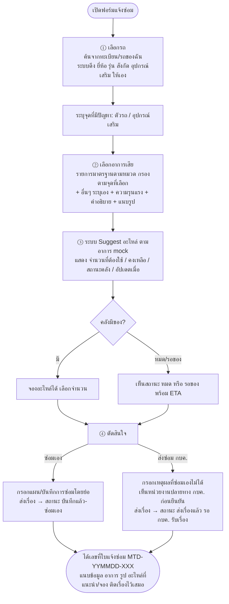

# Flow ฟอร์มแจ้งซ่อม

> ที่มา: `Maintenance-Request-Form/02-Flow-and-Mock-Data.md` · แยกมาเพื่อดูเป็นภาพง่าย (GitHub render mermaid ให้อัตโนมัติ)

```mermaid
flowchart TD
    A([เปิดฟอร์มแจ้งซ่อม]) --> B[① เลือกรถ<br/>ค้นจากทะเบียน/รถของฉัน<br/>ระบบดึง ยี่ห้อ รุ่น สังกัด อุปกรณ์เสริม ให้เอง]
    B --> B2[ระบุจุดที่มีปัญหา: ตัวรถ / อุปกรณ์เสริม]
    B2 --> C[② เลือกอาการเสีย<br/>รายการมาตรฐานตามหมวด กรองตามจุดที่เลือก<br/>+ อื่นๆ ระบุเอง + ความรุนแรง + คำอธิบาย + แนบรูป]
    C --> D[③ ระบบ Suggest อะไหล่ ตามอาการ mock<br/>แสดง จำนวนที่ต้องใช้ / คงเหลือ / สถานะคลัง / อัปเดตเมื่อ]
    D --> D2{คลังมีของ?}
    D2 -- มี --> D3[จองอะไหล่ได้ เลือกจำนวน]
    D2 -- หมด/รอของ --> D4[เห็นสถานะ หมด หรือ รอของ พร้อม ETA]
    D3 --> E
    D4 --> E[④ ตัดสินใจ]
    E -- ซ่อมเอง --> F[กรอกแผน/บันทึกการซ่อมโดยย่อ<br/>ส่งเรื่อง → สถานะ บันทึกแล้ว-ซ่อมเอง]
    E -- ส่งซ่อม กบค. --> G[กรอกเหตุผลที่ซ่อมเองไม่ได้<br/>เห็นหน่วยงานปลายทาง กบค. ก่อนยืนยัน<br/>ส่งเรื่อง → สถานะ ส่งเรื่องแล้ว รอ กบค. รับเรื่อง]
    F --> H([ได้เลขที่ใบแจ้งซ่อม MTD-YYMMDD-XXX<br/>แนบข้อมูล อาการ รูป อะไหล่ที่แนะนำ/จอง ติดเรื่องไว้เสมอ])
    G --> H
```
