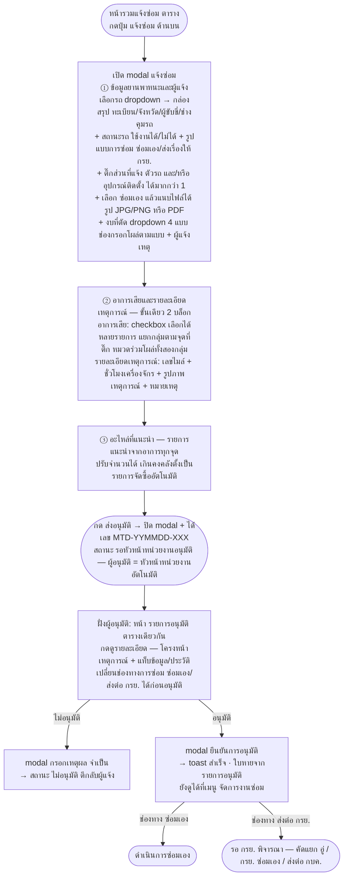

# Flow ฟอร์มแจ้งซ่อม

> ที่มา: `Maintenance-Request-Form/02-Flow-and-Mock-Data.md` · แยกมาเพื่อดูเป็นภาพง่าย (GitHub render mermaid ให้อัตโนมัติ)
>
> 🆕 อัปเดต 8 ก.ย. 2569 (2) — เลือก **"ดำเนินการซ่อมเอง"** แล้วมีช่อง **เอกสารแนบ** โผล่ในขั้น 1
> รับรูป JPG/PNG หรือ PDF แนบได้หลายไฟล์ ลบทีละไฟล์ได้ · แสดงเป็น `.file-chip` ของ design system
> · หน้าอนุมัติเห็นไฟล์ที่แนบมาในบล็อก "ช่องทางการซ่อม" (อ่านอย่างเดียว)
> · ⬜ ต้นแบบเก็บแค่ชื่อ/ขนาด/ชนิดไฟล์ — ยังไม่มีที่เก็บไฟล์จริง
>
> 🆕 อัปเดต 8 ก.ย. 2569 — เจ้าของงานสั่ง *"รายละเอียดสถานการณ์ กับอาการเสีย รวบไว้ด้วยกันเลย"*
> ⇒ **เหลือ 3 ขั้น** · ขั้นที่ 2 เป็น "อาการเสียและรายละเอียดเหตุการณ์" มี 2 บล็อกในขั้นเดียว
> (อาการเสียมาก่อน เพราะเป็นเนื้อของเรื่องและเป็นตัวกำหนดอะไหล่ในขั้นถัดไป) แบ่งด้วย
> `.incident-section` + `.incident-section-title` ของ design system · **ยังคงเป็น wizard**
> ไม่ยุบเป็นฟอร์มหน้าเดียว เพราะขั้นอะไหล่คำนวณจากอาการที่ติ๊กในขั้นก่อนหน้า
>
> อัปเดต 7 ก.ย. 2569 — เจ้าของงานส่งสเปกภาพชุดเต็มจากดีไซน์จริง: **modal 4 ขั้น (ตอนนั้น)**
> (สถานะรถ + รูปแบบการซ่อม + จุดที่แจ้ง + งบ + ผู้แจ้งเหตุ รวมอยู่ขั้น 1 ·
> ขั้นสถานที่/เหตุการณ์ตัดเหลือ ไมล์/ชั่วโมงเครื่องจักร/รูป/หมายเหตุ ·
> **ไม่มีขั้นเลือกผู้อนุมัติ** — ส่งอนุมัติตรงจากขั้นอะไหล่ ผู้อนุมัติ = หัวหน้าหน่วยงานอัตโนมัติ ·
> หัวหน้าเปลี่ยนช่องทางการซ่อม ซ่อมเอง/ส่งต่อ กรย. ได้ก่อนอนุมัติ)
>
> การนำเสนอมี 2 แบบ flow เดียวกันเป๊ะ (7 ก.ย. 2569): **modal** = mock หลัก ·
> **หน้าเต็ม + stepper** = `mock/Maintenance-Request-Form-page.html` (กดปุ่มแจ้งซ่อมแล้วนำทางไปหน้าฟอร์มแทนเปิด modal)

