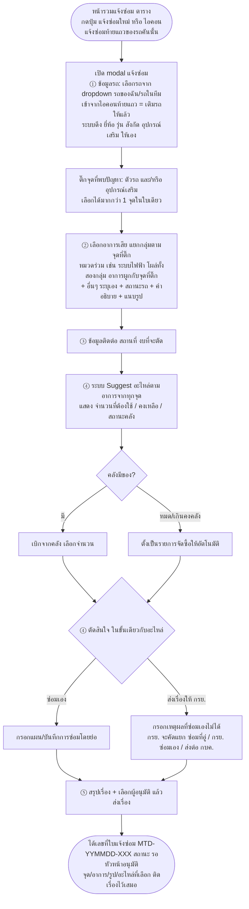

# Flow ฟอร์มแจ้งซ่อม

> ที่มา: `Maintenance-Request-Form/02-Flow-and-Mock-Data.md` · แยกมาเพื่อดูเป็นภาพง่าย (GitHub render mermaid ให้อัตโนมัติ)
>
> อัปเดต 4 ก.ย. 2569 — เจ้าของงานเคาะจากดีไซน์ VMS Plus จริง (3 ก.ย.):
> ฟอร์มเป็น **modal** เปิดจากหน้ารวมแจ้งซ่อม (ไม่ใช่หน้าเต็มแล้ว) ·
> เลือกรถเป็น **dropdown** · จุดที่พบปัญหา**ติ๊กได้หลายจุด** · อาการ**แยกกลุ่มตามจุด**

