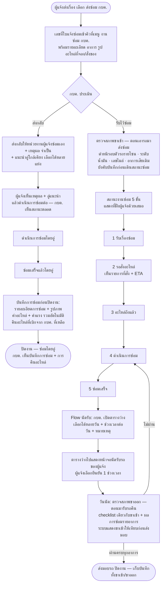

# Flow ฝั่ง กบค. — รับงาน · นัดรับ · ตรวจสภาพ

> ที่มา: `Maintenance-Request-Form/03-Flow-KBK-Pickup-Inspection.md` · แยกมาเพื่อดูเป็นภาพง่าย (GitHub render mermaid ให้อัตโนมัติ)

```mermaid
flowchart TD
    A([ผู้แจ้งส่งเรื่อง เลือก ส่งซ่อม กบค.]) --> B[เลขที่ใบแจ้งซ่อมเข้าคิวที่เมนู งานซ่อม กบค.<br/>พร้อมรายละเอียด อาการ รูป อะไหล่ที่จอง/สั่งของ]
    B --> C{กบค. ประเมิน}
    C -- ส่งกลับ --> D[ส่งกลับให้หน่วยงานผู้แจ้งซ่อมเอง<br/>+ เหตุผล จำเป็น<br/>+ แนะนำอู่ใกล้เคียง เลือกได้หลายแห่ง]
    D --> D2[ผู้แจ้งเห็นเหตุผล + อู่แนะนำ<br/>แล้วดำเนินการซ่อมต่อ — กบค. เห็นสถานะตลอด]
    D2 --> R1[ดำเนินการซ่อมโดยอู่] --> R2[ซ่อมเสร็จแล้วโดยอู่]
    R2 --> R3[บันทึกการซ่อมก่อนปิดงาน:<br/>รายละเอียดการซ่อม + รูปภาพ<br/>ค่าอะไหล่ + ค่าแรง รวมอัตโนมัติ<br/>คืนอะไหล่ที่เบิกจาก กบค. ที่เหลือ]
    R3 --> R4([ปิดงาน — ซ่อมโดยอู่<br/>กบค. เห็นบันทึกการซ่อม + การคืนอะไหล่])
    C -- รับไว้ซ่อม --> E0[ตรวจสภาพขาเข้า — ตอนเอารถมาส่งซ่อม<br/>ตำหนิรอบตัวรถรายโซน · ระดับน้ำมัน · เลขไมล์ · อาการเสียเดิม<br/>บังคับบันทึกก่อนเดินสถานะซ่อม]
    E0 --> E[สถานะงานซ่อม 5 ขั้น<br/>แสดงที่ฝั่งผู้แจ้งด้วยเสมอ]
    E --> E1[1 รับเรื่องซ่อม] --> E2[2 รอสั่งอะไหล่<br/>เห็นรายการที่สั่ง + ETA] --> E3[3 อะไหล่ถึงแล้ว] --> E4[4 ดำเนินการซ่อม] --> E5[5 ซ่อมเสร็จ]
    E5 --> F[Flow นัดรับ: กบค. เปิดตารางว่าง<br/>เลือกได้หลายวัน + ช่วงเวลาต่อวัน + หมายเหตุ]
    F --> F2[ตารางว่างไปแสดงหน้าจอนัดรับรถของผู้แจ้ง<br/>ผู้แจ้งเลือกยืนยัน 1 ช่วงเวลา]
    F2 --> G[วันนัด: ตรวจสภาพขาออก — ตอนมารับรถคืน<br/>checklist เดียวกับขาเข้า + ผลการซ่อมรายอาการ<br/>ระบบแสดงขาเข้าให้เทียบก่อนส่งมอบ]
    G -- ผ่านครบทุกอาการ --> H([ส่งมอบรถ ปิดงาน — เก็บบันทึกทั้งขาเข้า/ขาออก])
    G -- ไม่ผ่าน --> E4
```
