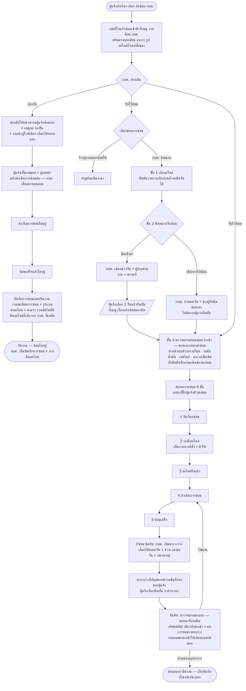

# Flow ฝั่ง กบค. — รับงาน · นัดรับ · ตรวจสภาพ

> 🧩 **ต้นแบบ "ทำแผนการเดินทาง" ของงานซ่อม — 25 ส.ค. 2569**
> `SC-15` ออกซ่อมหน้างาน · `UC-15.1` ทำแผนเดินทาง มีหน้าจอให้กดเล่นแล้วที่
> [`maintainance-yearly/trip-plan.html#repair`](../../maintainance-yearly/trip-plan.html)
> (แถบสลับสายงานบนหน้า "ทำแผนการเดินทาง" → เลือก **งานซ่อม**)
>
> 🔑 **เงื่อนไขรถที่เข้าแผนเดินทางได้** — เฉพาะใบที่เลือก **จัดซ่อมที่หน้างาน** ในหัวข้อ *รูปแบบการซ่อม*
>   (อีกทางคือ *เข้าซ่อมที่ กบค.* = นัดเจ้าของรถขนรถมา สนญ. ไม่ต้องจัดทีมเดินทาง) · เคาะ 25 ส.ค. 2569
>   ต้นแบบแสดงใบที่ถูกกันออกไว้ท้ายหน้าพร้อมเหตุผล ไม่ได้ซ่อน
> · ใช้โมดูล `trip-plan.js` ตัวเดียวกับสายบำรุงรักษา — **โครงกล่อง/ฟอร์ม/ตารางชุดเดียวกัน**
> · ต่างกันที่: **ไม่มีไตรมาส · ไม่มีปุ่มแยกอัตโนมัติตามจังหวัด** (เจ้าของงานสั่งตัดออกทั้งคู่)
>   · หน่วยของงานเป็น **ใบแจ้งซ่อม** ไม่ใช่รถในแผนประจำปี · **1 ใบเดินทางรวมได้หลายใบแจ้งซ่อม**
>   · งานที่จะทำ = **อาการที่แจ้งไว้** อ่านอย่างเดียว แก้ที่นี่ไม่ได้
>   · เพิ่ม 2 ช่องที่ `UC-15.1`/`AC-3.5` ขอ: **จุดนัดรับรถ** · **รถที่ใช้เดินทาง** (บังคับกรอกทั้งคู่)
> · เสนอเป็น **ช่วงเวลา** และให้ตอบรับเป็นช่วง เหมือนสายบำรุงรักษา (เจ้าของงานยืนยัน 25 ส.ค. 2569)
>
> ⚠️ **ขอบเขตต้นแบบรอบนี้ = จังหวะสร้างแผนเท่านั้น จบที่ "ส่งแผนนัดให้หน่วยงาน"**
> ยังไม่ได้ทำ: ฝั่งหน่วยงานตอบรับ · **ขั้นขออนุมัติแผนเดินทาง** (เจ้าของงานเคาะแล้วว่าต้องมี) · ยืนยันแผน
> ข้อมูลใบแจ้งซ่อมเป็น **ข้อมูลจำลอง** 8 ใบใน `mock-yearly.js` (`SEED_REPAIR_JOBS`) — ต้นแบบแจ้งซ่อม
> เก็บข้อมูลคนละที่และห้ามลิงก์ข้ามโฟลเดอร์ จึง seed ไว้ให้หน้านี้ยืนได้เอง

> ที่มา: `Maintenance-Request-Form/03-Flow-KBK-Pickup-Inspection.md` · แยกมาเพื่อดูเป็นภาพง่าย (GitHub render mermaid ให้อัตโนมัติ)

