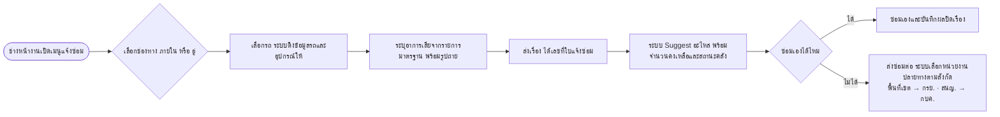

# BL01 — Flow การใช้งาน (แจ้งซ่อม + Suggest อะไหล่)

> ที่มา: `backlog/BL01-แจ้งซ่อม-Suggest-อะไหล่/00-ภาพรวม-Backlog.md` · แยกมาเพื่อดูเป็นภาพง่าย (GitHub render mermaid ให้อัตโนมัติ)

```mermaid
flowchart LR
    A([ช่างหน้างานเปิดเมนูแจ้งซ่อม]) --> B{เลือกช่องทาง ภายใน หรือ อู่}
    B --> C[เลือกรถ ระบบดึงข้อมูลรถและอุปกรณ์ให้]
    C --> D[ระบุอาการเสียจากรายการมาตรฐาน พร้อมรูปถ่าย]
    D --> E[ส่งเรื่อง ได้เลขที่ใบแจ้งซ่อม]
    E --> F[ระบบ Suggest อะไหล่ พร้อมจำนวนคงเหลือและสถานะคลัง]
    F --> G{ซ่อมเองได้ไหม}
    G -- ได้ --> H[ซ่อมเองและบันทึกผลปิดเรื่อง]
    G -- ไม่ได้ --> I[ส่งซ่อมต่อ ระบบเลือกหน่วยงานปลายทางตามสังกัด<br/>พื้นที่เขต → กรย. · สนญ. → กบค.]
```
