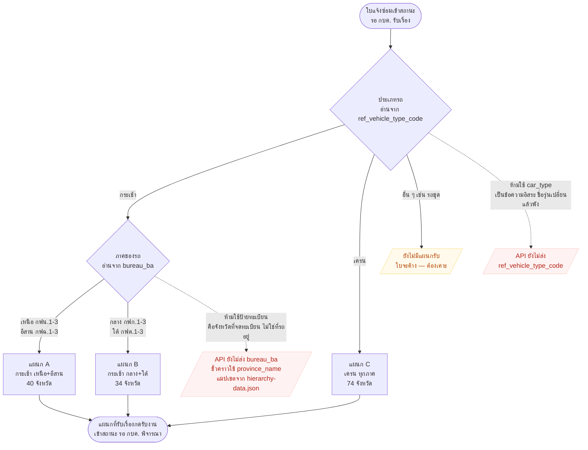

# Routing ใบแจ้งซ่อม → แผนกที่รับเรื่อง (ประเภทรถ × ภาค)

> **ที่มา:** เจ้าของงานสั่ง 15 ก.ย. 2569 — *"กระเช้า เหนือ อีสาน จะไปที่ 1 แผนก · กระเช้า กลางใต้ จะไปอีกแผนก · เครนของทุกภาค จะไปอีกแผนก"*
> **เอกสาร requirement เต็ม:** `db-schema/map-05-routing-ใบแจ้งซ่อม-ตามประเภทรถและภาค.md` (นอกรีโป)
> **⚠️ ยังไม่ implement** — ขาดข้อมูล 2 อย่างจาก API (ดูกล่องสีแดงในผัง) และยังไม่รู้รหัส `dept_sap` ของทั้ง 3 แผนก
>
> จุดเชื่อมกับผังอื่น: เกิดขึ้น**หลัง**สถานะ *"รอ กบค. รับเรื่อง"* ของ
> [03-กบค-รับงาน-นัดรับ-ตรวจสภาพ.md](03-กบค-รับงาน-นัดรับ-ตรวจสภาพ.md) — เดิมผังนั้นถือว่า กบค. เป็นก้อนเดียว

## ผัง

## แมปเขต → ภาค

ตัวอักษรตัวที่ 3 ของรหัสเขตบอกภาคได้ตรงๆ — ตรวจครบ 74 จังหวัดจาก `hierarchy-data.json` ไม่มีข้อยกเว้น

| ภาค | รหัสเขต | จำนวนจังหวัด |
|---|---|---|
| เหนือ | กฟ**น**.1–3 | 20 |
| อีสาน | กฟ**ฉ**.1–3 | 20 |
| กลาง | กฟ**ก**.1–3 | 16 |
| ใต้ | กฟ**ต**.1–3 | 18 |

## 🔴 กับดักที่พิสูจน์แล้วจากใบจริง

ใบ `RRG6900006` มีข้อมูลจังหวัด 2 ชุดที่**ขัดกัน** — เลือกผิดแล้ว route ผิดแผนกทันที

| ฟิลด์ | ค่า | → ภาค | → แผนก |
|---|---|---|---|
| `province_name` | พะเยา | เหนือ | **A** ✅ |
| `vehicle_license_plate_province_short` | อย (อยุธยา) | กลาง | **B** ❌ |

ยืนยันด้วย `pea_name` = `กฟอ.แม่ใจ` ซึ่งอยู่พะเยา ⇒ `province_name` ถูก
**ป้ายทะเบียน = จังหวัดที่จดทะเบียนตอนซื้อ ไม่ใช่ที่รถอยู่** รถโอนย้ายได้แต่ป้ายไม่เปลี่ยน

## ที่ยังไม่เคาะ

1. **รถประเภทอื่น (รถขุด ฯลฯ) ไปแผนกไหน** — ถ้าไม่มีแผนกรับ ใบจะค้าง (กล่องสีเหลืองในผัง)
2. **ยึดภาคจากอะไร** — จังหวัดที่ใช้รถตอนนี้ หรือเขตที่รถสังกัดใน SAP
3. **ชื่อ + รหัส `dept_sap` จริงของ 3 แผนก**
4. **รถโอนย้ายข้ามภาคระหว่างใบค้าง** — ย้ายแผนกตามไหม หรือค้างแผนกเดิมจนจบงาน
