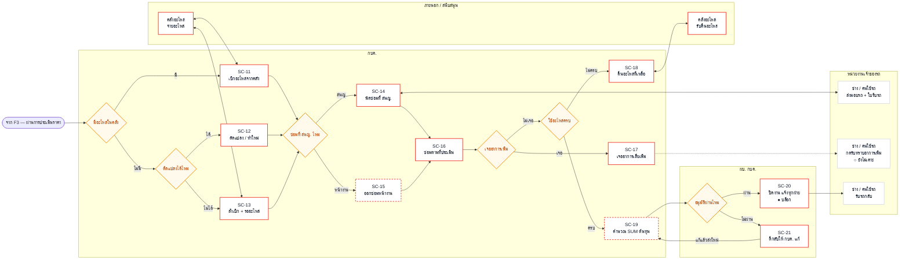

# 🏢 ผังหน่วยงาน × เส้นทางงานซ่อม — ระดับ Scenario (Stakeholder Map)

> **ต่างจากไฟล์อื่นในโฟลเดอร์นี้ยังไง** — [`01-flow-กบค-6ช่วง.md`](01-flow-กบค-6ช่วง.md) และไฟล์อื่นเป็นผัง**ขั้นตอน** (ทำอะไรต่อจากอะไร)
> ไฟล์นี้เป็นผัง**หน่วยงาน** (ใครอยู่กลุ่มไหน · เรื่องเดินจากมือใครไปมือใคร · ใครยังไม่มี role) — ข้อมูลชุดเดียวกัน คนละแกน
>
> **ระดับรายละเอียด:** Scenario — ครบทั้ง **21 เส้นทาง (SC-01…SC-21)** + **ด่านตัดสินใจ 12 จุด** · แบ่ง 2 ผังเพราะใส่ผังเดียวแล้วกว้างเกินอ่าน
> **หน้าเว็บฉบับเต็ม:** [`08-stakeholder-map.html`](../../08-stakeholder-map.html) (การ์ดบนฮับ `more.html`) — มีการ์ดรายบทบาท 11 ใบ + 10 เรื่องที่ต้องเคาะ
> **ที่มา:** [`flow-กบค/00-สารบัญ.md`](../../../flow-กบค/00-สารบัญ.md) (F1–F7 · 21 SC · 65 UC) + โค้ดจริง `code-maintainD` (21 ส.ค. 2569) + บทถอดเสียงประชุม กฟภ. ครั้งที่ 4

**อ่านผังยังไง**

| สัญลักษณ์ | ความหมาย |
|---|---|
| กรอบแดง | ยังไม่มี role ในระบบรองรับ |
| กรอบแดงประ | ไม่มี role **และ** flow ต้นทางยังไม่กำหนดเส้นทางต่อ (SC-08 · SC-09 · SC-10 · SC-15 · SC-19) |
| กรอบเทาประ | ยังไม่อยู่ใน flow F1–F7 เลย (ช่องว่างของ flow ต้นทาง ไม่ใช่ของระบบ) |
| ข้าวหลามตัดเหลือง | ด่านตัดสินใจ |
| `●` | บล็อกงานแน่นอน — ไม่กด เรื่องไม่เดินต่อ |
| `○` | ยังไม่เคาะว่าบล็อกไหม |

---

## ใบที่ 1 — แจ้ง → คัดแยก → ประเมิน (F1–F3 · SC-01…SC-10)

```mermaid
flowchart LR
    classDef norole fill:#fff,stroke:#F04438,stroke-width:2px,color:#101828
    classDef okrole fill:#fff,stroke:#D0D5DD,stroke-width:1.5px,color:#101828
    classDef opencase fill:#fff,stroke:#F04438,stroke-width:2px,stroke-dasharray:5 4,color:#101828
    classDef offflow fill:#fff,stroke:#98A2B3,stroke-width:1.5px,stroke-dasharray:5 4,color:#475467
    classDef gate fill:#FFFAEB,stroke:#F79009,stroke-width:2px,color:#B54708

    subgraph OWNER["หน่วยงานเจ้าของรถ"]
        direction LR
        G1{"ซ่อมเองได้ไหม"}
        SC01["SC-01<br/>ซ่อมเองได้ จบหน้างาน"]
        SC02["SC-02<br/>ส่งเรื่องให้ กรย."]
        AC7["AC-7<br/>อนุมัติใบแจ้งซ่อม<br/>● บล็อก"]
    end

    subgraph KRY["กรย. — 12 เขต"]
        direction LR
        G2{"เลือกช่องทางซ่อม"}
        SC04["SC-04<br/>กรย. ซ่อมเอง"]
        SC05["SC-05<br/>ส่งต่อ กบค.<br/>● บล็อก"]
    end

    subgraph KBK["กบค."]
        direction LR
        G3{"อาการชัดไหม"}
        SC06["SC-06<br/>ระบุอาการ + ประเมินราคา<br/>● บล็อก"]
        SC07["SC-07<br/>ส่งช่างตรวจหน้างาน"]
        G4{"Overhaul ไหม"}
        SC08["SC-08<br/>เข้าข่าย Overhaul"]
        G5{"คุ้มค่าซ่อมไหม"}
        SC09["SC-09<br/>ไม่คุ้ม → จำหน่าย"]
        G6{"กบค. ซ่อมเองไหม"}
        SC10["SC-10<br/>กบค. ไม่ซ่อมเอง"]
    end

    subgraph EXT1["ภายนอก / สนับสนุน"]
        SC03["SC-03<br/>ซ่อมอู่ภายนอก"]
    end

    subgraph OFF1["ยังไม่อยู่ใน flow"]
        direction LR
        OF1["ผจก.กอง<br/>อนุมัติ ≤ 500,000"]
        OF2["กองจัดซื้อ<br/>เกิน 500,000 → e-GP"]
    end

    START(["แจ้งปัญหาเข้าระบบ"]) --> G1
    G1 -->|"ได้"| SC01
    G1 -->|"ไม่ได้"| SC02
    SC02 --> AC7 --> G2
    G2 -->|"ซ่อมอู่"| SC03
    G2 -->|"กรย. ซ่อมเอง"| SC04
    G2 -->|"ส่งต่อ"| SC05
    SC05 --> G3
    G3 -->|"ชัด"| SC06
    G3 -->|"ไม่ชัด"| SC07
    SC07 -->|"ตรวจแล้ววกกลับ"| SC06
    SC06 --> G4
    G4 -.->|"ใช่"| SC08
    G4 -->|"ไม่ใช่"| G5
    G5 -.->|"ไม่คุ้ม"| SC09
    G5 -->|"คุ้ม"| G6
    G6 -.->|"ไม่ต้องซ่อมเอง"| SC10
    G6 --> NEXT(["ไป F4 — จัดการอะไหล่ (ใบที่ 2)"])
    SC06 -.->|"ราคาที่ประเมินได้"| OF1
    OF1 -.->|"เกินเพดาน"| OF2

    class AC7,SC03,SC04,SC05,SC06,SC07 norole
    class SC01,SC02 okrole
    class SC08,SC09,SC10 opencase
    class OF1,OF2 offflow
    class G1,G2,G3,G4,G5,G6 gate
```

---

## ใบที่ 2 — อะไหล่ → นัดหมาย → ซ่อม → ปิดงาน (F4–F7 · SC-11…SC-21)

---

## 3 เรื่องที่ผังนี้ชี้

1. **คนที่ถืออำนาจสูงสุด 3 ราย ไม่มีที่ยืนในระบบเลย** — ผบ. กบค. · หัวหน้าหน่วยงานผู้แจ้ง · กรย. ทั้งสามบล็อกงานได้คนละ 1 จุด รวมเป็น 3 ใน 6 จุดอนุมัติ แต่ไม่มี role และไม่มีหน้าจอฝั่งผู้อนุมัติ ⇒ เปิดใช้จริงตอนนี้ ใบแจ้งซ่อมค้างที่จุดแรกทันที

2. **โฟลว์ไม่มีจุดอนุมัติวงเงินเลยสักจุด** — ทั้งที่ ผจก.กอง อนุมัติซ่อมได้ ≤ 500,000 บาท เกินนั้นเข้า e-GP · ถ้าโฟลว์ต้องรองรับเส้นทางเงิน งานจะเกิน 66 ขั้น **ควรเคาะก่อนลงมือหน้าจอ F4**

3. **F3 คือช่วงที่เสี่ยงที่สุด** — มีด่านตัดสินใจติดกัน 4 ด่าน (อาการชัด → Overhaul → คุ้มค่า → ซ่อมเอง) และ **3 ใน 4 ทางแยกยังไม่มีเส้นทางต่อ** (SC-08 · SC-09 · SC-10) ⇒ เรื่องที่ตกลงทางแยกพวกนี้จะค้างในระบบโดยไม่มีปลายทาง

---

## เอกสารที่คู่กัน

- [`01-flow-กบค-6ช่วง.md`](01-flow-กบค-6ช่วง.md) — ผังขั้นตอนของ flow เดียวกัน
- [`flow-กบค/00-สารบัญ.md`](../../../flow-กบค/00-สารบัญ.md) — ต้นทางของ SC ทั้ง 21 + Use Case 65 ขั้น
- [`08-stakeholder-map.html`](../../08-stakeholder-map.html) — หน้าเว็บฉบับเต็ม (การ์ดรายบทบาท · แถบสัดส่วนการมีส่วนร่วม · 10 เรื่องที่ต้องเคาะ)
- `Maintenance-Request/VMS-Plus-ผู้เกี่ยวข้อง-โฟลว์ซ่อมบำรุง.md` (นอกรีโป) — ต้นทางเอกสาร + `.xlsx` 6 ชีตสำหรับส่งลูกค้าเติมมติ
