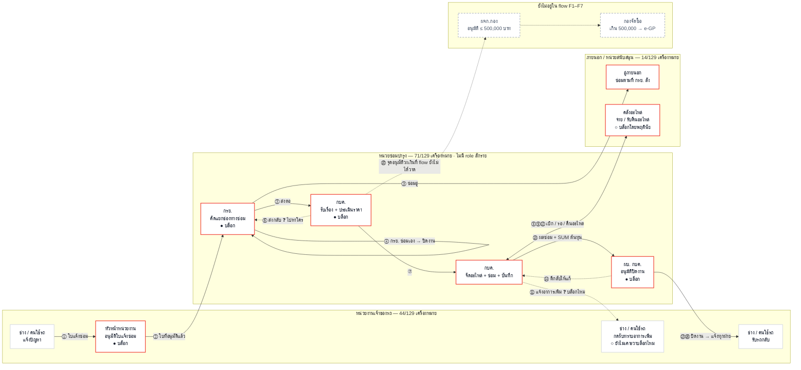

# 🏢 ผังหน่วยงานที่เกี่ยวข้องกับงานซ่อม (Stakeholder Map)

> **ต่างจากไฟล์อื่นในโฟลเดอร์นี้ยังไง** — [`01-flow-กบค-6ช่วง.md`](01-flow-กบค-6ช่วง.md) และไฟล์อื่นเป็นผัง**ขั้นตอน** (ทำอะไรต่อจากอะไร)
> ไฟล์นี้เป็นผัง**หน่วยงาน** (ใครอยู่กลุ่มไหน · เรื่องเดินจากมือใครไปมือใคร · ใครยังไม่มี role) — ข้อมูลชุดเดียวกัน คนละแกน
>
> **หน้าเว็บฉบับเต็ม:** [`08-stakeholder-map.html`](../../08-stakeholder-map.html) (การ์ดบนฮับ `more.html`) — มีการ์ดรายบทบาท 11 ใบ + 10 เรื่องที่ต้องเคาะ
> **ที่มาของตัวเลข:** ตาราง `ขั้นตอน × บทบาท` ของ flow-กบค. F1–F7 (66 ขั้น · จุดอนุมัติ 6 จุด) + โค้ดจริง `code-maintainD` (21 ส.ค. 2569) + บทถอดเสียงประชุม กฟภ. ครั้งที่ 4

---

## ผัง

**อ่านผังยังไง**

| สัญลักษณ์ | ความหมาย |
|---|---|
| กรอบแดง | ยังไม่มี role ในระบบรองรับ — **7 กล่อง** |
| กรอบประเทา | ยังไม่อยู่ใน flow F1–F7 เลย (เป็นช่องว่างของ flow ต้นทาง ไม่ใช่ของระบบ) |
| `●` | บล็อกงานแน่นอน — ไม่กด เรื่องไม่เดินต่อ |
| `○` | ยังไม่เคาะว่าบล็อกไหม |
| เส้นประ | flow ยังไม่กำหนดปลายทาง |
| เลข ①–⑯ | ตรงกับตาราง "แผนที่ความสัมพันธ์" ในหน้าเว็บและใน `VMS-Plus-ผู้เกี่ยวข้อง-โฟลว์ซ่อมบำรุง.md` |

---

## 3 เรื่องที่ผังนี้ชี้

1. **คนที่ถืออำนาจสูงสุด 3 ราย ไม่มีที่ยืนในระบบเลย** — ผบ. กบค. · หัวหน้าหน่วยงานผู้แจ้ง · กรย. ทั้งสามบล็อกงานได้คนละ 1 จุด รวมเป็น 3 ใน 6 จุดอนุมัติ แต่ไม่มี role และไม่มีหน้าจอฝั่งผู้อนุมัติ ⇒ เปิดใช้จริงตอนนี้ ใบแจ้งซ่อมค้างที่จุดแรกทันที

2. **โฟลว์ไม่มีจุดอนุมัติวงเงินเลยสักจุด** — ทั้งที่ ผจก.กอง อนุมัติซ่อมได้ ≤ 500,000 บาท เกินนั้นเข้า e-GP · ถ้าโฟลว์ต้องรองรับเส้นทางเงิน งานจะเกิน 66 ขั้น **ควรเคาะก่อนลงมือหน้าจอ F4**

3. **กรย. อาจไม่ต้องสร้าง role ใหม่** — ทำงานระดับเขต 12 เขต ตรงกับ `admin-region` ที่มีอยู่แล้วและเขียนเงื่อนไขกรอง `bureau_ba` รอไว้ เพียงแต่ตั้งค่าสิทธิ์ผิดอยู่ 10 โมดูล · ถ้ายืนยันว่าใช่ ประหยัดงานไปทั้งก้อน

---

## เอกสารที่คู่กัน

- [`01-flow-กบค-6ช่วง.md`](01-flow-กบค-6ช่วง.md) — ผังขั้นตอนของ flow เดียวกัน
- [`08-stakeholder-map.html`](../../08-stakeholder-map.html) — หน้าเว็บฉบับเต็ม (การ์ดรายบทบาท · แถบสัดส่วนการมีส่วนร่วม · 10 เรื่องที่ต้องเคาะ)
- `Maintenance-Request/VMS-Plus-ผู้เกี่ยวข้อง-โฟลว์ซ่อมบำรุง.md` (นอกรีโป) — ต้นทางเอกสาร + `.xlsx` 6 ชีตสำหรับส่งลูกค้าเติมมติ
