# Swimlane — โฟลว์แจ้งซ่อมทั้งเส้น (21 สถานะ)

> **เลน = actor (แถวแนวนอน) · flow ไหลจากซ้ายไปขวา** ตามที่เจ้าของงานสั่ง 15 ก.ย. 2569

> **ผังภาพรวมทั้งเส้น** ตั้งแต่ผู้แจ้งกรอกใบ จนปิดงาน/รับรถกลับ · แบ่งเลนตามผู้รับผิดชอบ
> ผังนี้ตอบว่า **"ใบอยู่ในมือใคร ณ สถานะไหน"** — ส่วน *"อะไรทำให้สถานะเปลี่ยน"*
> ดูที่ [07-state-เงื่อนไขเปลี่ยนสถานะ.md](07-state-เงื่อนไขเปลี่ยนสถานะ.md) (ผังคู่กัน ใช้เลข S เดียวกัน)
>
> **ที่มา:** ตาราง permission ที่เจ้าของงานกรอกส่งมา 15 ก.ย. 2569 (21 สถานะ · **4 บทบาท**)
> — แทนชุด 19 สถานะเดิม · สิทธิ์เห็น/แก้ราย สถานะ×บทบาท อยู่ที่ `db-schema/map-04-permission-…`
>
> **กบค. ทำเป็นเลนเดียว** ไม่แตกเป็น 3 แผนก เพราะใบหนึ่งใบวิ่งเข้าแผนกเดียวเท่านั้น —
> รายละเอียดว่าเข้าแผนกไหนดูที่ [05-routing-ใบไปแผนก.md](05-routing-ใบไปแผนก.md)
>
> 🔲 **สีเทา = รอเจ้าของงาน CF แต่ลงมือทำก่อนได้** (S7 · S9 · S11 — สายซ่อมเอง/ส่งอู่)

```mermaid
flowchart LR
    subgraph L1["👤 หน่วยงานต้นทาง / ผู้แจ้งซ่อม"]
        direction LR
        A0([กรอกใบแจ้งซ่อม]) --> S1x[ ]
        S4["S4 รอผู้แจ้งซ่อมดำเนินการ<br/>(ตีกลับ)"] --> A1[แก้ข้อมูล<br/>แล้วส่งใหม่]
        S2["S2 รอหน่วยงาน<br/>ดำเนินการซ่อมเอง"]
        S5["S5 ส่งกลับ<br/>ต้นทางซ่อมเอง"]
        S3(["S3 ไม่อนุมัติ"])
        S13["S13 รอต้นทาง<br/>ยืนยันนัดหมาย"]
        S18["S18 รอต้นทางพิจารณา<br/>อาการเพิ่มเติม"]
        S19["S19 รอต้นทาง<br/>ยืนยันรับรถ"]
        S20["S20 รอต้นทาง<br/>รับรถกลับไปใช้งาน"]
    end

    subgraph L2["👔 หัวหน้าหน่วยงานต้นทาง"]
        direction LR
        S1["S1 รอหัวหน้า<br/>หน่วยงานอนุมัติ"]
    end

    subgraph L3["🏢 กรย. / แผนก ผยค."]
        direction LR
        S6["S6 รอ กรย.<br/>พิจารณา"]
        S7["S7 กรย. เห็นชอบ<br/>รอหน่วยงานซ่อมเอง"]
        S8["S8 รอ กรย.<br/>ดำเนินการ"]
        S9["S9 กรย. ส่งซ่อม<br/>ศูนย์บริการ/อู่"]
    end

    subgraph L4["🔧 กบค. (แผนก A / B / C)"]
        direction LR
        S10["S10 รอ กบค. พิจารณา<br/>routing ประเภทรถ × ภาค"]
        S11["S11 กบค. เห็นชอบ<br/>รอหน่วยงานซ่อมเอง"]
        S12["S12 รอเตรียมอะไหล่"]
        S14["S14 พร้อม<br/>ดำเนินการซ่อม"]
        S15["S15 อยู่ระหว่าง<br/>ดำเนินการซ่อม"]
        S17["S17 พบอาการเพิ่มเติม<br/>รอ กบค. ประเมิน"]
        S16["S16 ซ่อมเสร็จ<br/>รอส่งมอบรถ"]
        S21(["S21 ปิดงาน"])
    end

    subgraph L5["📦 กบค. พัสดุ / แผนกผู้รับผิดชอบ"]
        direction LR
        B1[จัดอะไหล่<br/>ตามรายการที่เบิก]
    end

    S1x --> S1
    S1 -- ไม่อนุมัติ --> S3
    S1 -- ตีกลับ --> S4
    A1 --> S1
    S1 -- อนุมัติ · ต้นทางซ่อมเอง --> S2
    S1 -- อนุมัติ · ส่งต่อ กรย. --> S6
    S6 -- เห็นชอบ ให้ต้นทางซ่อมเอง --> S7
    S6 -- ส่งกลับต้นทาง --> S5
    S6 -- กรย. รับดำเนินการเอง --> S8
    S6 -. ส่งซ่อมอู่ .-> S9
    S6 -- ส่งซ่อม กบค. --> S10
    S7 --> S2
    S5 --> S2
    S2 -- บันทึกผลซ่อม --> S21
    S8 -- ซ่อมเสร็จ --> S21
    S8 -- ต้องให้ กบค. ซ่อม --> S10
    S9 -. อู่ซ่อมเสร็จ .-> S21
    S10 -. เห็นชอบ ให้หน่วยงานซ่อมเอง .-> S11
    S10 -- ส่งคืน กรย. --> S8
    S10 -- รับซ่อม --> S12
    S11 -. ซ่อมเสร็จ .-> S21
    S12 --> B1
    B1 -- อะไหล่พร้อม --> S13
    S13 -- ต้นทางเลือกวันนัด --> S14
    S14 -- รับรถ · ตรวจสภาพก่อนซ่อม --> S15
    S15 -- พบอาการเพิ่มเติม --> S17
    S15 -- ซ่อมเสร็จสิ้น --> S16
    S17 -- ส่งให้ต้นทางตัดสิน --> S18
    S18 -- เห็นชอบให้ซ่อมเพิ่ม --> S12
    S18 -- ไม่ซ่อมเพิ่ม --> S16
    S16 -- เปิดช่วงนัดรับรถ --> S19
    S19 -- ยืนยันนัดรับ --> S20
    S20 -- ตรวจสภาพหลังซ่อม · ส่งมอบ --> S21

    classDef done fill:#ECFDF3,stroke:#ABEFC6,color:#067647
    classDef stop fill:#FEF3F2,stroke:#FECDCA,color:#B42318
    classDef cf   fill:#F9FAFB,stroke:#D0D5DD,color:#667085
    classDef hide fill:none,stroke:none,color:#FFFFFF
    class S21 done
    class S3 stop
    class S7,S9,S11 cf
    class S1x hide
```

## 5 เลน

| เลน | ถือใบตอนไหน |
|---|---|
| 👤 **หน่วยงานต้นทาง / ผู้แจ้งซ่อม** | S2 · S4 · S5 · S13 · S18 · S19 · S20 |
| 👔 **หัวหน้าหน่วยงานต้นทาง** | S1 (เป็นบทบาทที่ 4 แยกจากผู้แจ้ง ตามตาราง 15 ก.ย.) |
| 🏢 **กรย. / ผยค.** | S6 · S8 · S9 🔲 |
| 🔧 **กบค. (แผนก A/B/C)** | S10 · S11 🔲 · S12 · S14 · S15 · S16 · S17 |
| 📦 **กบค. พัสดุ** | ช่วง S12 (จัดอะไหล่) |

## จุดที่ใบ "ข้ามเลน" กลับมาหาต้นทาง ระหว่างงานยังไม่จบ

สี่จุดนี้ กบค. เป็นคนเปิดเรื่อง แต่**คนที่ต้องกดคือต้นทาง**

- **S13 รอต้นทางยืนยันนัดหมาย** → เลือกวันจากช่องที่ กบค. เปิดให้
- **S18 รอต้นทางพิจารณาอาการเพิ่มเติม** → ตัดสินว่าจะซ่อมเพิ่มหรือไม่ ⇒ ปิดคำถามเดิมที่ค้างว่า "ใครตัดสินตอนเจออาการเพิ่ม"
- **S19 รอต้นทางยืนยันรับรถ** → ยืนยันนัดรับ
- **S20 รอต้นทางรับรถกลับไปใช้งาน** → มารับรถจริง แล้ว กบค. จึงปิดงานได้

## ลูปย้อนกลับ 3 เส้น

1. **S1 → S4 → S1** ตีกลับให้ผู้แจ้งแก้ แล้ววนกลับหาหัวหน้า
2. **S10 → S8 → S10** กบค. ส่งคืน กรย. แล้ว กรย. ส่งกลับมาใหม่
3. **S15 → S17 → S18 → S12** พบอาการเพิ่ม → ต้นทางเห็นชอบ → วนกลับเตรียมอะไหล่

## ที่ยังไม่เคาะ

ดูรายละเอียดครบใน [07-state-เงื่อนไขเปลี่ยนสถานะ.md](07-state-เงื่อนไขเปลี่ยนสถานะ.md)

1. เจ้าของงานของ **S7** — ตารางเขียน `หน่วยงานต้นทาง (กรย ?)`
2. **"กบค. ส่งซ่อมอู่" เป็นสถานะแยกไหม** — ตารางมีแค่ของ กรย. (S9) แต่เจ้าของงานบอกว่าสายอู่มีทั้งสองฝั่ง
3. **routing เข้าแผนกที่ S10** — [05-routing-ใบไปแผนก.md](05-routing-ใบไปแผนก.md)
