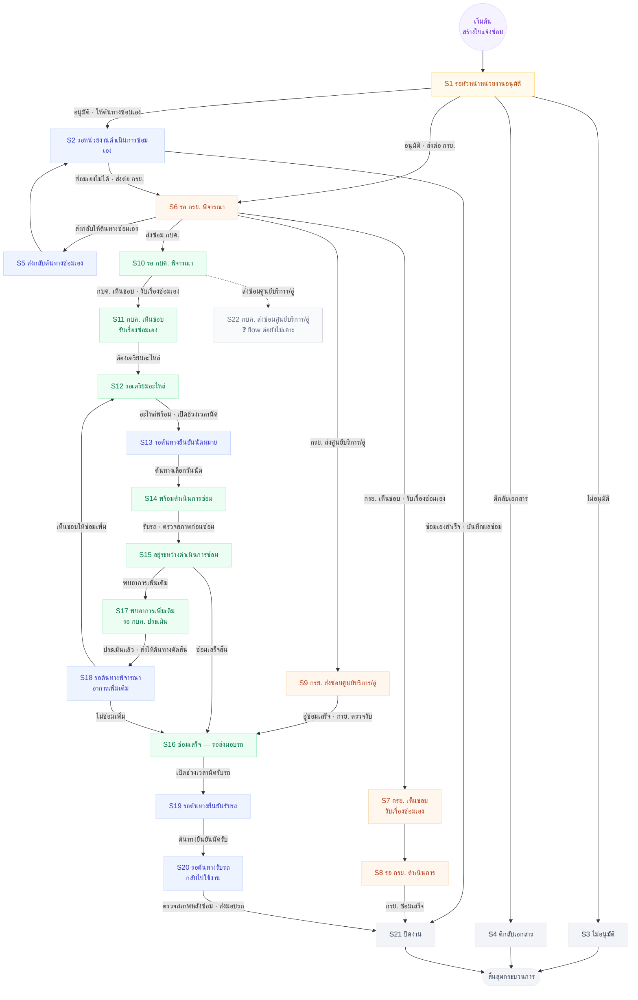

# ผังสถานะ + เงื่อนไขการเปลี่ยนสถานะ — ใบแจ้งซ่อม (22 สถานะ)

> **ผังนี้ตอบว่า "อะไรทำให้สถานะเปลี่ยน"** — ทุกเส้นมีป้ายบอกเงื่อนไข/ปุ่มที่กด
> ต่างจาก [06-swimlane](06-swimlane-โฟลว์ซ่อมทั้งเส้น.md) ที่ตอบว่า *"ใบอยู่ในมือใคร"*
>
> **ที่มา:** ตาราง permission ที่เจ้าของงานกรอกส่งมา 15 ก.ย. 2569 (21 สถานะ · 4 บทบาท)
> **+ เคาะเพิ่ม 16 ก.ย. 2569** จากผังที่เจ้าของงานส่งมา ⇒ **22 สถานะ** (เพิ่ม S22)
> เลข S1–S21 = ลำดับแถวในตาราง 15 ก.ย. · S22 = ของใหม่ 16 ก.ย.
>
> ✅ **ไม่มีข้อค้างเรื่องโครง flow แล้ว** — 8 จุดที่เคยไม่ตรงกัน เคาะครบ 16 ก.ย. 2569
> (ดูตาราง "สิ่งที่เคาะ 16 ก.ย." ด้านล่าง · ผังภาพ PlantUML: [08-โฟลว์ซ่อมบำรุง-plantuml.md](08-โฟลว์ซ่อมบำรุง-plantuml.md))
>
> **สีบอกเจ้าของงานปัจจุบัน**
> 🟪 เริ่มต้น · 🟦 หน่วยงานต้นทาง/ผู้แจ้ง · 🟨 หัวหน้าหน่วยงาน · 🟧 กรย. · 🟩 กบค. · ⬜ จบ
> 🔲 **สีเทา = ยังไม่มี flow ต่อ** (S22 กบค. ส่งอู่ — เจ้าของงานยืนยันว่ามีสถานะ แต่ยังไม่บอกว่าเดินต่อยังไง)

## ✅ สิ่งที่เคาะ 16 ก.ย. 2569 (8 จุด)

เทียบผังที่เจ้าของงานส่งมา กับชุด 21 สถานะเดิม แล้วเจ้าของงานเคาะทีละข้อ

| # | เรื่อง | เคาะเป็น | ผลกับผัง |
|---|---|---|---|
| 1 | **ตีกลับเอกสารอยู่ที่ใคร** | **หัวหน้าหน่วยงาน** เท่านั้น | กรย./กบค. **ตีกลับไม่ได้** · S4 เป็นปลายทาง = ปิดงาน |
| 2 | **หัวหน้าอนุมัติแล้วไปไหนได้บ้าง** | UI ให้เลือกได้ **2 ทาง** (ตามของเรา) + ยังมีเส้นซ่อมเองไม่ได้แล้วส่งต่อ (ตามผังที่ส่งมา) | S1 → S2 หรือ S1 → S6 · **และเพิ่ม S2 → S6** |
| 3 | **"เห็นชอบให้ซ่อมเอง" คือใครซ่อม** | **กรย./กบค. ซ่อมเอง** — *"ตอนที่เลือกซ่อมเองและเลือกอู่ ถือว่าเป็นการรับเรื่องซ่อมเอง"* | S7/S11 เปลี่ยนความหมาย · **ตัด S7 → S2 ออก** · S11 → S12 |
| 4 | **กบค. ส่งศูนย์บริการ/อู่** | **มีจริง** แต่ **flow ต่อยังไม่เคาะ** | เพิ่ม **S22** (เส้นประ · ปลายทางค้าง ❓) |
| 5 | **สายอู่ซ่อมเสร็จจบที่ไหน** | เข้า **ขั้นส่งมอบรถ** ไม่ปิดงานทันที | S9 → **S16** (เดิม S9 → S21) |
| 6 | **เส้นย้อน กรย. ↔ กบค.** | **ไม่มี** | **ตัด S8 → S10 และ S10 → S8 ออก** |
| 7 | **อนุมัติซ่อมเพิ่มวนกลับไปไหน** | กลับ **S12 รอเตรียมอะไหล่** + มีเส้น "ไม่ซ่อมเพิ่ม" | คงตามของเรา |
| 8 | **ลำดับ เตรียมอะไหล่ ↔ นัดหมาย** | **เรียงกัน** S12 → S13 → S14 | คงตามของเรา |

## เงื่อนไขทั้งหมด เรียงตามสถานะต้นทาง

| จาก | เงื่อนไข / ปุ่มที่กด | ไป | ใครกด |
|---|---|---|---|
| **S1** รอหัวหน้าอนุมัติ | ไม่อนุมัติ | S3 → จบ | หัวหน้าหน่วยงานต้นทาง |
| | ตีกลับเอกสาร ⇒ **ปิดงาน** | S4 → จบ | หัวหน้าหน่วยงานต้นทาง |
| | อนุมัติ · ให้ต้นทางซ่อมเอง | S2 | หัวหน้าหน่วยงานต้นทาง |
| | อนุมัติ · ส่งต่อ กรย. | S6 | หัวหน้าหน่วยงานต้นทาง |
| **S2** รอหน่วยงานซ่อมเอง | ซ่อมเองสำเร็จ · บันทึกผลซ่อม | S21 | หน่วยงานต้นทาง |
| | **ซ่อมเองไม่ได้ · ส่งต่อ กรย.** | S6 | หน่วยงานต้นทาง |
| **S6** รอ กรย. พิจารณา | ส่งกลับให้ต้นทางซ่อมเอง | S5 | กรย. |
| | **กรย. เห็นชอบ · รับเรื่องซ่อมเอง** | S7 | กรย. |
| | **กรย. ส่งศูนย์บริการ/อู่** | S9 | กรย. |
| | ส่งซ่อม กบค. | S10 | กรย. |
| **S5** ส่งกลับต้นทางซ่อมเอง | — | S2 | — |
| **S7** กรย. เห็นชอบ รับเรื่องเอง | — | S8 | กรย. |
| **S8** รอ กรย. ดำเนินการ | กรย. ซ่อมเสร็จ | S21 | กรย. |
| **S9** กรย. ส่งศูนย์บริการ/อู่ | อู่ซ่อมเสร็จ · กรย. ตรวจรับ | **S16** | กรย. |
| **S10** รอ กบค. พิจารณา | **กบค. เห็นชอบ · รับเรื่องซ่อมเอง** | S11 | กบค. |
| | **กบค. ส่งศูนย์บริการ/อู่** | S22 🔲 | กบค. |
| **S11** กบค. เห็นชอบ รับเรื่องเอง | ต้องเตรียมอะไหล่ | S12 | กบค. |
| **S22** กบค. ส่งศูนย์บริการ/อู่ | ❓ **ยังไม่เคาะว่าเดินต่อยังไง** | ❓ | กบค. |
| **S12** รอเตรียมอะไหล่ | อะไหล่พร้อม · เปิดช่วงเวลานัด | S13 | กบค./แผนกผู้รับผิดชอบ |
| **S13** รอต้นทางยืนยันนัดหมาย | ต้นทางเลือกวันนัด | S14 | **หน่วยงานต้นทาง** |
| **S14** พร้อมดำเนินการซ่อม | รับรถ · ตรวจสภาพก่อนซ่อม | S15 | กบค. |
| **S15** อยู่ระหว่างซ่อม | พบอาการเพิ่มเติม | S17 | กบค. |
| | ซ่อมเสร็จสิ้น | S16 | กบค. |
| **S17** พบอาการเพิ่มเติม | ประเมินแล้ว · ส่งให้ต้นทางตัดสิน | S18 | กบค. |
| **S18** รอต้นทางพิจารณา | เห็นชอบให้ซ่อมเพิ่ม | S12 ↺ | **หน่วยงานต้นทาง** |
| | ไม่ซ่อมเพิ่ม | S16 | **หน่วยงานต้นทาง** |
| **S16** ซ่อมเสร็จ รอส่งมอบ | เปิดช่วงเวลานัดรับรถ | S19 | กบค./ผู้คุมงานซ่อม |
| **S19** รอต้นทางยืนยันรับรถ | ต้นทางยืนยันนัดรับ | S20 | **หน่วยงานต้นทาง/ผู้รับรถ** |
| **S20** รอต้นทางรับรถ | ตรวจสภาพหลังซ่อม · ส่งมอบรถ | S21 | หน่วยงานต้นทาง/ผู้รับรถ |

## ลูปย้อนกลับ — เหลือเส้นเดียว

> ✏️ **16 ก.ย. 2569** — เดิมมี 3 เส้น · ตัดออก 2
> `S1 → S4 → S1` (ตีกลับ = ปิดงาน) และ `S10 → S8 → S10` (ไม่มีเส้นย้อน กรย. ↔ กบค.)

1. **S15 → S17 → S18 → S12 → S13 → S14 → S15** พบอาการเพิ่ม → ต้นทางเห็นชอบ → วนกลับไปเตรียมอะไหล่

## สามทางเข้า "รอ กรย. พิจารณา" (S6)

ข้อ 2 ที่เคาะ ทำให้ S6 รับใบได้จาก 2 ทาง — เวลาทำ UI ต้องรองรับทั้งคู่

1. **หัวหน้าอนุมัติแล้วส่งต่อ กรย. เลย** (S1 → S6) — รู้ตั้งแต่แรกว่าซ่อมเองไม่ไหว
2. **ต้นทางลองซ่อมเองก่อนแล้วไม่ไหว** (S1 → S2 → S6) — ใบวิ่งกลับออกมาจากสถานะซ่อมเอง

## ที่ยังไม่เคาะ

1. 🔲 **S22 กบค. ส่งซ่อมศูนย์บริการ/อู่ — flow ต่อ** · เจ้าของงานยืนยันว่ามีสถานะจริง แต่ยังไม่ได้บอกว่าเดินยังไง
   (เทียบสาย กรย. คือ S9 → S16 → ส่งมอบรถ · ของ กบค. น่าจะรูปเดียวกันแต่ยังไม่ยืนยัน)
2. **"ตีกลับ" กับ "ไม่อนุมัติ" ยุบเป็นสถานะเดียวได้ไหม** — จบเหมือนกันทั้งคู่ แต่ตาราง 15 ก.ย. แยกไว้ 2 แถว
3. **ใบที่ถูกตีกลับแล้วยังต้องซ่อม** ⇒ เปิดใบใหม่ · ใบใหม่ควรอ้างอิงใบเดิมไหม
4. **routing เข้าแผนกที่ S10** — [05-routing-ใบไปแผนก.md](05-routing-ใบไปแผนก.md)
