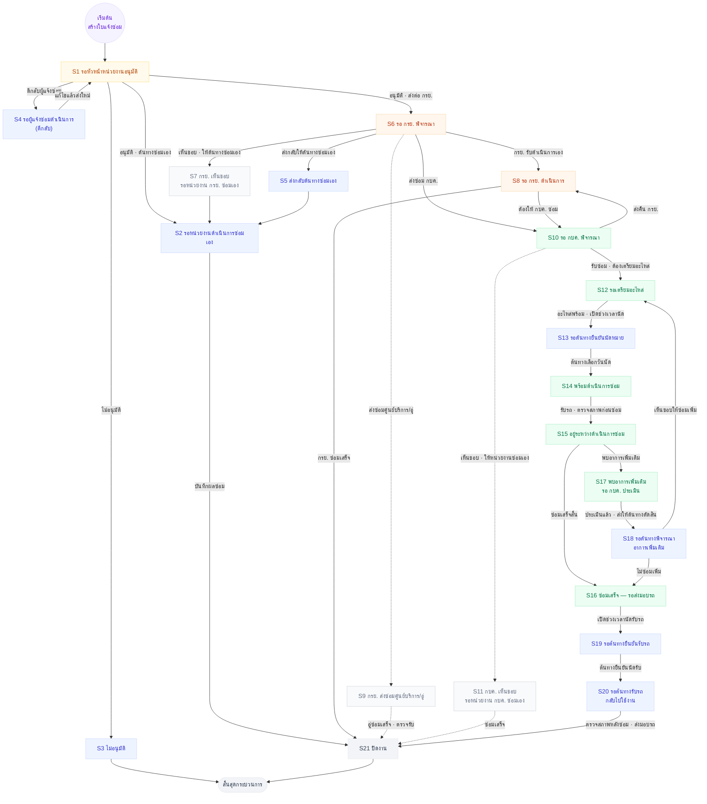

# ผังสถานะ + เงื่อนไขการเปลี่ยนสถานะ — ใบแจ้งซ่อม (21 สถานะ)

> **ผังนี้ตอบว่า "อะไรทำให้สถานะเปลี่ยน"** — ทุกเส้นมีป้ายบอกเงื่อนไข/ปุ่มที่กด
> ต่างจาก [06-swimlane](06-swimlane-โฟลว์ซ่อมทั้งเส้น.md) ที่ตอบว่า *"ใบอยู่ในมือใคร"*
>
> **ที่มา:** ตาราง permission ที่เจ้าของงานกรอกส่งมา 15 ก.ย. 2569 (21 สถานะ · 4 บทบาท)
> — แทนชุด 19 สถานะเดิม · เลข S1–S21 = ลำดับแถวในตารางนั้น
>
> **สีบอกเจ้าของงานปัจจุบัน**
> 🟪 เริ่มต้น · 🟦 หน่วยงานต้นทาง/ผู้แจ้ง · 🟨 หัวหน้าหน่วยงาน · 🟧 กรย. · 🟩 กบค. · ⬜ จบ
> 🔲 **เส้นประ = รอเจ้าของงาน CF แต่ลงมือทำก่อนได้** (สั่ง 15 ก.ย. 2569) — มี flow แล้ว แค่ยังไม่ยืนยันรายละเอียด

## 🔲 สามสถานะที่รอ CF — แต่ทำก่อนได้

เจ้าของงาน 15 ก.ย. 2569: *"ส่งซ่อมอู่ ของ กรย กับ กบค มี flow แต่ว่ายังไม่ได้ทำ"*
และ *"3 แถวนั้นรอให้เจ้าของงานมา CF แต่ว่าทำก่อนได้เลย"* ⇒ **ลงมือทำได้ ไม่ต้องรอ** แค่เผื่อว่ารายละเอียดอาจเปลี่ยน

| สถานะ | เจ้าของงาน | สถานะการทำ |
|---|---|---|
| **S7** กรย. เห็นชอบ — รอหน่วยงาน กรย. ซ่อมเอง | หน่วยงานต้นทาง ❓ (ตารางเขียน `กรย ?`) | รอ CF · ทำก่อนได้ |
| **S9** กรย. ส่งซ่อมศูนย์บริการ/อู่ | กรย. | รอ CF · ทำก่อนได้ |
| **S11** กบค. เห็นชอบ — รอหน่วยงาน กบค. ซ่อมเอง | กบค. | รอ CF · ทำก่อนได้ |

⚠️ **ยังขาดสถานะ "กบค. ส่งซ่อมศูนย์บริการ/อู่"** — เจ้าของงานบอกว่าสายอู่มีทั้งฝั่ง กรย. และ กบค.
แต่ตารางที่ส่งมามีแค่ของ กรย. (S9) ⇒ ถ้าฝั่ง กบค. เป็นสถานะแยก ต้องเพิ่มอีก 1 แถว

## เงื่อนไขทั้งหมด เรียงตามสถานะต้นทาง

| จาก | เงื่อนไข / ปุ่มที่กด | ไป | ใครกด |
|---|---|---|---|
| **S1** รอหัวหน้าอนุมัติ | ไม่อนุมัติ | S3 | หัวหน้าหน่วยงานต้นทาง |
| | ตีกลับผู้แจ้งซ่อม | S4 | หัวหน้าหน่วยงานต้นทาง |
| | อนุมัติ · ต้นทางซ่อมเอง | S2 | หัวหน้าหน่วยงานต้นทาง |
| | อนุมัติ · ส่งต่อ กรย. | S6 | หัวหน้าหน่วยงานต้นทาง |
| **S4** ตีกลับ | แก้ไขแล้วส่งใหม่ | S1 ↺ | ผู้แจ้งซ่อม |
| **S2** ซ่อมเอง | บันทึกผลซ่อม | S21 | หน่วยงานต้นทาง |
| **S6** รอ กรย. พิจารณา | เห็นชอบ ให้ต้นทางซ่อมเอง | S7 🔲 | กรย. |
| | ส่งกลับให้ต้นทางซ่อมเอง | S5 | กรย. |
| | กรย. รับดำเนินการเอง | S8 | กรย. |
| | ส่งซ่อมศูนย์บริการ/อู่ | S9 🔲 | กรย. |
| | ส่งซ่อม กบค. | S10 | กรย. |
| **S8** รอ กรย. ดำเนินการ | กรย. ซ่อมเสร็จ | S21 | กรย. |
| | ต้องให้ กบค. ซ่อม | S10 | กรย. |
| **S10** รอ กบค. พิจารณา | เห็นชอบ ให้หน่วยงานซ่อมเอง | S11 🔲 | กบค. |
| | ส่งคืน กรย. | S8 ↺ | กบค. |
| | รับซ่อม · ต้องเตรียมอะไหล่ | S12 | กบค. |
| **S12** รอเตรียมอะไหล่ | อะไหล่พร้อม · เปิดช่วงเวลานัด | S13 | กบค./แผนกผู้รับผิดชอบ |
| **S13** รอต้นทางยืนยันนัดหมาย | ต้นทางเลือกวันนัด | S14 | **หน่วยงานต้นทาง** |
| **S14** พร้อมดำเนินการซ่อม | รับรถ · ตรวจสภาพก่อนซ่อม | S15 | กบค. |
| **S15** อยู่ระหว่างซ่อม | พบอาการเพิ่มเติม | S17 | กบค. |
| | ซ่อมเสร็จสิ้น | S16 | กบค. |
| **S17** พบอาการเพิ่มเติม | ประเมินแล้ว · ส่งให้ต้นทางตัดสิน | S18 | กบค. |
| **S18** รอต้นทางพิจารณา | เห็นชอบให้ซ่อมเพิ่ม | S12 ↺ | **หน่วยงานต้นทาง** |
| | ไม่ซ่อมเพิ่ม | S16 | **หน่วยงานต้นทาง** |
| **S16** ซ่อมเสร็จ รอส่งมอบ | เปิดช่วงเวลานัดรับรถ | S19 | กบค. |
| **S19** รอต้นทางยืนยันรับรถ | ต้นทางยืนยันนัดรับ | S20 | **หน่วยงานต้นทาง/ผู้รับรถ** |
| **S20** รอต้นทางรับรถ | ตรวจสภาพหลังซ่อม · ส่งมอบรถ | S21 | หน่วยงานต้นทาง/ผู้รับรถ |

## ลูปย้อนกลับ 3 เส้น

1. **S1 → S4 → S1** ตีกลับให้ผู้แจ้งแก้ แล้ววนกลับหาหัวหน้า
2. **S10 → S8 → S10** กบค. ส่งคืน กรย. แล้ว กรย. ส่งกลับมาใหม่
3. **S15 → S17 → S18 → S12 → …** พบอาการเพิ่ม → ต้นทางเห็นชอบ → วนกลับไปเตรียมอะไหล่

## จุดต่างจากชุด 19 สถานะเดิม (ที่เคยทำไว้)

| เรื่อง | ชุดเดิม | ตารางใหม่ 15 ก.ย. |
|---|---|---|
| **รอ กบค. รับเรื่อง** | มีแยก (S8 เดิม) | **ยุบรวมกับ "รอ กบค. พิจารณา"** |
| **สายอู่** | ไม่มีเลย | เพิ่ม `กรย. ส่งซ่อมศูนย์บริการ/อู่` 🔲 |
| **เห็นชอบให้ซ่อมเอง (กบค.)** | ไม่มี | เพิ่ม S11 🔲 |
| **เจออาการเพิ่ม** | วนกลับเตรียมอะไหล่ตรงๆ (❓ ว่าใครตัดสิน) | **มี S18 ให้ต้นทางพิจารณาก่อน** ⇒ ปิดคำถามเดิม |
| **หัวหน้าหน่วยงาน** | รวมอยู่กับผู้แจ้ง | **แยกเป็นบทบาทที่ 4** |

## ที่ยังไม่เคาะ

1. **เจ้าของงานของ S7** — ตารางเขียน `หน่วยงานต้นทาง (กรย ?)` ยังไม่ชัดว่าใครถือใบ
2. **"กบค. ส่งซ่อมอู่" เป็นสถานะแยกไหม** — ดูกล่องเตือนด้านบน
3. **routing เข้าแผนกที่ S10** — [05-routing-ใบไปแผนก.md](05-routing-ใบไปแผนก.md)
