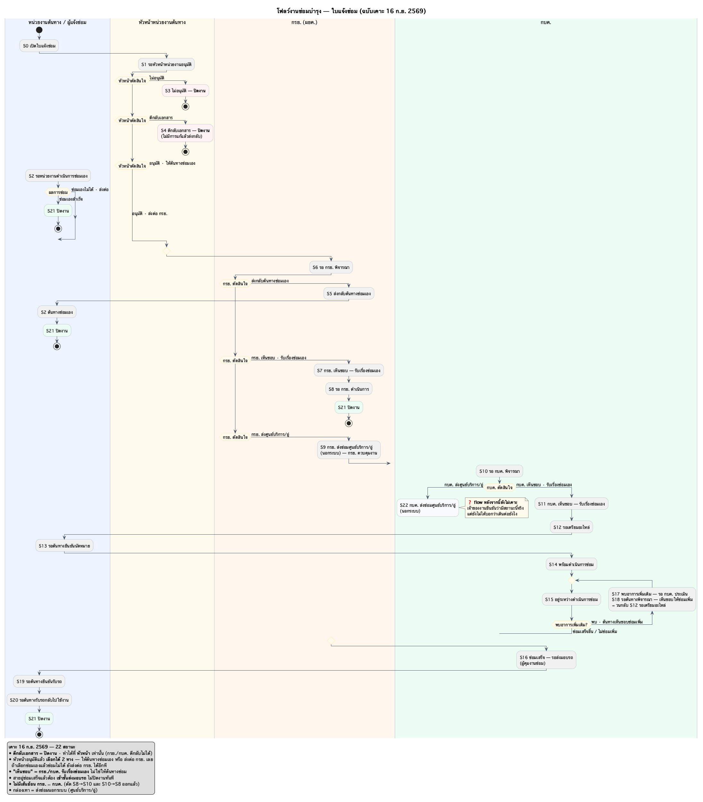
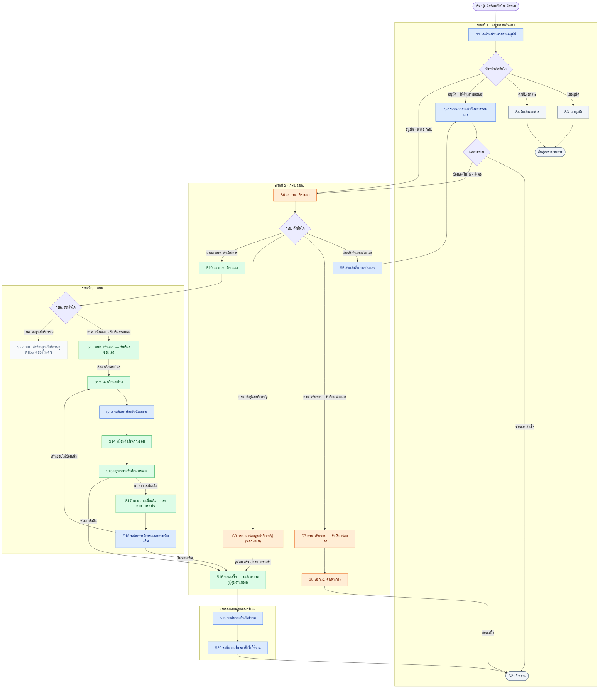

# โฟลว์งานซ่อมบำรุง — ผัง PlantUML (swimlane)

> **ผังภาพของโฟลว์แจ้งซ่อมทั้งเส้น ฉบับเคาะ 16 ก.ย. 2569 (22 สถานะ)**
> mermaid ไม่มี swimlane จริง — ผังนี้เลยทำด้วย PlantUML activity diagram ที่มีเลนจริง
>
> **ผังคู่กัน (ใช้เลข S ชุดเดียวกัน)** — [06-swimlane](06-swimlane-โฟลว์ซ่อมทั้งเส้น.md) *ใบอยู่ในมือใคร* ·
> [07-state](07-state-เงื่อนไขเปลี่ยนสถานะ.md) *อะไรทำให้สถานะเปลี่ยน* (เจ้าของความจริงของเงื่อนไข)
> **แก้ flow ที่ไหน ต้องแก้ครบทั้ง 3 ไฟล์ + `figma-export/5-swimlane.js` ในคอมมิตเดียวกัน**

- ต้นฉบับ: [`plantuml/08-โฟลว์ซ่อมบำรุง.puml`](plantuml/08-โฟลว์ซ่อมบำรุง.puml)
- ที่ export: [`plantuml/out/08-โฟลว์ซ่อมบำรุง.png`](plantuml/out/08-โฟลว์ซ่อมบำรุง.png) · [`.svg`](plantuml/out/08-โฟลว์ซ่อมบำรุง.svg)
- เรนเดอร์ใหม่: `./plantuml/render.sh` — ใช้ java ที่มีอยู่ · **ไม่ต้องลง graphviz** ·
  jar เก็บ**นอกรีโป**ที่ `~/PEA/Maintain-D/.tools/plantuml.jar` (สคริปต์โหลดให้เองถ้าไม่มี)
- SVG เห็นภาษาไทยถูกเฉพาะเครื่องที่มีฟอนต์ Thonburi — **ส่งให้คนอื่นดูใช้ PNG**

## ✅ 8 จุดที่เคาะ 16 ก.ย. 2569

ผังที่เจ้าของงานส่งมา เทียบกับชุด 21 สถานะเดิม (ตาราง permission 15 ก.ย.) แล้วเคาะทีละข้อ

| # | เรื่อง | เคาะเป็น |
|---|---|---|
| 1 | ตีกลับเอกสารอยู่ที่ใคร | **หัวหน้าหน่วยงาน** เท่านั้น · กรย./กบค. ตีกลับไม่ได้ · **ตีกลับ = ปิดงาน** |
| 2 | หัวหน้าอนุมัติแล้วไปไหนได้ | UI ให้เลือก **2 ทาง** (ให้ต้นทางซ่อมเอง / ส่งต่อ กรย.) **และ** ซ่อมเองไม่ได้ก็ส่งต่อ กรย. ได้อีกที |
| 3 | "เห็นชอบให้ซ่อมเอง" คือใครซ่อม | **กรย./กบค. ซ่อมเอง** — *"ตอนที่เลือกซ่อมเองและเลือกอู่ ถือว่าเป็นการรับเรื่องซ่อมเอง"* |
| 4 | กบค. ส่งศูนย์บริการ/อู่ | **มีจริง (S22)** แต่ ❓ **flow ต่อยังไม่เคาะ** |
| 5 | สายอู่ซ่อมเสร็จจบที่ไหน | เข้า **ขั้นส่งมอบรถ (S16)** ไม่ปิดงานทันที |
| 6 | เส้นย้อน กรย. ↔ กบค. | **ไม่มี** — ตัด S8→S10 และ S10→S8 ออก |
| 7 | อนุมัติซ่อมเพิ่มวนกลับไปไหน | **S12 รอเตรียมอะไหล่** + คงเส้น "ไม่ซ่อมเพิ่ม" ไว้ |
| 8 | ลำดับ เตรียมอะไหล่ ↔ นัดหมาย | **เรียงกัน** S12 → S13 → S14 |

ผลรวม: **21 สถานะเดิม + S22 = 22 สถานะ** · ลูปย้อนกลับเหลือเส้นเดียว (อาการเพิ่มเติม)

## ฉบับ Mermaid (ให้ GitHub render ได้ในหน้านี้เลย)

## ❓ ที่ยังไม่เคาะ

1. 🔲 **S22 กบค. ส่งซ่อมศูนย์บริการ/อู่ — flow ต่อ**
   สาย กรย. คือ S9 → S16 → ส่งมอบรถ · ของ กบค. น่าจะรูปเดียวกัน แต่ยังไม่ยืนยัน
2. **"ตีกลับ" กับ "ไม่อนุมัติ" ยุบเป็นสถานะเดียวได้ไหม** — จบเหมือนกันทั้งคู่ แต่ตาราง 15 ก.ย. แยกไว้ 2 แถว
3. **ใบที่ถูกตีกลับแล้วยังต้องซ่อม** ⇒ เปิดใบใหม่ · ใบใหม่ควรอ้างอิงใบเดิมไหม

## ⬜ ที่ยังไม่ได้ทำในต้นแบบ

`mock/Maintenance-Request-Form-page.html` ยังเป็นของเดิม ต้องตามมาแก้ให้ตรงผังนี้

| จุด | ตอนนี้ | ต้องเป็น |
|---|---|---|
| ตีกลับของ กรย. (`openKryReturn`) | มีปุ่ม "ตีกลับ" ที่หน้า กรย. | **ถอดออก** — ตีกลับได้แค่หัวหน้า |
| ตีกลับ/ปฏิเสธของ กบค. | มีในไทม์ไลน์ + `RSTEPS` | **ถอดออก** |
| ป้ายสถานะ `reject` | *"ถูกปฏิเสธ/ตีกลับ ต้องแก้แล้วส่งใหม่"* | **ปิดงาน** ไม่มีแก้แล้วส่งใหม่ |
| toast ตอนหัวหน้าไม่อนุมัติ | *"ตีกลับให้ผู้แจ้งแก้ไขแล้ว"* | เปลี่ยนข้อความให้ตรงว่าปิดงาน |
| หน้าอนุมัติของหัวหน้า | อนุมัติ/ไม่อนุมัติ | เพิ่มทางเลือก **ให้ต้นทางซ่อมเอง / ส่งต่อ กรย.** (ข้อ 2) |
