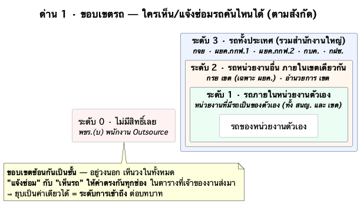
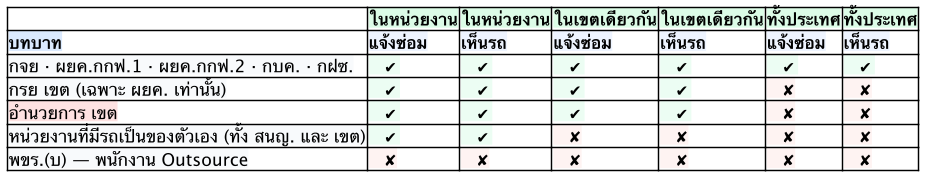
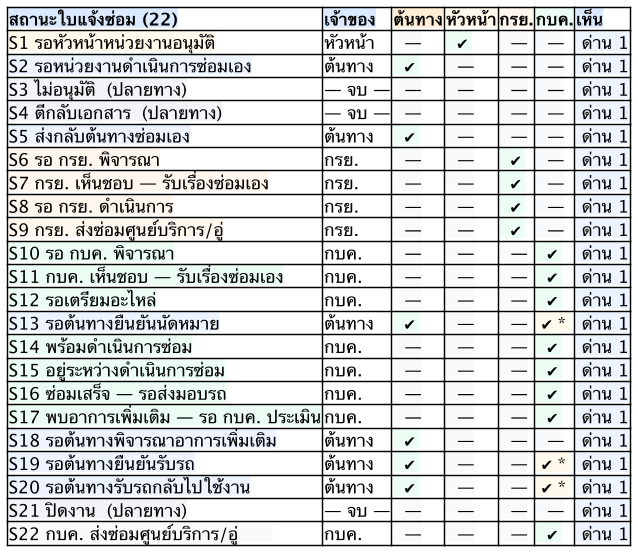

# สิทธิ์ใบแจ้งซ่อม — 2 ด่าน (ขอบเขตรถ → สถานะใบ)

> **ที่มา:** ตาราง "แจ้งซ่อม / เห็นรถ × สังกัด" ที่เจ้าของงานส่งมา 16 ก.ย. 2569
> + [`db-schema/map-04-permission-สถานะ-x-บทบาท.md`](../../../../db-schema/map-04-permission-สถานะ-x-บทบาท.md) (15 ก.ย. · 19 สถานะ)
> แมปเข้าชุด **22 สถานะ** ปัจจุบันของ [07-state](07-state-เงื่อนไขเปลี่ยนสถานะ.md) แล้ว
>
> เรนเดอร์ใหม่: `./plantuml/render.sh`

## ทำไมเป็น 2 ด่าน

`map-04` เขียนคำถามค้างไว้เองข้อ 3 ว่า *"ขอบเขตเห็นของ กรย./กบค. — ถ้าต้องจำกัดเป็นเฉพาะรถในเขต/หน่วยงาน
ที่รับผิดชอบ **ต้องเพิ่มเงื่อนไขขอบเขตหน่วยงาน ไม่ใช่เงื่อนไขสถานะ**"* — ตารางที่ส่งมา 16 ก.ย. คือคำตอบข้อนั้นพอดี

```
ด่าน 1 · สังกัด  ──►  เห็นรถคันนี้ / แจ้งซ่อมคันนี้ได้ไหม     (ไม่เกี่ยวกับสถานะใบเลย)
                        │ ผ่าน
                        ▼
ด่าน 2 · สถานะใบ ──►  ตอนนี้ "แก้ไข" ได้ไหม                  (ลูกบอลอยู่ในมือใคร)
```

**"เห็น" ไม่ได้คุมด้วยสถานะ** — `map-04` ให้ ✅ ทุกช่องอยู่แล้ว (หลักการข้อ 2: ประวัติซ่อมของรถต้องครบทุกใบ
ไม่งั้นวิเคราะห์ต้นทุน/รุ่นที่เสียบ่อยไม่ได้) ⇒ ตัวที่คุม "เห็น" จริงๆ คือ **ด่าน 1**

---

## ด่าน 1 · ขอบเขตรถ



🔎 **ข้อสังเกตจากตารางที่ส่งมา** — ไล่ครบทั้ง 15 คู่ช่องแล้ว **`แจ้งซ่อม` กับ `เห็นรถ` ให้ค่าตรงกันทุกช่อง
ไม่มีแถวไหนต่างเลย** ⇒ 2 คอลัมน์นี้ยุบเป็นค่าเดียวได้ เหลือแค่ "ระดับการเข้าถึง" ต่อบทบาท
(ถ้าตั้งใจให้ต่างกันในอนาคต เช่น เห็นได้แต่แจ้งไม่ได้ ต้องบอก จะได้แยกคอลัมน์ไว้)



| ระดับ | ใคร | เห็น/แจ้งซ่อมรถได้ถึงไหน |
|---|---|---|
| **3** | กจย · ผยค.กกฟ.1 · ผยค.กกฟ.2 · กบค. · กฝซ. | ทั้งประเทศ รวม สนญ. |
| **2** | กรย เขต (เฉพาะ ผยค.) · **อำนวยการ เขต** | ภายในเขตเดียวกัน |
| **1** | หน่วยงานที่มีรถเป็นของตัวเอง (ทั้ง สนญ. และ เขต) | หน่วยงานตัวเองเท่านั้น |
| **0** | พขร.(บ) พนักงาน Outsource | ไม่มีสิทธิ์เลย |

---

## ด่าน 2 · สถานะใบ (22 สถานะ × 4 บทบาท)



**หลักการที่ใช้ตัดสิน** (ยกมาจาก `map-04` — ยังใช้ได้ทั้ง 4 ข้อ)

1. **แก้ไขได้ = เจ้าของสถานะเท่านั้น** — ลูกบอลอยู่ในมือใคร คนนั้นแก้ได้ คนอื่นอ่านอย่างเดียว
2. **เห็นได้ = ทุกบทบาทที่เกี่ยวกับรถคันนั้น ตลอดทุกสถานะ** ⇒ คุมด้วยด่าน 1 ไม่ใช่สถานะ
3. **สถานะปลายทาง (S3 · S4 · S21) ล็อกทุกคน** — แก้ไม่ได้ ต้องเปิดใบใหม่
4. **สถานะที่ขึ้นต้นว่า "รอต้นทาง…" ลูกบอลอยู่ที่ต้นทาง** แม้เจ้าของ status จะเขียนว่า กบค.

`✔ *` = กบค. แก้ได้เฉพาะ**ช่วงเวลาที่เสนอ** (เลื่อน/เพิ่มรอบ) ไม่ใช่กดยืนยันแทนต้นทาง

> ✅ **แยกคอลัมน์ "หัวหน้าหน่วยงาน" ออกมาแล้ว** — `map-04` ถามค้างไว้ข้อ 2 ว่า *"คอลัมน์คนแจ้งซ่อม
> รวมหัวหน้าด้วยหรือไม่"* · ตาราง 21 สถานะ 15 ก.ย. แยกหัวหน้าเป็นบทบาทที่ 4 แล้ว และ 07-state
> ระบุ "ใครกด" รายเส้นไว้ครบ ⇒ ตารางนี้เลยเป็น **4 คอลัมน์** ตามนั้น

---

## 🔗 Mapping 19 สถานะเดิม → 22 สถานะปัจจุบัน

| map-04 | ชื่อเดิม (19) | → | ปัจจุบัน (22) | สถานะการแมป |
|:--:|---|:--:|---|---|
| 1 | รอหัวหน้าหน่วยงานอนุมัติ | → | **S1** | ตรง |
| 2 | ดำเนินการซ่อมเอง | → | **S2** รอหน่วยงานดำเนินการซ่อมเอง | ตรง (ชื่อยาวขึ้น) |
| 3 | ไม่อนุมัติ | → | **S3** | ตรง |
| 4 | รอคนแจ้งซ่อมดำเนินการ (ตีกลับ) | → | **S4** ตีกลับเอกสาร | 🔴 **ความหมายเปลี่ยน** — เดิม "รอผู้แจ้งแก้" (ต้นทางแก้ได้ ✅) · ตอนนี้ **ตีกลับ = ปิดงาน** ⇒ ล็อกทุกคน |
| 5 | ส่งกลับต้นทางซ่อมเอง | → | **S5** | ตรง |
| 6 | รอ กรย. พิจารณา | → | **S6** | ตรง |
| 7 | กรย. เห็นชอบ ซ่อมเอง | → | **S7** กรย. เห็นชอบ — รับเรื่องซ่อมเอง | 🔴 **ความหมายชัดขึ้น** — เคาะ 16 ก.ย. ว่า **กรย. ซ่อมเอง** ไม่ใช่ให้ต้นทางซ่อม |
| 8 | รอ กบค. รับเรื่อง | → | **S10** | 🔴 **ยุบหาย** — ตาราง 15 ก.ย. ยุบเข้ากับ "รอ กบค. พิจารณา" · **เชิงอรรถ 1 เดิม (กรย. ถอนเรื่องได้ก่อน กบค. กดรับ) ตกไปด้วย ต้องเคาะใหม่** |
| 9 | รอ กรย. ดำเนินการ | → | **S8** | ตรง |
| 10 | รอ กบค. พิจารณา | → | **S10** | ตรง |
| 11 | เตรียมอะไหล่ | → | **S12** รอเตรียมอะไหล่ | ตรง |
| 12 | รอต้นทางยืนยันนัดหมาย | → | **S13** | ตรง |
| 13 | พร้อมดำเนินการ | → | **S14** พร้อมดำเนินการซ่อม | ตรง |
| 14 | ดำเนินการซ่อม | → | **S15** อยู่ระหว่างดำเนินการซ่อม | ตรง |
| 15 | ซ่อมเสร็จ | → | **S16** ซ่อมเสร็จ — รอส่งมอบรถ | ตรง |
| 16 | เจออาการเพิ่ม | → | **S17 + S18** | 🔴 **แตกเป็น 2** — S17 รอ กบค. ประเมิน · S18 รอต้นทางพิจารณา ⇒ **ปิดเชิงอรรถ 4 ที่ค้าง** ("เป็นการแก้ไข หรือแค่รับทราบ") = **ต้นทางเป็นคนตัดสิน** |
| 17 | ปิดงาน | → | **S21** | ตรง |
| 18 | รอต้นทางยืนยันรับรถ | → | **S19** | ตรง |
| 19 | รอต้นทางรับรถกลับไปใช้งาน | → | **S20** | ตรง |

**ใหม่ 3 สถานะที่ `map-04` ยังไม่เคยมี** — ต้องเติมสิทธิ์ให้

| ปัจจุบัน | เจ้าของ | ที่มา |
|---|---|---|
| **S9** กรย. ส่งซ่อมศูนย์บริการ/อู่ | กรย. | เพิ่มจากตาราง 15 ก.ย. (สายอู่) |
| **S11** กบค. เห็นชอบ — รับเรื่องซ่อมเอง | กบค. | เพิ่มจากตาราง 15 ก.ย. |
| **S22** กบค. ส่งซ่อมศูนย์บริการ/อู่ ❓ | กบค. | เคาะ 16 ก.ย. · flow ต่อยังไม่เคาะ |

**สรุป:** 17 ตรงตัว · 1 ยุบ (8 → S10) · 1 แตกเป็น 2 (16 → S17+S18) · 1 เปลี่ยนความหมาย (4) · 3 ใหม่

---

## ❓ ที่ต้องเคาะ

1. **ดอกจัน `*` ท้ายแถวแรกของตารางที่ส่งมา** หมายถึงอะไร — มีเชิงอรรถที่ยังไม่ได้ส่งมาหรือเปล่า
2. **แถว "อำนวยการ เขต" ไฮไลต์ชมพู** — แปลว่ายังไม่ชัวร์ หรือเป็นแถวที่เพิ่งแก้
3. **ช่อง "หมายเหตุ" ท้ายตาราง** ตั้งใจเว้นไว้ หรือยังไม่ได้กรอก
4. **บทบาท 2 ชุดยังไม่ผูกกัน** — ด่าน 1 ใช้สังกัด 5 กลุ่ม · ด่าน 2 ใช้บทบาทในโฟลว์ 4 ตัว
   ที่ชัดคือ `กบค. ↔ กบค.` · `กรย เขต ↔ กรย.` · `หน่วยงานเจ้าของรถ ↔ ต้นทาง`
   แต่ **"อำนวยการ เขต" กับ "กฝซ." ยังไม่รู้ว่าไปนั่งบทบาทไหนในโฟลว์**
5. **เชิงอรรถ 1 เดิมที่ตกไปตอนยุบสถานะ 8** — กรย. ถอน/ยกเลิกเรื่องได้ก่อน กบค. กดรับไหม
6. `map-04` ยังมีคำถามค้างอีก 2 ข้อที่ยังไม่ตอบ — *"เห็นรถ" หมายถึง read ใบ/ประวัติ หรือรถยังจองได้*
   และ *"แก้ไข" = แก้เนื้อหาใบ กับ เปลี่ยนสถานะ เป็นคนละสิทธิ์ไหม*
