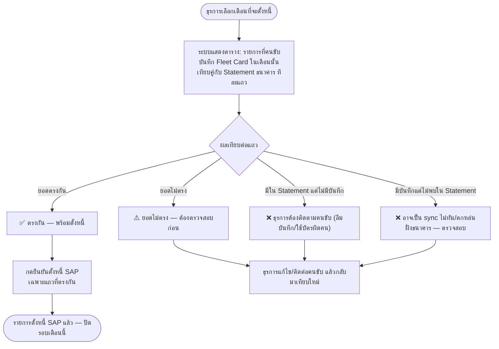

# Flow ตั้งหนี้ + Reconcile Fleet Card รายเดือน (บัญชี/ธุรการ) — mock คร่าวๆ

> ที่มา: `Maintenance-Request-Form/04-Flow-Fuel-and-Hours.md` · แยกมาเพื่อดูเป็นภาพง่าย (GitHub render mermaid ให้อัตโนมัติ)

