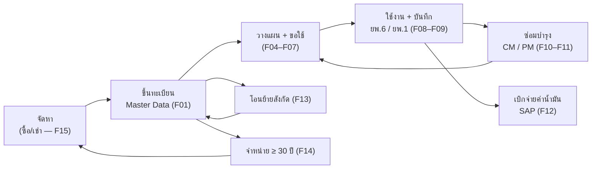

# FL-00 — ภาพรวมวงจรชีวิตรถ (Lifecycle Overview)

> ที่มา: `VMS-Plus-รถก่อสร้าง-Flowcharts.md` · แยกมาเพื่อดูเป็นภาพง่าย (GitHub render mermaid ให้อัตโนมัติ)

```mermaid
flowchart LR
    A["จัดหา<br/>(ซื้อ/เช่า — F15)"] --> B["ขึ้นทะเบียน<br/>Master Data (F01)"]
    B --> C["วางแผน + ขอใช้<br/>(F04–F07)"]
    C --> D["ใช้งาน + บันทึก<br/>ยพ.6 / ยพ.1 (F08–F09)"]
    D --> E["ซ่อมบำรุง<br/>CM / PM (F10–F11)"]
    E --> C
    D --> F["เบิกจ่ายค่าน้ำมัน<br/>SAP (F12)"]
    B --> G["โอนย้ายสังกัด (F13)"]
    G --> B
    B --> H["จำหน่าย ≥ 30 ปี (F14)"]
    H --> A
```
