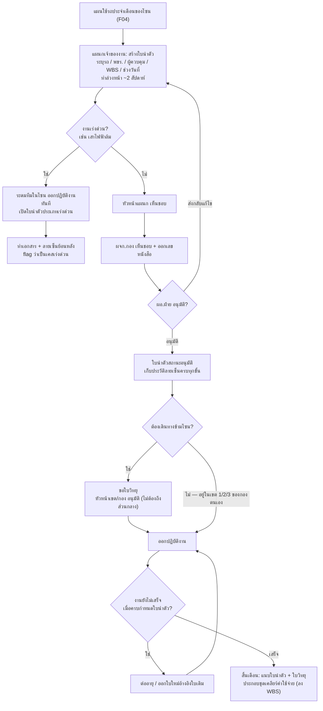

# FL-01 — ขออนุมัติใช้รถออกปฏิบัติงาน: ใบนำตัว + ใบวิทยุ (F05 + F06)

> ที่มา: `VMS-Plus-รถก่อสร้าง-Flowcharts.md` · แยกมาเพื่อดูเป็นภาพง่าย (GitHub render mermaid ให้อัตโนมัติ)

```mermaid
flowchart TD
    A["แผนใช้รถประจำเดือนของโซน (F04)"] --> B["แผนกเจ้าของงาน: สร้างใบนำตัว<br/>ระบุรถ / พขร. / ผู้ควบคุม / WBS / ช่วงวันที่<br/>ทำล่วงหน้า ~2 สัปดาห์"]
    B --> C{"งานเร่งด่วน?<br/>เช่น เสาไฟฟ้าล้ม"}
    C -->|ใช่| D["ระดมทีมในโซน ออกปฏิบัติงานทันที<br/>เปิดใบนำตัวประเภทเร่งด่วน"]
    D --> E["ทำเอกสาร + ลายเซ็นย้อนหลัง<br/>flag ว่าเป็นเคสเร่งด่วน"]
    C -->|ไม่| F["หัวหน้าแผนก เห็นชอบ"]
    F --> G["ผจก.กอง เห็นชอบ + ออกเลขหนังสือ"]
    G --> H{"ผอ.ฝ่าย อนุมัติ?"}
    H -->|ส่งกลับแก้ไข| B
    H -->|อนุมัติ| I["ใบนำตัวสถานะอนุมัติ<br/>เก็บประวัติลายเซ็นครบทุกขั้น"]
    I --> J{"ต้องเดินทางข้ามโซน?"}
    J -->|ใช่| K["ขอใบวิทยุ<br/>หัวหน้าเขต/กอง อนุมัติ (ไม่ต้องถึงส่วนกลาง)"]
    K --> L["ออกปฏิบัติงาน"]
    J -->|ไม่ — อยู่ในเขต 1/2/3 ของกองตนเอง| L
    L --> M{"งานยังไม่เสร็จ<br/>เมื่อครบกำหนดใบนำตัว?"}
    M -->|ใช่| N["ต่ออายุ / ออกใบใหม่อ้างอิงใบเดิม"]
    N --> L
    M -->|เสร็จ| O["สิ้นเดือน: แนบใบนำตัว + ใบวิทยุ<br/>ประกอบชุดเคลียร์ค่าใช้จ่าย (ลง WBS)"]
```
