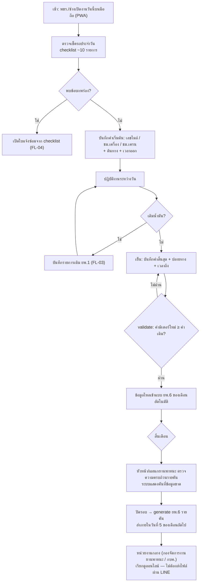

# FL-02 — บันทึกการใช้รถประจำวัน → ยพ.6 (F08)

> ที่มา: `VMS-Plus-รถก่อสร้าง-Flowcharts.md` · แยกมาเพื่อดูเป็นภาพง่าย (GitHub render mermaid ให้อัตโนมัติ)

```mermaid
flowchart TD
    A["เช้า: พขร./ช่างเปิดงานวันนี้บนมือถือ (PWA)"] --> B["ตรวจเช็ครถประจำวัน<br/>checklist ~10 รายการ"]
    B --> C{"พบข้อบกพร่อง?"}
    C -->|ใช่| D["เปิดใบแจ้งซ่อมจาก checklist (FL-04)"]
    C -->|ไม่| E["บันทึกค่าเริ่มต้น: เลขไมล์ / ชม.เครื่อง / ชม.เครน<br/>+ ต้นทาง + เวลาออก"]
    E --> F["ปฏิบัติงานระหว่างวัน"]
    F --> G{"เติมน้ำมัน?"}
    G -->|ใช่| H["บันทึกรายการเติม ยพ.1 (FL-03)"]
    H --> F
    G -->|ไม่| I["เย็น: บันทึกค่าสิ้นสุด + ปลายทาง + เวลาถึง"]
    I --> J{"validate: ค่ามิเตอร์ใหม่ ≥ ค่าเดิม?"}
    J -->|ไม่ผ่าน| I
    J -->|ผ่าน| K["ข้อมูลไหลเข้าแบบ ยพ.6 ของเดือนอัตโนมัติ"]
    K --> L{"สิ้นเดือน"}
    L --> M["หัวหน้า/แผนกยานพาหนะ ตรวจความครบถ้วนรายคัน<br/>ระบบแสดงคันที่ข้อมูลขาด"]
    M --> N["ปิดรอบ → generate ยพ.6 รายคัน<br/>ส่งภายในวันที่ 5 ของเดือนถัดไป"]
    N --> O["หน่วยงานกลาง (กองจัดการงานยานพาหนะ / กบค.)<br/>เรียกดูออนไลน์ — ไม่ต้องส่งไฟล์ผ่าน LINE"]
```
